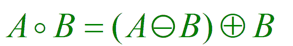
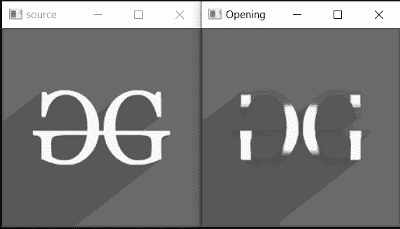

# c++中 OpenCV 的打开|形态转换

> 原文:[https://www . geesforgeks . org/open-形态学-transformations-in-opencv-in-c/](https://www.geeksforgeeks.org/opening-morphological-transformations-in-opencv-in-c/)

本文讨论了一种叫做“开”的[形态运算](https://www.geeksforgeeks.org/python-morphological-operations-in-image-processing-opening-set-1/)。

[打开](https://www.geeksforgeeks.org/python-morphological-operations-in-image-processing-opening-set-1/)操作类似于[腐蚀](https://www.geeksforgeeks.org/erosion-dilation-images-using-opencv-python/)，因为它也从图像边缘移除前景像素。开启操作是侵蚀操作，然后是[扩张](https://www.geeksforgeeks.org/difference-between-dilation-and-erosion/)。它通常用于消除图像内部的内部噪声。该操作符保护前景区域，该前景区域与结构化组件或适合结构化元素的前景区域具有相似性，同时移除其他所有内容。

**语法:**

> *morphologyEx (src、dst、op、内核、锚点、迭代、borderType、borderValue)*

**参数:**

*   **src:** 是输入图像。
*   **dst:** 是输出图像。
*   **op:** 形态操作类型。
*   **内核:**用于关闭的结构元素。
*   **锚:**结构元素内部的锚位置。默认值为[-1，-1}表示位置为结构元素的中心。
*   **迭代:**应用关闭的次数。
*   **边框类型:**边框的类型(BORDER_CONSTANT、BORDER_REPLICATE 等。)
*   **边框值:**边框值
*   **返回:**输出图像(Mat 对象)

开运算符由表达式给出:

[](https://media.geeksforgeeks.org/wp-content/uploads/20191224004548/gft_opening1.png)

该表达式表示 B 的 **A <sup>是子集(A 的子图像)。打开操作符去除图像内部的内部噪声和薄突起。</sup>**

下面是演示开放形态操作的 C++程序:

## C++

```
// C++ program to demonstrate the
// opening morphological transformation
#include <iostream>
#include <opencv2/core/core.hpp>

// Library include for drawing shapes
#include <opencv2/highgui/highgui.hpp>
#include <opencv2/imgproc.hpp>
using namespace cv;
using namespace std;

// Function to demonstrate the
// opening morphological operator
int openingMorphological()
{
    // Reading the Image
    Mat image = imread(
        "C:/Users/harsh/Downloads/geeks.png",
        IMREAD_GRAYSCALE);

    // Check if the image is
    // created successfully or not
    if (!image.data) {
        cout << "Could not open or"
             << " find the image\n";

        return 0;
    }

    // Create a structuring element
    int morph_size = 2;
    Mat element = getStructuringElement(
        MORPH_RECT,
        Size(2 * morph_size + 1,
             2 * morph_size + 1),
        Point(morph_size,
              morph_size));
    Mat output;

    // Opening
    morphologyEx(image, output,
                 MORPH_OPEN, element,
                 Point(-1, -1), 2);

    // Display the image
    imshow("source", image);
    imshow("Opening", output);
    waitKey();

    return 0;
}

// Driver Code
int main()
{

    openingMorphological();

    return 0;
}
```

**输出:**

[](https://media.geeksforgeeks.org/wp-content/uploads/20210125153136/gg.jpg)