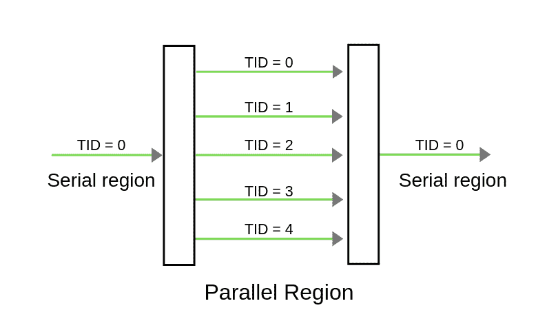

# OpenMP |你好世界节目

> 原文:[https://www.geeksforgeeks.org/openmp-hello-world-program/](https://www.geeksforgeeks.org/openmp-hello-world-program/)

**先决条件:** [OpenMP |安装指南简介](https://www.geeksforgeeks.org/openmp-introduction-with-installation-guide/)
在 C/C++/Fortran 中，[并行编程](https://www.geeksforgeeks.org/introduction-to-parallel-computing/)可以使用 [OpenMP](https://www.geeksforgeeks.org/openmp-introduction-with-installation-guide/) 实现。在本文中，我们将学习如何使用 [OpenMP](https://www.geeksforgeeks.org/openmp-introduction-with-installation-guide/) 创建一个并行的 **Hello World Program** 。
**<u>创建并行程序的步骤</u>**

1.  **包含头文件**:我们必须在标准头文件的同时包含我们程序的 OpenMP 头文件。

```
//OpenMP header
#include <omp.h>
```

2.  **指定平行区域**:在 OpenMP 中，我们需要使用关键字 **pragma omp parallel** 来提及我们将要使其平行的区域。 **pragma omp 平行**用于分叉额外的螺纹，以执行平行中包含的工作。**原线程将表示为线程 ID 为 0 的主线程。**用于创建平行区域的代码是:

```
#pragma omp parallel
{
  //Parallel region code 
} 
```

1.  所以，这里我们包括

```
#pragma omp parallel                   
{
    printf("Hello World... from thread = %d\n", 
           omp_get_thread_num());
}  
```

2.  **设置线程数** :
    我们可以使用外部变量设置执行程序的线程数。

```
export OMP_NUM_THREADS=5
```

1.  **<u>平行区域示意图</u>**



1.  如上图所示，一旦编译器遇到并行区域代码，线程 id 为 0 的主线程(*线程)将分叉成指定数量的线程。在这里，它将分叉成 5 个线程，因为我们将使用命令 export OMP_NUM_THREADS=5 将执行的线程数初始化为 5。并行区域内的整个代码将由所有线程并发执行。**一旦并行区域结束，所有线程将被合并到主线程中。*** 
2.  **编译运行** :
    **编译:**

```
gcc -o hello -fopenmp hello.c
```

1.  **执行:**

```
./hello
```

下面是具有上述方法输出的完整程序:
**程序:**由于我们将要执行的线程数指定为 5，因此 5 个线程将在同一时间点执行相同的 print 语句。这里我们不能保证线程的执行顺序，也就是说**语句在并行区域的执行顺序不会对所有的执行都一样**。在下图中，当第一次执行程序时，线程 1 首先完成，而在第二次运行中，线程 0 首先完成。omp_get_thread_num()将返回与该线程关联的线程号。

## 你好世界计划

```
// OpenMP program to print Hello World
// using C language

// OpenMP header
#include <omp.h>

#include <stdio.h>
#include <stdlib.h>

int main(int argc, char* argv[])
{

    // Beginning of parallel region
    #pragma omp parallel
    {

        printf("Hello World... from thread = %d\n",
               omp_get_thread_num());
    }
    // Ending of parallel region
}
```