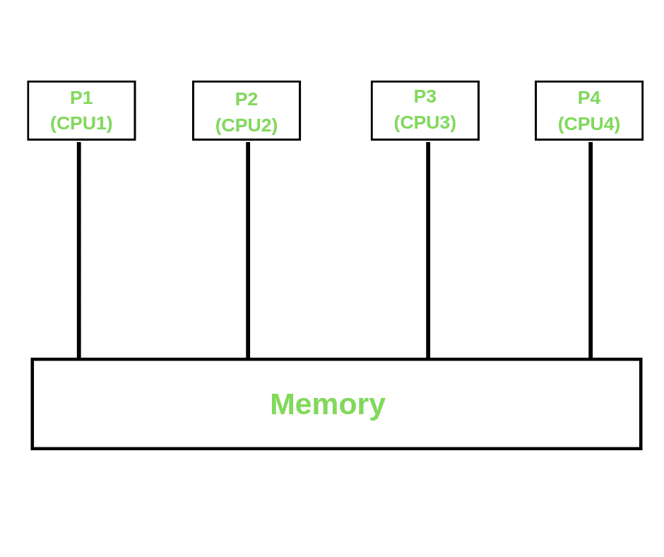
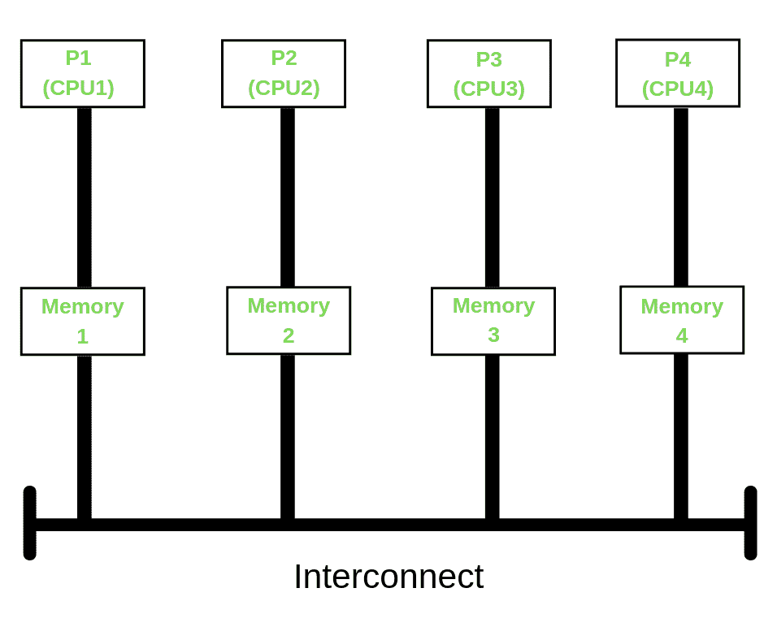
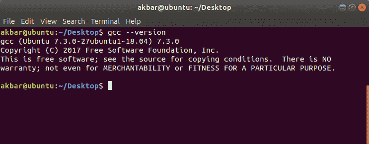
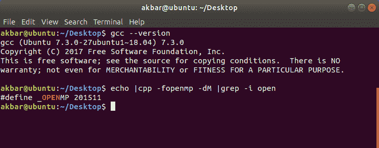
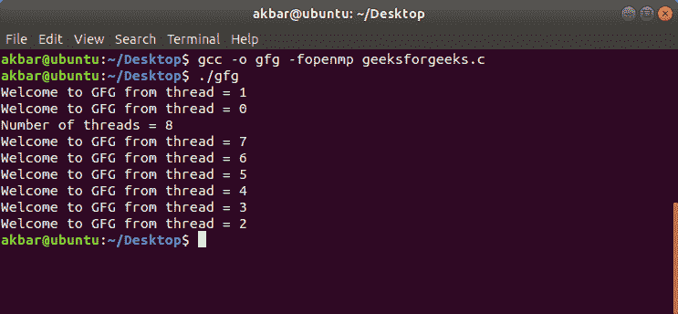

# OpenMP |安装指南简介

> 原文:[https://www . geesforgeks . org/openmp-introduction-with-installation-guide/](https://www.geeksforgeeks.org/openmp-introduction-with-installation-guide/)

在长期渴望在面向矩阵的数值编程中并行化高度规则的循环之后，OpenMP 于 1997 年由 **OpenMP 架构审查委员会(ARB)**推出。在随后的版本中，热情的 OpenMP 团队为其添加了许多功能，包括任务并行化、对加速器的支持、用户定义的减少等等。最新的 **OpenMP 5.0** 发布于 2018 年 11 月。

**开放多处理(OpenMP)** 是一种将 C/C++/Fortran 代码的一段(或多段)并行化的技术。OpenMP 也被认为是对 C/C++/Fortran 语言的扩展，增加了并行化的特性。总的来说，OpenMP 使用的是**便携式**、**可扩展**模型，为程序员开发从普通台式计算机到高端超级计算机等平台的并行应用提供了一个简单灵活的界面。

<u>**【THREAD Vs PROCESS】**</u>
一个进程由操作系统创建，以给定的资源(内存、寄存器)执行一个程序；一般来说，不同的进程不会共享它们的内存。线程是进程的子集，它共享其父进程的资源，但有自己的堆栈来跟踪函数调用。一个进程的多个线程可以访问同一个内存。

<u>**【并行内存架构】**</u>
在深入 OpenMP 之前，我们先来复兴一下基本的并行内存架构。
这些分为三类；

*   **共享内存:** [](https://media.geeksforgeeks.org/wp-content/uploads/20190420121611/Copy-of-P1-CPU1.png) 
    OpenMP 属于共享内存概念。在这种情况下，不同的中央处理器可以访问相同的内存位置。由于所有的中央处理器都连接到同一个内存，内存访问应该小心处理。
*   **分布式内存:** [](https://media.geeksforgeeks.org/wp-content/uploads/20190420121722/P1-CPU1.png) 
    在这里，每个 CPU(处理器)都会有自己的内存位置来访问和使用。为了使它们通信，所有独立的系统将使用网络连接在一起。 [MPI](https://computing.llnl.gov/tutorials/mpi/#What) 基于分布式架构。
*   **混合:**混合是共享和分布式架构的结合。展示 OpenMP 强大功能的一个简单场景是比较普通 C/C++ 程序和 OpenMP 程序的执行时间。

<u>**安装 OpenMP 的步骤**</u>

*   **STEP 1: Check the GCC version of the compiler**

    ```cpp
    gcc --version
    ```

    GCC 从其 4.2.0 版本开始提供对 OpenMP 的支持。所以如果系统有版本高于 4.2.0 的 GCC 编译器，那么就必须配置 OpenMP 特性。

    [](https://media.geeksforgeeks.org/wp-content/uploads/20190415125805/Screenshot-from-2019-04-15-00-25-35.png)

    如果系统没有 GCC 编译器，我们可以使用以下命令

    ```cpp
    sudo apt install gcc
    ```

    关于安装的更详细支持，我们可以参考这里的

*   **STEP 2: Configuring OpenMP**
    We can check whether the OpenMP features are configured into our compiler or not, using the command

    ```cpp
    echo |cpp -fopenmp -dM |grep -i open
    ```

    [](https://media.geeksforgeeks.org/wp-content/uploads/20190415125807/Screenshot-from-2019-04-15-00-25-56.png)

    如果编译器中没有 OpenMP，我们可以使用命令配置它

    ```cpp
    sudo apt install libomp-dev
    ```

*   **第三步:设置线程数量**
    在 OpenMP 中，在运行代码之前，我们可以使用以下命令初始化要执行的线程数量。这里，我们将要执行的线程数设置为 8 个线程。

    ```cpp
    export OMP_NUM_THREADS=8
    ```

<u>**在 OpenMP 中运行第一个代码**</u>

```cpp
// OpenMP header
#include <omp.h>
#include <stdio.h>
#include <stdlib.h>

int main(int argc, char* argv[])
{
    int nthreads, tid;

    // Begin of parallel region
    #pragma omp parallel private(nthreads, tid)
    {
        // Getting thread number
        tid = omp_get_thread_num();
        printf("Welcome to GFG from thread = %d\n",
               tid);

        if (tid == 0) {

            // Only master thread does this
            nthreads = omp_get_num_threads();
            printf("Number of threads = %d\n",
                   nthreads);
        }
    }
}
```

**输出:**
[](https://media.geeksforgeeks.org/wp-content/uploads/20190415125809/Screenshot-from-2019-04-15-00-26-57.png)

这个程序将打印一条消息，由不同的线程执行。

```cpp
Compile: 
gcc -o gfg -fopenmp geeksforgeeks.c

Execute:
./gfg

```