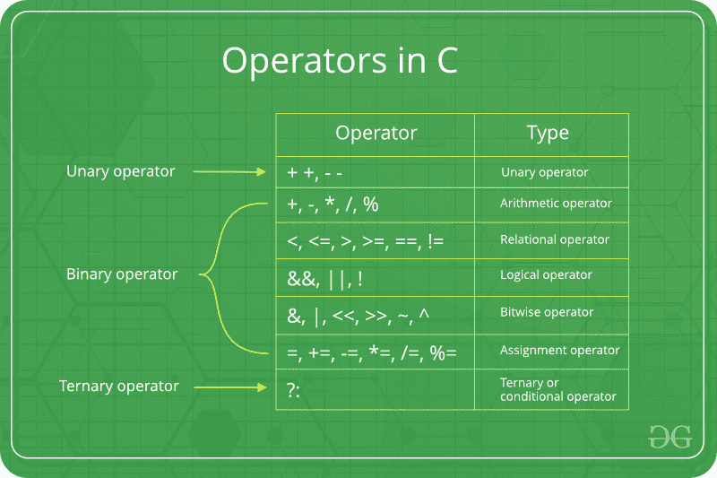

# C/c++

中的运算符

> 原文:[https://www.geeksforgeeks.org/operators-c-c/](https://www.geeksforgeeks.org/operators-c-c/)

**运算符**是任何编程语言的基础。我们可以将运算符定义为符号，帮助我们对操作数执行特定的数学和逻辑计算。换句话说，我们可以说一个运算符操作操作数。例如，'+'是用于加法的运算符，如下所示:

```cpp
c = a + b;
```

这里，'+'是被称为加法运算符的运算符，而' a '和' b '是操作数。加法运算符告诉编译器将操作数“a”和“b”相加。

如果不使用运算符，C/C++ 编程语言的功能是不完整的。

***C/C++ 有很多内置运算符，可以分为 6 种:***

1.  算术运算符
2.  关系运算符
3.  逻辑运算符
4.  按位运算符
5.  赋值运算符
6.  其他操作员



上面已经详细讨论了操作符:

**1。算术运算符:**

这些运算符用于对操作数执行算术/数学运算。示例:(+、-、*、/、%、+、–)。算术运算符有两种类型:

**a)一元运算符**:操作或处理单个操作数的运算符是一元运算符。例如:递增(++)和递减(–)运算符

```cpp
int val = 5;
++ val;  // 6
```

**b)二进制运算符**:操作或处理两个操作数的运算符是二进制运算符。例如:加法(+)、减法(-)、乘法(*)、除法(/)运算符

```cpp
int a = 7;
int b = 2;
cout<<a+b; // 9
```

**2。关系运算符:**

这些用于比较两个操作数的值。例如，检查一个操作数是否等于另一个操作数，一个操作数是否大于另一个操作数，等等。一些关系运算符是(==，> =，<= )(See [本文](https://www.geeksforgeeks.org/operators-in-c-set-2-relational-and-logical-operators/)供更多参考)。

```cpp
int a = 3;
int b = 5;
a < b;
// operator to check if a is smaller than b
```

**3。逻辑运算符:**

逻辑运算符用于组合两个或多个条件/约束，或者补充所考虑的原始条件的评估。逻辑运算符的运算结果是布尔值**真**或**假**。

例如，当考虑的两个条件都满足时，在 C 或 C++ 中表示为**&&的**逻辑与**运算符返回真。否则，它返回 false。因此，当 a 和 b 都为真(即非零)时，a & & b 返回真(更多参考见[这篇](https://www.geeksforgeeks.org/operators-in-c-set-2-relational-and-logical-operators/)文章)。**

```cpp
(4 != 5) && (4 < 5);     // true
```

**4。按位运算符:**

按位运算符用于对操作数执行位级操作。运算符首先转换为位级，然后对操作数执行计算。加法、减法、乘法等数学运算。可以在位级执行，以实现更快的处理。例如，在 C 或 C++ 中表示为 **&运算符的**按位“与”**将两个数字作为操作数，并对两个数字的每一位进行“与”。仅当两位都为 1 时，“与”的结果才为 1。(详见[这篇](https://www.geeksforgeeks.org/interesting-facts-bitwise-operators-c/)文章)。**

```cpp
int a = 5, b = 9;   // a = 5(00000101), b = 9(00001001)
cout << (a ^ b);   //  00001100
cout <<(~a);       // 11111010
```

**5。分配操作员:**

赋值运算符用于给变量赋值。赋值运算符的左侧操作数是一个变量，右侧操作数是一个值。右侧的值必须与左侧的变量具有相同的数据类型，否则编译器将引发错误。

不同类型的赋值运算符如下所示:
**a .“=”:**这是最简单的赋值运算符。该运算符用于将右边的值赋给左边的变量。
例如:

```cpp
a = 10;
b = 20;
ch = 'y';
```

**b .“+=”**:这个运算符是“+”和“=”运算符的组合。该运算符首先将左边变量的当前值与右边的值相加，然后将结果赋给左边的变量。
例如:

```cpp
(a += b) can be written as (a = a + b)
If initially value stored in a is 5\. Then (a += 6) = 11.
```

**c .“-=”**:这个运算符是“-”和“=”运算符的组合。该运算符首先从左边变量的当前值中减去右边的值，然后将结果赋给左边的变量。
例如:

```cpp
(a -= b) can be written as (a = a - b)
If initially value stored in a is 8\. Then (a -= 6) = 2.
```

**d .“* =”**:这个运算符是“*”和“=”运算符的组合。该运算符首先将左边变量的当前值乘以右边的值，然后将结果赋给左边的变量。
例如:

```cpp
(a *= b) can be written as (a = a * b)
If initially, the value stored in a is 5\. Then (a *= 6) = 30.
```

**e .“/=”**:这个运算符是“/”和“=”运算符的组合。该运算符首先将左边变量的当前值除以右边的值，然后将结果赋给左边的变量。
例如:

```cpp
(a /= b) can be written as (a = a / b)
If initially, the value stored in a is 6\. Then (a /= 2) = 3.
```

**6。其他操作员**:

除了上述操作符之外，在 C 或 C++ 中还有一些其他的操作符可以用来执行一些特定的任务。这里讨论了其中的一些:

**a .**[**sizeof operator**](https://www.geeksforgeeks.org/sizeof-operator-c/):

*   sizeof 在 C/C++ 编程语言中被大量使用。
*   它是一个编译时一元运算符，可用于计算其操作数的大小。
*   sizeof 的结果是无符号整数类型，通常用 size_t 表示。
*   基本上，操作符的大小用于计算变量的大小。(参考[这篇](https://www.geeksforgeeks.org/sizeof-operator-c/)文章)

**b.** [**逗号运算符**](https://www.geeksforgeeks.org/comna-in-c-and-c/) :

*   逗号运算符(由标记表示)是一个二进制运算符，它计算第一个操作数并丢弃结果，然后计算第二个操作数并返回该值(和类型)。
*   逗号运算符是所有 C 运算符中优先级最低的。
*   逗号既是运算符又是分隔符。(参考[这篇](https://www.geeksforgeeks.org/comna-in-c-and-c/)文章)

**c.** [**条件运算符**](https://www.geeksforgeeks.org/cc-ternary-operator-some-interesting-observations/) :

*   条件运算符的形式是*表达式 1？表达式 2:表达式 3* 。
*   这里，表达式 1 是要评估的条件。如果条件(表达式 1)为*真*，那么我们将执行并返回表达式 2 的结果；否则，如果条件(表达式 1)为*假*，那么我们将执行并返回表达式 3 的结果。
*   我们可以取代 if 的使用..带有条件运算符的 else 语句。(参考[这篇](https://www.geeksforgeeks.org/cc-ternary-operator-some-interesting-observations/)文章)

### **操作员优先图表**

下表描述了 C / C++ 中运算符的优先顺序和结合性。运算符的优先级从上到下递减。

<figure class="table">T51】+/–2T61】+/–前缀增量~ &=，！ = t245】+=，-=

| order of priority | operational character | explain | associative law |
| --- | --- | --- | --- |
| one | () | Parentheses (function calls) | from left to right |
|  | Parentheses (array subscript) |  |
| Member selection via object name |  |
| -> | Member selection via pointer |  |
| Suffix increment/decrement | T57】 |
| Logic negation/bit complement |  |
| (type) | Cast (Convert value of type to temporary value) |  |
| * | Unreference |  |
| Address (operand) |  |
| 西泽夫 | Determine the size in bytes on this implementation. |  |
| three | *、/、% | Multiplication/division/modulus | From left to right |
| 4 < = | Relationship less than/less than or equal to | about |
| >,> = | Relationship greater than/greater than or equal to | about |
| seven | The relation is equal to/not equal to | From left to right |
| eight | t307 | Bit sum | From left to right |
| nine | ^ | By bit: | Ternary condition | From right to left |
| Fourteen | = | evaluation | From right to left |
| Addition and subtraction assignment | t250 &#124;= | Assignment by bit XOR/XOR |  |
| <> = | Assignment by bit left/right shift |  |
| Fifteen |  | Expression separator | from left to right |

</figure>

如果你发现任何不正确的地方，或者你想分享更多关于上面讨论的话题的信息，请写评论。