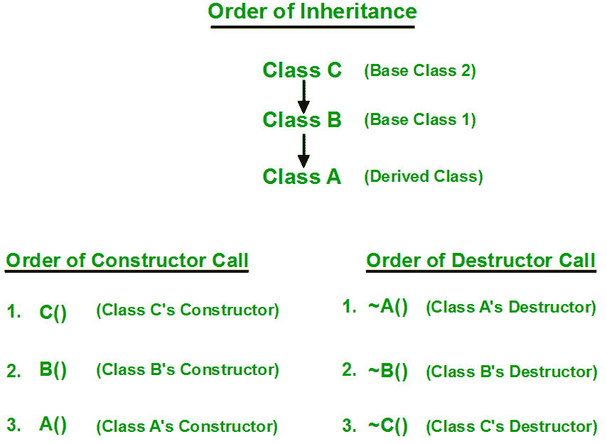

# c++ 中构造函数/析构函数调用的顺序

> 原文:[https://www . geesforgeks . org/order-constructor-destructor-call-c/](https://www.geeksforgeeks.org/order-constructor-destructor-call-c/)

**先决条件:** [构造函数](https://www.geeksforgeeks.org/constructors-c/)
每当我们创建一个类的对象时，该类的默认构造函数都会被自动调用来初始化该类的成员。

如果我们从另一个类继承一个类并创建一个派生类的对象，很明显派生类的默认构造函数将被调用，但在此之前，所有基类的默认构造函数都将被调用，即调用的顺序是首先调用基类的默认构造函数，然后调用派生类的默认构造函数。

**为什么在创建派生类的对象时调用基类的构造函数？**

为了理解这一点，你必须回忆起你对继承的知识。当一个类从其他类继承时会发生什么？基类的数据成员和成员函数根据访问说明符自动出现在派生类中，但是这些成员的定义只存在于基类中。因此，当我们创建派生类的对象时，派生类的所有成员都必须初始化，但是派生类中继承的成员只能由基类的构造函数初始化，因为这些成员的定义只存在于基类中。这就是为什么首先调用**基类的构造函数来初始化所有继承的成员。**

## C++

```cpp
// C++ program to show the order of constructor call
// in single inheritance

#include <iostream>
using namespace std;

// base class
class Parent
{
    public:

    // base class constructor
    Parent()
    {
        cout << "Inside base class" << endl;
    }
};

// sub class
class Child : public Parent
{
    public:

    //sub class constructor
    Child()
    {
        cout << "Inside sub class" << endl;
    }
};

// main function
int main() {

    // creating object of sub class
    Child obj;

    return 0;
}
```

**输出:**

```cpp
Inside base class
Inside sub class
```

**多重继承的构造函数调用顺序**

对于构造函数调用的多重继承顺序为，基类的构造函数按继承顺序调用，然后是派生类的构造函数。

## C++

```cpp
// C++ program to show the order of constructor calls
// in Multiple Inheritance

#include <iostream>
using namespace std;

// first base class
class Parent1
{  

    public:

    // first base class's Constructor   
    Parent1()
    {
        cout << "Inside first base class" << endl;
    }
};

// second base class
class Parent2
{
    public:

    // second base class's Constructor
    Parent2()
    {
        cout << "Inside second base class" << endl;
    }
};

// child class inherits Parent1 and Parent2
class Child : public Parent1, public Parent2
{
    public:

    // child class's Constructor
    Child()
    {
        cout << "Inside child class" << endl;
    }
};

// main function
int main() {

    // creating object of class Child
    Child obj1;
    return 0;
}
```

**输出:**

```cpp
Inside first base class
Inside second base class
Inside child class
```

**构造函数和析构函数调用给定继承顺序的顺序**



**如何在派生类构造函数中调用基类的参数化构造函数？**

要在调用派生类的参数化构造函数时调用基类的参数化构造函数，必须在派生类中显式指定基类的参数化构造函数，如下程序所示:

## C++

```cpp
// C++ program to show how to call parameterised Constructor
// of base class when derived class's Constructor is called

#include <iostream>
using namespace std;

// base class
class Parent {
    int x;

public:
    // base class's parameterised constructor
    Parent(int i)
    {
        x = i;
        cout << "Inside base class's parameterised "
                "constructor"
             << endl;
    }
};

// sub class
class Child : public Parent {
public:
    // sub class's parameterised constructor
    Child(int x): Parent(x)
    {
        cout << "Inside sub class's parameterised "
                "constructor"
             << endl;
    }
};

// main function
int main()
{

    // creating object of class Child
    Child obj1(10);
    return 0;
}
```

**输出:**

```cpp
Inside base class's parameterised constructor
Inside sub class's parameterised constructor
```

**要点**:

*   每当调用派生类的默认构造函数时，都会自动调用基类的默认构造函数。
*   要在子类的参数化构造函数中调用基类的参数化构造函数，我们必须明确提到它。
*   基类的参数化构造函数不能在子类的默认构造函数中调用，应该在子类的参数化构造函数中调用。

C++ 中的 [**【析构函数】**](https://www.geeksforgeeks.org/destructors-c/) 的调用顺序与构造函数相反。
本文由**阿比拉夫·卡里亚**[和**哈什·阿加瓦尔**](https://www.facebook.com/harsh.agarwal.16752) 供稿。如果你喜欢 GeeksforGeeks 并想投稿，你也可以使用[write.geeksforgeeks.org](http://www.write.geeksforgeeks.org)写一篇文章或者把你的文章邮寄到 review-team@geeksforgeeks.org。看到你的文章出现在极客博客主页上，帮助其他极客。
如果发现有不正确的地方，或者想分享更多关于上述话题的信息，请写评论。