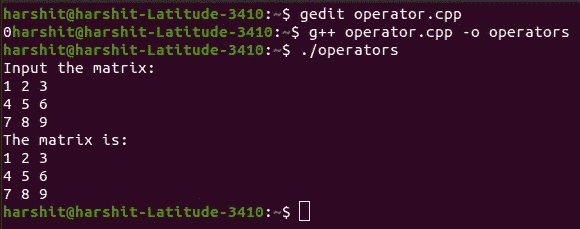

# c++中函数调用运算符的重载

> 原文:[https://www . geeksforgeeks . org/overload-of-function-call-operator-in-CPP/](https://www.geeksforgeeks.org/overloading-of-function-call-operator-in-cpp/)

在本文中，我们将讨论 [C++](https://www.geeksforgeeks.org/c-plus-plus/) 中函数调用运算符的[重载](https://www.geeksforgeeks.org/function-overloading-c/)。

*   [函数调用运算符](https://www.geeksforgeeks.org/operator-overloading-c/)用**“()”**表示，用于调用函数和传递参数。它被称为**函数对象**的类的实例重载。
*   当函数调用运算符重载时，将创建一个可用于传递参数的运算符函数。
*   它修改了对象获取运算符的方式。
*   在[面向对象语言](https://www.geeksforgeeks.org/object-oriented-programming-in-cpp/)中，运算符()可以被视为普通运算符，类类型的[对象可以像对任何其他重载运算符进行函数调用一样调用函数(命名为**运算符()**)。](https://www.geeksforgeeks.org/c-classes-and-objects/)
*   当函数调用运算符重载时，不会创建调用函数的新方法，而是创建一个可以传递任意数量参数的**运算符()函数**。

**程序:**

下面是使用[友元函数](https://www.geeksforgeeks.org/friend-class-function-cpp/)在矩阵中进行输入的程序，首先重载[插入算子](https://www.geeksforgeeks.org/overloading-stream-insertion-operators-c/)和[提取算子](https://www.geeksforgeeks.org/overloading-stream-insertion-operators-c/)，然后重载算子()为矩阵的 **i <sup>第</sup>行**和 **j <sup>第</sup>列**进行输入，并在 **i <sup>第</sup>行**和 **j <sup>处显示值</sup>**

## C++

```
// C++ program to illustrate the
// above concepts
#include <bits/stdc++.h>
#include <iostream>
using namespace std;
#define N 3
#define M 3

// Matrix Class
class Matrix {
private:
    int arr[N][M];

public:
    // Overloading of input stream
    friend istream& operator>>(
        istream&, Matrix&);

    // Overloading of output stream
    friend ostream& operator<<(
        ostream&, Matrix&);
    int& operator()(int, int);
};

// Function to overload the input
// ">>" operator
istream& operator>>(istream& cin,
                    Matrix& m)
{
    int x;
    for (int i = 0; i < N; i++) {
        for (int j = 0; j < M; j++) {
            // Overloading operator()
            // to take input
            cin >> m(i, j);
        }
    }
    return cin;
}

// Function to overload the output
// "<<" operator
ostream& operator<<(ostream& cout,
                    Matrix& m)
{
    for (int i = 0; i < N; i++) {
        for (int j = 0; j < M; j++) {

            // Overloading operator() to
            // take input m.operator()(i, j);
            cout << m(i, j) << " ";
        }
        cout << endl;
    }
    return cout;
}

// Function to call the operator
// function to overload the operators
int& Matrix::operator()(int i, int j)
{
    return arr[i][j];
}

// Driver Code
int main()
{
    Matrix m;

    printf("Input the matrix:\n");

    // Compiler calls operator >> and
    // passes object cin and object m
    // as parameter operator>>(cin, m);
    cin >> m;

    printf("The matrix is:\n");
    // Compiler calls operator << and
    // passes object cout and object m
    // as parameter operator<<(cin, m);
    cout << m;

    return 0;
}
```

**输出:**
[](https://media.geeksforgeeks.org/wp-content/cdn-uploads/20210416101101/Function-call-overloading.jpg)