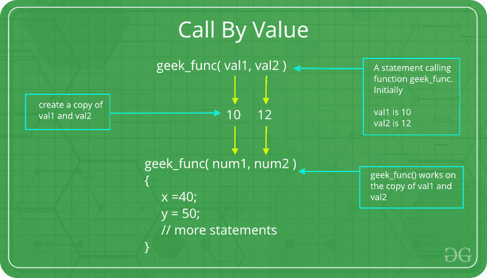
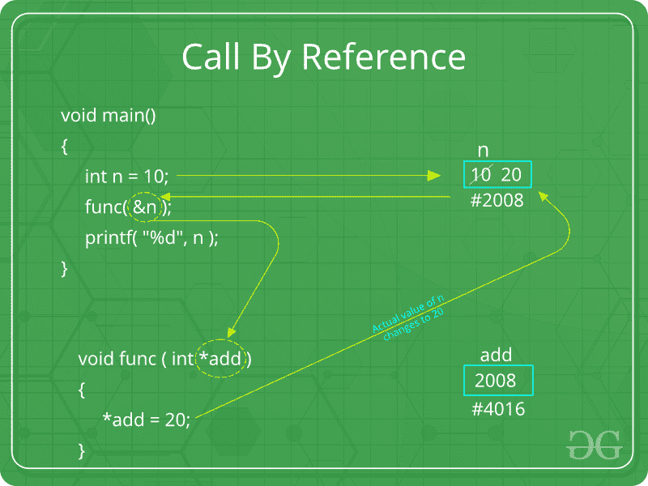

# C/c++ 中的参数传递技术

> 原文:[https://www . geesforgeks . org/parameter-passing-technologies-in-c-CPP/](https://www.geeksforgeeks.org/parameter-passing-techniques-in-c-cpp/)

参数数据可以通过不同的方式传入和传出方法和函数。让我们假设一个函数 *B()* 是从另一个函数 *A()* 调用的。在这种情况下 *A* 被称为 ***【调用者函数】****B*被称为 ***【被调用者函数或被调用者函数】*** 。并且 *A* 发送给 *B* 的参数称为*实际参数*， *B* 的参数称为*形式参数*。

**术语**

*   **形式参数:**出现在函数或方法原型中的变量及其类型。
*   **实际参数:**在调用环境中出现在函数或方法调用中的形式参数对应的变量或表达式。
*   **模式:**
    *   **输入:**将信息从呼叫者传递给被呼叫者。
    *   **OUT:** 被调用者在调用者中写入值。
    *   **输入/输出:**调用者告诉被调用者变量的值，被调用者可以更新该值。

**参数传递的重要方法**

1.  **通过值:**该方法使用 *in-mode* 语义。对形式参数所做的更改不会传回给调用者。对被调用函数或方法内部的形式参数变量的任何修改只影响单独的存储位置，不会反映在调用环境中的实际参数中。此法又称***按值调用*** 。



## C++

```cpp
// C++ program to illustrate
// call by value
#include <iostream>
using namespace std;

void func(int a, int b)
{
    a += b;
    cout <<"In func, a = " << a << " b = "<< b << endl;
}
int main(void)
{
    int x = 5, y = 7;

    // Passing parameters
    func(x, y);
    cout << "In main, x = " << x << " y = " << y;
    return 0;
}

// This code is contributed by shivanisinghss2110
```

## C

```cpp
// C program to illustrate
// call by value
#include <stdio.h>

void func(int a, int b)
{
    a += b;
    printf("In func, a = %d b = %d\n", a, b);
}
int main(void)
{
    int x = 5, y = 7;

    // Passing parameters
    func(x, y);
    printf("In main, x = %d y = %d\n", x, y);
    return 0;
}
```

1.  输出:

```cpp
In func, a = 12 b = 7
In main, x = 5 y = 7
```

1.  像 C、C++、Java 这样的语言都支持这种类型的参数传递。 [Java 实际上是严格按值调用的。](https://www.geeksforgeeks.org/g-fact-31-java-is-strictly-pass-by-value/)
    **缺点:**
    *   存储分配效率低
    *   对于对象和数组，复制语义成本很高
2.  **通过引用传递(别名):**该技术使用*入/出模式*语义。对形式参数所做的更改确实会通过参数传递传递回调用方。对形式参数的任何更改都会反映在调用环境中的实际参数中，因为形式参数接收对实际数据的引用(或指针)。这个方法也被称为**引用调用**。这种方法在时间和空间上都是有效的。



## C++

```cpp
// C++ program to illustrate
// call by reference
#include <iostream.h>
using namespace std;

void swapnum(int* i, int* j)
{
    int temp = *i;
    *i = *j;
    *j = temp;
}

int main(void)
{
    int a = 10, b = 20;

    // passing parameters
    swapnum(&a, &b);

    cout <<"a is " << a <<" and b is "<< b;
    return 0;
}

// this code is contributed by shivanisinghss2110
```

## C

```cpp
// C program to illustrate
// call by reference
#include <stdio.h>

void swapnum(int* i, int* j)
{
    int temp = *i;
    *i = *j;
    *j = temp;
}

int main(void)
{
    int a = 10, b = 20;

    // passing parameters
    swapnum(&a, &b);

    printf("a is %d and b is %d\n", a, b);
    return 0;
}
```

1.  输出:

```cpp
a is 20 and b is 10
```

1.  C 和 C++ 都支持按值调用和按引用调用，而 Java 不支持按引用调用。
    **缺点:**
    *   可能会出现许多潜在的情况
    *   程序有时很难理解

**参数传递的其他方法**

这些技术比较古老，曾用于早期的编程语言，如 Pascal、Algol 和 Fortran。这些技术不适用于高级语言。

1.  **通过结果:**该方法使用*出模*语义。就在控制权转移回调用方之前，形式参数的值被传输回实际参数。他的方法有时被称为*按结果调用*。一般来说，传递结果技术是通过复制实现的。

2.  **通过值-结果传递:**该方法使用*进/出模式*语义。它是按值传递和按结果传递的组合。就在控制转移回调用方之前，形式参数的值被传输回实际参数。这种方法有时被称为*价值结果调用*
3.  **按名称传递:**这种技巧用于编程语言，如 ***【阿尔戈尔】*** 。在这种技术中，变量的符号“*名称*”被传递，这允许它被访问和更新。
    示例:
    要将*C【j】*的值翻倍，可以将其名称(不是其值)传入以下程序。

```cpp
procedure double(x);
  real x;
begin 
  x:=x*2
end;
```

1.  通常，按名称传递的效果是用过程调用中的参数替换过程主体中的相应参数。
    按名称传递机制的含义:
    *   每次传递形式参数时，都会重新计算参数表达式。
    *   该过程可以更改参数表达式中使用的变量值，从而更改表达式的值。

This article is contributed by **Krishna Bhatia**. If you like GeeksforGeeks and would like to contribute, you can also write an article using [write.geeksforgeeks.org](http://www.write.geeksforgeeks.org) or mail your article to review-team@geeksforgeeks.org. See your article appearing on the GeeksforGeeks main page and help other Geeks. Please write comments if you find anything incorrect, or you want to share more information about the topic discussed above.