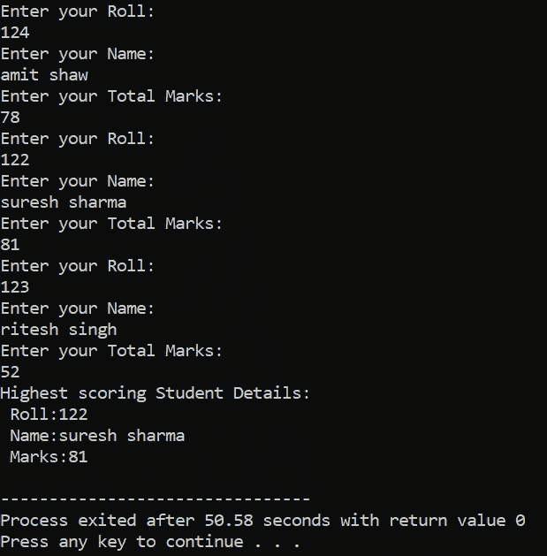

# 在 C++中将对象数组作为参数传递

> 原文:[https://www . geesforgeks . org/passing-array-of-objects-as-in-c 参数/](https://www.geeksforgeeks.org/passing-array-of-objects-as-parameter-in-c/)

[**物阵**](https://www.geeksforgeeks.org/how-to-create-array-of-objects-in-java/) **:** 这是一个 [物阵](https://www.geeksforgeeks.org/introduction-to-arrays/) ，其元素属于 [类](https://www.geeksforgeeks.org/c-classes-and-objects/) 类型。它可以声明为任意 [数据类型](https://www.geeksforgeeks.org/c-data-types/) 的数组。

**语法:**

> class name array _ name[size]；

下面是 [C++](https://www.geeksforgeeks.org/c-plus-plus/) 程序，通过计算 3 个学生的最高分来说明对象的数组:

## C++

```cpp
// C++ program to illustrate the
// passing the array of objects
// to function parameter
#include <bits/stdc++.h>
using namespace std;

// Class Student
class Student {
    int roll;
    char name[50];
    int total;

public:
    // Function to input Roll Number
    void getdata()
    {
        cout << "Enter your Roll: "
             << endl;
        cin >> roll;
        cout << "Enter your Name: "
             << endl;
        cin.ignore();
        cin.get(name, 50);
        cout << "Enter your Total "
             << "Marks: " << endl;
        cin >> total;
    }

    // Function to pass the array of
    // objects
    int pos(Student obj[], int size)
    {
        int pos = 0;
        int max = obj[0].total;

        // Traverse the array of object
        for (int i = 0; i < size; i++) {
            if (obj[i].total > max) {
                max = obj[i].total;
                pos = i;
            }
        }
        return pos;
    }

    // Function to display the students
    // details
    void putdata()
    {
        cout << "Roll: " << roll
             << endl;
        cout << "Name: " << name
             << endl;
        cout << "Total Marks: "
             << total << endl;
    }
};

// Function that have array of objects
void arrayOfObjects()
{
    Student s[3], s1;
    int pos;
    for (int i = 0; i < 3; i++) {
        s[i].getdata();
    }
    pos = s1.pos(s, 3);
    cout << "Highest scoring Student"
         << " Details:" << endl;
    s[pos].putdata();
    return 0;
}

// Driver Code
int main()
{
    // Function Call
    arrayOfObejects();

    return 0;
}
```

**输出:**

[](https://media.geeksforgeeks.org/wp-content/uploads/20210121141037/output.jpg)

**<u>解说</u> :**

*   在 [**主()**](https://www.geeksforgeeks.org/executing-main-in-c-behind-the-scene/) 中，创建了学生类的功能对象:
    *   这里，对象的第一个数组是**s【3】**，另一个是 **s1** (一个简单的对象)。
    *   在 for 循环中，已经进行了 3 组用户输入(即，用户将在此输入 3 组学生的姓名、姓名、总成绩)。
    *   然后通过 **pos(Student obj []，int size)** 成员函数中的 **s1** 对象传递 **s[3]** (包含学生详细信息集的对象数组)及其大小。
*   **pos(Student obj []，int size)** 功能，返回学生集合总分最高的对象的位置，即 **s[3]** 对象数组的(0，1 或 2)索引位置，存储在 **pos = s1.pos(s，3)** 中。
*   **显示部分:**调用显示功能，**S【pos】。使用 putdata()** 。
    *   ****putdata()****功能是显示学生班级的对象详情。****
    *   ****在这里， **pos** 在 **s** 发送(存储最高学生集合对象的索引位置)，显示总分最高的学生详细信息。****