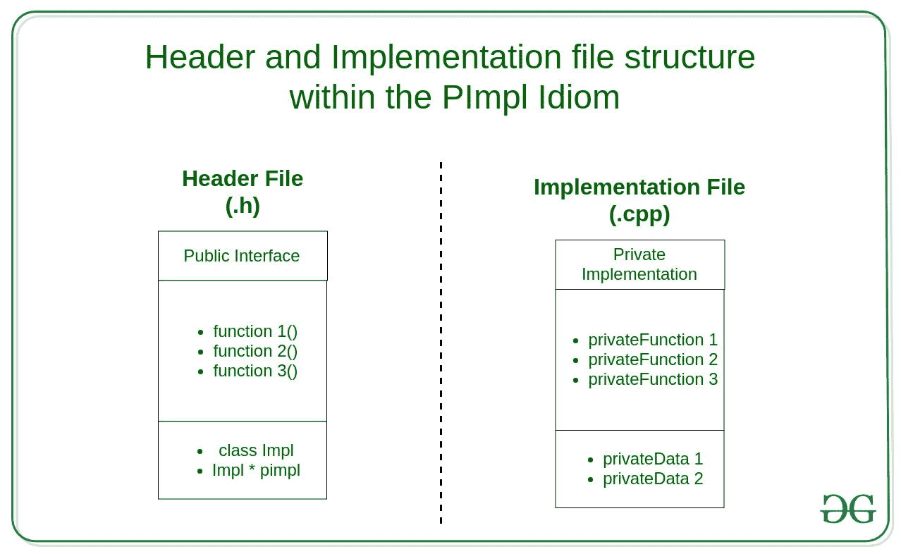

# c++中的 PImpl 成语，附示例

> 原文:[https://www . geeksforgeeks . org/pimpl-成语-in-c-with-examples/](https://www.geeksforgeeks.org/pimpl-idiom-in-c-with-examples/)

当对[头文件](https://www.geeksforgeeks.org/difference-header-file-library/)进行更改时，包括它在内的所有源都需要重新编译。在大型项目和库中，这可能会导致构建时间问题，因为即使对实现进行了小的更改，每个人也必须等待一段时间，直到他们编译自己的代码。解决这个问题的一种方法是使用***puppl 成语*** ，其中**将实现隐藏在头文件中，并包含一个可以立即编译的接口文件**。

PImpl 习语 ***(指向实现的指针)*** 是一种用于将实现与接口分离的技术。它通过将私有数据成员移动到一个单独的类中，并通过一个[不透明指针](https://www.geeksforgeeks.org/opaque-pointer/)来访问它们，最大限度地减少了头文件暴露，并帮助程序员减少构建依赖。



**<u>如何实现:</u>**

1.  创建一个单独的类 ***(或结构体)*** 来实现
2.  将头文件中的所有私有成员放入该类。
3.  在头文件中定义一个实现类。
4.  在头文件中创建一个正向声明 ***(一个指针)*** ，指向实现类。
5.  定义一个 ***析构器*** 和一个**副本/赋值** ***操作符*** 。

显式声明析构函数的原因是，在编译时，智能指针(***【STD::unique _ ptr】***)会检查类型定义中是否存在可见的析构函数，如果只是正向声明，则会引发编译错误。

使用智能指针是一种更好的方法，因为指针控制了皮条客的生命周期。

**<u>例:</u>**

*   头文件中包含的类定义是类的公共接口。
*   我们定义一个唯一的指针，而不是原始指针，因为接口类型的对象负责对象的生存期。
*   由于 ***std::unique_ptr*** 是一个完整的类型，它需要一个用户声明的析构函数和复制/赋值操作符来完成实现类。
*   从用户的角度来看，拉皮条是透明的。在内部，对实现结构所做的更改只影响包含它的文件 ***(User.cpp)*** 。这意味着用户不需要重新编译就可以应用这些更改。

## 头文件

```cpp
/* |INTERFACE| User.h file */

#pragma once
#include <memory> // PImpl
#include <string>
using namespace std;

class User {
public:
    // Constructor and Destructors

    ~User();
    User(string name);

    // Assignment Operator and Copy Constructor

    User(const User& other);
    User& operator=(User rhs);

    // Getter
    int getSalary();

    // Setter
    void setSalary(int);

private:
    // Internal implementation class
    class Impl;

    // Pointer to the internal implementation
    unique_ptr<Impl> pimpl;
};
```

## 实现文件

```cpp
/* |IMPLEMENTATION| User.cpp file */

#include "User.h"
#include <iostream>
using namespace std;

struct User::Impl {

    Impl(string name)
        : name(name){};

    ~Impl();

    void welcomeMessage()
    {
        cout << "Welcome, "
             << name << endl;
    }

    string name;
    int salary = -1;
};

// Constructor connected with our Impl structure
User::User(string name)
    : pimpl(new Impl(name))
{
    pimpl->welcomeMessage();
}

// Default Constructor
User::~User() = default;

// Assignment operator and Copy constructor

User::User(const User& other)
    : pimpl(new Impl(*other.pimpl))
{
}

User& User::operator=(User rhs)
{
    swap(pimpl, rhs.pimpl);
    return *this;
}

// Getter and setter
int User::getSalary()
{
    return pimpl->salary;
}

void User::setSalary(int salary)
{
    pimpl->salary = salary;
    cout << "Salary set to "
         << salary << endl;
}
```

**<u>皮条客的优势:</u>**

*   **二进制兼容**:二进制接口独立于私有字段。对实现进行更改不会破坏相关代码。
*   **编译时间**:编译时间下降是因为只需要重新构建实现文件，而不是每个客户端都重新编译自己的文件。
*   **数据隐藏**:可以轻松隐藏某些内部细节，比如实现技术和其他用于实现公共接口的库。

**<u>皮条客的劣势:</u>**

*   **内存管理**:与默认结构相比，由于更多的内存分配，内存使用可能会增加，这在嵌入式软件开发中至关重要。
*   **维护努力**:由于为了使用 pimpl 和附加指针间接 ***(接口只能通过指针/引用使用)*** 而增加了类，维护变得更加复杂。
*   **继承**:隐藏实现不能被继承，虽然一个类 PImpl 可以。

**参考:**[<u>https://en.cppreference.com/w/cpp/language/pimpl</u>](https://en.cppreference.com/w/cpp/language/pimpl)