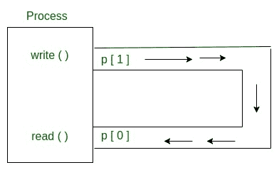
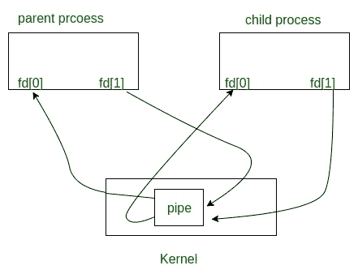

# 管道()系统调用

> 原文:[https://www.geeksforgeeks.org/pipe-system-call/](https://www.geeksforgeeks.org/pipe-system-call/)

**先决条件:** [输入输出系统调用](https://www.geeksforgeeks.org/input-output-system-calls-c-create-open-close-read-write/)

从概念上讲，管道是两个过程之间的连接，这样一个过程的标准输出就变成了另一个过程的标准输入。在 UNIX 操作系统中，管道对于相关进程之间的通信(进程间通信)非常有用。

*   管道只是单向通信，也就是说，我们可以使用管道，这样一个进程向管道写入，另一个进程从管道读取。它打开一个管道，这是主内存的一个区域，被视为 ***【虚拟文件】*** 。
*   创建进程及其所有子进程都可以使用该管道进行读写。一个进程可以写入这个“虚拟文件”或管道，另一个相关进程可以从中读取。
*   如果一个进程试图在向管道写入内容之前进行读取，那么该进程将被挂起，直到写入内容。
*   The pipe system call finds the first two available positions in the process’s open file table and allocates them for the read and write ends of the pipe.

    [](https://media.geeksforgeeks.org/wp-content/uploads/Process.jpg)
    **C 语言语法:**

    ```
    int pipe(int fds[2]);

    Parameters :
    fd[0] will be the fd(file descriptor) for the 
    read end of pipe.
    fd[1] will be the fd for the write end of pipe.
    Returns : 0 on Success.
    -1 on error.
    ```

    管道表现为**先进先出**(先进先出)，管道表现为一个**队列**数据结构。这里读写大小不必匹配。我们可以一次写入 **512** 个字节，但在管道中一次只能读取 1 个字节。

    ```
    // C program to illustrate
    // pipe system call in C
    #include <stdio.h>
    #include <unistd.h>
    #define MSGSIZE 16
    char* msg1 = "hello, world #1";
    char* msg2 = "hello, world #2";
    char* msg3 = "hello, world #3";

    int main()
    {
        char inbuf[MSGSIZE];
        int p[2], i;

        if (pipe(p) < 0)
            exit(1);

        /* continued */
        /* write pipe */

        write(p[1], msg1, MSGSIZE);
        write(p[1], msg2, MSGSIZE);
        write(p[1], msg3, MSGSIZE);

        for (i = 0; i < 3; i++) {
            /* read pipe */
            read(p[0], inbuf, MSGSIZE);
            printf("% s\n", inbuf);
        }
        return 0;
    }
    ```

    **输出:**

    ```
    hello, world #1
    hello, world #2
    hello, world #3

    ```

    **父子共用一根管道**

    当我们在任何进程中使用[分叉](https://www.geeksforgeeks.org/fork-system-call/)时，文件描述符在子进程和父进程中保持打开。如果我们在创建管道后调用 fork，那么父节点和子节点可以通过管道进行通信。

    [](https://media.geeksforgeeks.org/wp-content/uploads/sharing-pipe.jpg)

    **输出以下程序。**

    ```
    // C program to illustrate
    // pipe system call in C
    // shared by Parent and Child
    #include <stdio.h>
    #include <unistd.h>
    #define MSGSIZE 16
    char* msg1 = "hello, world #1";
    char* msg2 = "hello, world #2";
    char* msg3 = "hello, world #3";

    int main()
    {
        char inbuf[MSGSIZE];
        int p[2], pid, nbytes;

        if (pipe(p) < 0)
            exit(1);

        /* continued */
        if ((pid = fork()) > 0) {
            write(p[1], msg1, MSGSIZE);
            write(p[1], msg2, MSGSIZE);
            write(p[1], msg3, MSGSIZE);

            // Adding this line will
            // not hang the program
            // close(p[1]);
            wait(NULL);
        }

        else {
            // Adding this line will
            // not hang the program
            // close(p[1]);
            while ((nbytes = read(p[0], inbuf, MSGSIZE)) > 0)
                printf("% s\n", inbuf);
            if (nbytes != 0)
                exit(2);
            printf("Finished reading\n");
        }
        return 0;
    }
    ```

    **输出:**

    ```
    hello world, #1
    hello world, #2
    hello world, #3
    (hangs)         //program does not terminate but hangs

    ```

    在这里，在这段代码中，读/写完成后，父进程和子进程都会阻塞，而不是终止进程，这就是程序挂起的原因。发生这种情况是因为读取系统调用获取的数据与它请求的一样多，或者与管道获取的数据一样多，以较少者为准。

    *   如果管道为空，我们调用 read 系统调用，那么如果没有进程打开写端，管道上的 Reads 将返回 **EOF(返回值 0)** 。
    *   如果某个其他进程打开管道进行写入，read 将在预期新数据时阻塞，因此此代码输出挂起，因为这里 write 结束父进程，子进程也不会关闭。

    关于父子共享管道的更多细节，请参考 [C 程序演示 fork()和 pipe()](https://www.geeksforgeeks.org/c-program-demonstrate-fork-and-pipe/) 。

    本文由 **[卡丹·帕特尔](https://www.facebook.com/kadam.patel.750?hc_ref=NEWSFEED)** 供稿。如果你喜欢 GeeksforGeeks 并想投稿，你也可以使用[contribute.geeksforgeeks.org](http://www.contribute.geeksforgeeks.org)写文章或者把你的文章邮寄到 contribute@geeksforgeeks.org。看到你的文章出现在极客博客主页上，帮助其他极客。

    如果你发现任何不正确的地方，或者你想分享更多关于上面讨论的话题的信息，请写评论。