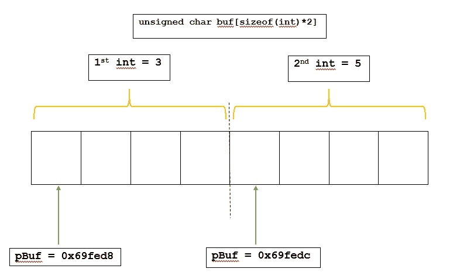
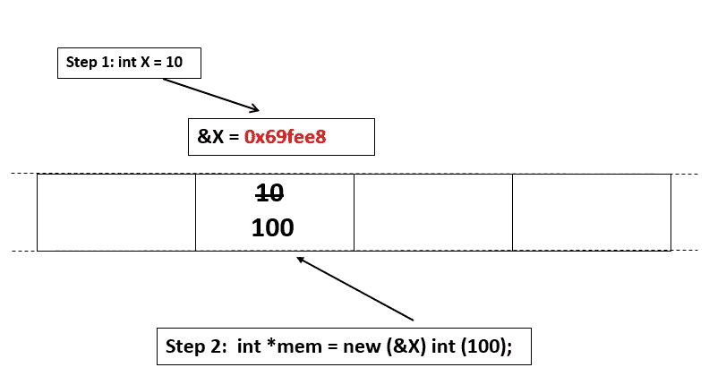

# 在 C++中放置新运算符

> 原文:[https://www.geeksforgeeks.org/placement-new-operator-cpp/](https://www.geeksforgeeks.org/placement-new-operator-cpp/)

Placement new 是 C++中的一个变体 [new](https://www.geeksforgeeks.org/malloc-vs-new/) 运算符。普通的新运算符做两件事:(1)分配内存(2)在分配的内存中构造一个对象。
放置新允许我们将以上两件事分开。在 placement new 中，我们可以传递一个预分配的内存，并在传递的内存中构造一个对象。

**新 vs 放置新**

*   普通 new 在堆中分配内存并在那里构造对象，而使用**放置 new** ，对象构造可以在**已知地址**完成。
*   对于普通 new，不知道它指向什么地址或存储位置，而当**使用放置 new 时，它指向的地址或存储位置是已知的。**
*   当分配由 new 完成但没有放置删除时，使用 [delete](https://www.geeksforgeeks.org/g-fact-30//) 操作完成解除分配，但是如果需要，可以在[析构函数](https://www.geeksforgeeks.org/playing-with-destructors-in-c/)的帮助下写入

**语法:**

```
new (address) (type) initializer
As we can see, we can specify an address
where we want a new object of given type 
to be constructed.
```

**什么时候更喜欢使用放置新？**

因为它允许在已经分配的内存上构造一个对象，所以需要进行优化，因为不总是重新分配会更快。可能会有需要多次重新构造对象的情况，因此在这些情况下，放置新的运算符可能更有效。

## 卡片打印处理机（Card Print Processor 的缩写）

```
// C++ program to illustrate the placement new operator
#include<iostream>
using namespace std;

int main()
{
    // buffer on stack
    unsigned char buf[sizeof(int)*2] ;

    // placement new in buf
    int *pInt = new (buf) int(3);

    int *qInt = new (buf + sizeof (int)) int(5);
    int *pBuf = (int*)(buf+0) ;
    int *qBuf = (int*) (buf + sizeof(int));
    cout << "Buff Addr             Int Addr" << endl;
    cout << pBuf <<"             " << pInt << endl;
    cout << qBuf <<"             " << qInt << endl;
    cout << "------------------------------" << endl;
    cout << "1st Int             2nd Int" << endl;
    cout << *pBuf << "                         "
         << *qBuf << endl;

    return 0;
}
```

输出:

```
Buff Addr              Int Addr
0x69fed8               0x69fed8
0x69fedc               0x69fedc
------------------------------
1st Int                2nd Int
3                      5
```

下图形象地显示了上述 C++程序中实际发生的情况。



下面是 C++中另一个简单的**实现，以说明在 C++中放置 new 的使用:** 

## **卡片打印处理机（Card Print Processor 的缩写）**

```
// C++ program to illustrate the placement new operator
#include<iostream>
using namespace std;
int main()
{
    // initial value of X
    int X = 10;

    cout << "Before placement new :" << endl;
    cout << "X : " << X << endl;
    cout << "&X : " << &X << endl;

    // Placement new changes the value of X to 100
    int *mem = new (&X) int(100);

    cout << "\nAfter placement new :" << endl;
    cout << "X : " << X << endl;
    cout << "mem : " << mem << endl;
    cout << "&X : " << &X << endl;

    return 0;
}
```

**输出:** 

```
Before placement new :
X : 10
&X : 0x69fee8

After placement new :
X : 100
mem : 0x69fee8
&X : 0x69fee8
```

****说明:**在这里，很明显 **x** 的新值是在 **x** 的地址上借助放置新操作符分配的。这一点可以通过 **& X** 和 **mem** 的值相等这一事实来明确。
下图形象地展示了上述 C++程序中实际发生的事情。** 

****

****如何删除放置新分配的内存？****

**delete 运算符只能删除堆中创建的存储，因此当使用 placement new 时，delete 运算符不能用于删除存储。在使用 placement new 运算符进行内存分配的情况下，由于它是在**堆栈**中创建的，编译器知道何时删除它，并将自动处理内存的解除分配。如果需要，可以借助[析构函数](https://www.geeksforgeeks.org/playing-with-destructors-in-c/)编写，如下图。** 

## **卡片打印处理机（Card Print Processor 的缩写）**

```
// C++ program to illustrate using destructor for
// deleting memory allocated by placement new
#include<iostream>
#include<cstdlib>
#include<cmath>
using namespace std;

class Complex
{
private:
    double re_, im_;
public:
    // Constructor
    Complex(double re = 0, double im = 0): re_(re), im_(im)
    {
        cout << "Constructor : (" << re_
             << ", " << im_ << ")" << endl;
    }

    // Destructor
    ~Complex()
    {
        cout << "Destructor : (" << re_ << ", "
             << im_ << ")" << endl;
    }

    double normal()
    {
        return sqrt(re_*re_ + im_*im_);
    }

    void print()
    {
        cout << "|" << re_ <<" +j" << im_
             << " | = " << normal() << endl;
    }
};

// Driver code
int main()
{
    // buffer on stack
    unsigned char buf[100];

    Complex* pc = new Complex(4.2, 5.3);
    Complex* pd = new Complex[2];

    // using placement new
    Complex *pe = new (buf) Complex(2.6, 3.9);

    // use objects
    pc -> print();
    pd[0].print();
    pd[1].print();
    pe->print();

    // Release objects
    // calls destructor and then release memory
    delete pc;

    // Calls the destructor for object pd[0]
    // and then release memory
    // and it does same for pd[1]
    delete [] pd;

    // No delete : Explicit call to Destructor.
    pe->~Complex();

    return 0;
}
```

**输出:** 

```
Constructor : (4.2, 5.3)
Constructor : (0, 0)
Constructor : (0, 0)
Constructor : (2.6, 3.9)
|4.2 +j5.3 | = 6.7624
|0 +j0 | = 0
|0 +j0 | = 0
|2.6 +j3.9 | = 4.68722
Destructor : (4.2, 5.3)
Destructor : (0, 0)
Destructor : (0, 0)
Destructor : (2.6, 3.9)
```

****解释:**这里析构函数是显式调用的，因为在这里它不能封装在 delete 操作符中，因为 delete 需要释放你在这里没有的内存，它不能是隐式的，因为它是一个动态的过程，我们想自己管理。** 

****落点新算子什么时候会出现分割故障？****

**应小心使用新操作员。传递的地址可以是指向有效存储位置的引用或指针。当传递的地址为:
时，可能会显示错误**

*   **指针，如空指针。**
*   **不指向任何位置的指针。**
*   **除非指向某个位置，否则它不能是空指针。**

## **卡片打印处理机（Card Print Processor 的缩写）**

```
// C++ program to illustrate segmentation fault
// while using placement new operator
#include<iostream>
using namespace std;

int main()
{
    // Fine
    int i = 10;
    int *ipt = &i ;
    int *i1 = new(ipt) int(9) ;

    // Incorrect as ip may not
    // be a valid address
    int *ip;
    int *i2 = new(ip) int(4) ;

    // Fine
    void *vd = &i;
    int *i3 = new(vd) int(34) ;

    // Incorrect as x is not an address
    int x;
    int *i5 = new(x) int(3) ;

    return 0;
}
```

```
Segmentation fault
```

****放置新操作员相对于新操作员的优势****

*   **内存分配的地址在手之前就是**已知的**。**
*   **在构建内存池、垃圾收集器或者仅仅在性能和异常安全是最重要的时候非常有用。**
*   **没有分配失败的危险，因为内存已经被分配了，在预先分配的缓冲区上构造一个对象花费的时间更少。**
*   **在资源有限的环境中工作时，此功能变得非常有用。**

**本文由 MAZHAR IMAM KHAN 供稿。如果你喜欢 GeeksforGeeks 并想投稿，你也可以用[write.geeksforgeeks.org](http://www.write.geeksforgeeks.org)写一篇文章或者把你的文章邮寄到 review-team@geeksforgeeks.org。看到你的文章出现在极客博客主页上，帮助其他极客。
如果你发现任何不正确的地方，或者你想分享更多关于上面讨论的话题的信息，请写评论。**