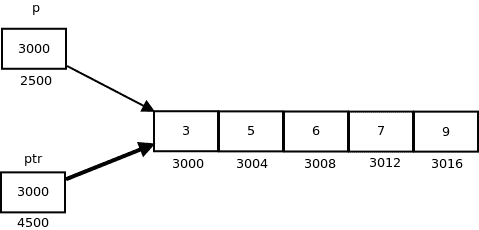
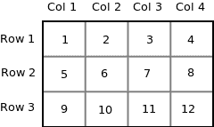
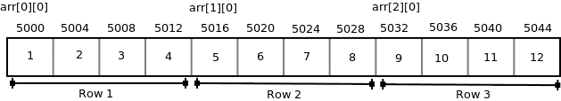
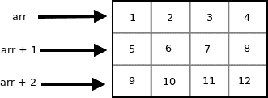
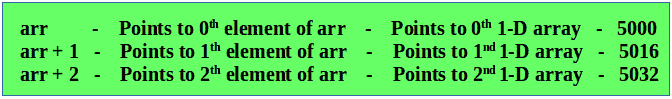
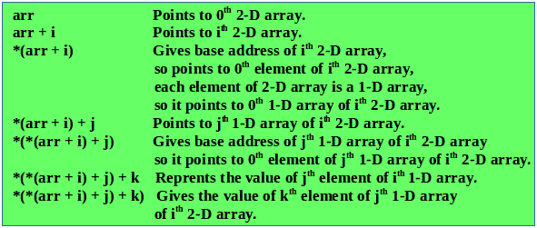
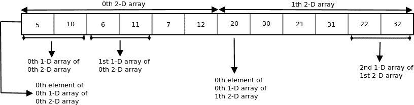
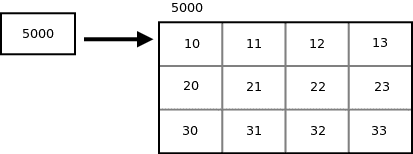

# 指向数组的指针|数组指针

> 原文:[https://www.geeksforgeeks.org/pointer-array-array-pointer/](https://www.geeksforgeeks.org/pointer-array-array-pointer/)

先决条件:[指针介绍](https://www.geeksforgeeks.org/pointers-in-c-and-c-set-1-introduction-arithmetic-and-array/)

**指向数组的指针**

考虑以下程序:

## C++

```cpp
#include <iostream>
using namespace std;

int main()
{
int arr[5] = { 1, 2, 3, 4, 5 };
int *ptr = arr;

cout <<"\n"<< ptr;
return 0;
}

// thus code is contributed by shivanisinghss2110
```

## C

```cpp
#include<stdio.h>

int main()
{
  int arr[5] = { 1, 2, 3, 4, 5 };
  int *ptr = arr;

  printf("%p\n", ptr);
  return 0;
}
```

在这个程序中，我们有一个指针 *ptr* ，它指向数组的第 0 个<sup>元素。同样，我们也可以声明一个指针，它可以指向整个数组，而不是数组中的一个元素。当谈论多维数组时，这个指针很有用。
**语法:**</sup>

```cpp
data_type (*var_name)[size_of_array];
```

**示例:**

```cpp
int (*ptr)[10];
```

这里 *ptr* 是可以指向 10 个整数数组的指针。由于下标的优先级高于间接寻址，因此有必要将间接寻址操作符和指针名称放在括号内。这里 ptr 的类型是“指向 10 个整数的数组的指针”。
**注:**指向数组第 0 <sup>个</sup>元素的指针和指向整个数组的指针完全不同。以下程序显示了这一点:

## C++

```cpp
// C++ program to understand difference between
// pointer to an integer and pointer to an
// array of integers.
#include <iostream>
using namespace std;
int main()
{
    // Pointer to an integer
    int *p;

    // Pointer to an array of 5 integers
    int (*ptr)[5];
    int arr[5];

    // Points to 0th element of the arr.
    p = arr;

    // Points to the whole array arr.
    ptr = &arr;

    cout << "p =" << p <<", ptr = "<< ptr<< endl;
    p++ ;
    ptr++ ;
    cout << "p =" << p <<", ptr = "<< ptr<< endl;

    return 0;
}

// This code is contributed by SHUBHAMSINGH10
```

## C

```cpp
// C program to understand difference between
// pointer to an integer and pointer to an
// array of integers.
#include<stdio.h>

int main()
{
    // Pointer to an integer
    int *p;

    // Pointer to an array of 5 integers
    int (*ptr)[5];
    int arr[5];

    // Points to 0th element of the arr.
    p = arr;

    // Points to the whole array arr.
    ptr = &arr;

    printf("p = %p, ptr = %p\n", p, ptr);

    p++ ;
    ptr++ ;

    printf("p = %p, ptr = %p\n", p, ptr);

    return 0;
}
```

**输出:**

```cpp
p = 0x7fff4f32fd50, ptr = 0x7fff4f32fd50
p = 0x7fff4f32fd54, ptr = 0x7fff4f32fd64
```

***p*** :是指向数组 *arr* 第 0 <sup>个</sup>元素的指针，而 ***ptr*** 是指向整个数组 *arr* 的指针。

*   *p* 的基类型是 int，而 *ptr* 的基类型是“5 个整数的数组”。
*   我们知道指针算术是相对于基本大小来执行的，所以如果我们写 ptr++，那么指针 *ptr* 将向前移动 20 个字节。

下图显示了指针 p 和 ptr。较暗的箭头表示指向数组的指针。



在对指针表达式解引用时，我们会得到该指针表达式所指向的值。指向一个数组的指针指向一个数组，所以在取消对它的引用时，我们应该得到这个数组，数组的名称表示基地址。因此，每当指向数组的指针被取消引用时，我们都会得到它所指向的数组的基址。

## C++

```cpp
// C++ program to illustrate sizes of
// pointer of array
#include <bits/stdc++.h>
using namespace std;

int main()
{
    int arr[] = { 3, 5, 6, 7, 9 };
    int *p = arr;
    int (*ptr)[5] = &arr;

    cout << "p = "<< p <<", ptr = " << ptr << endl;
    cout << "*p = "<< *p <<", *ptr = " << *ptr << endl;

    cout << "sizeof(p) = "<< sizeof(p) <<
            ", sizeof(*p) = " << sizeof(*p) << endl;
    cout << "sizeof(ptr) = "<< sizeof(ptr) <<
        ", sizeof(*ptr) = " << sizeof(*ptr) << endl;
    return 0;
}

// This code is contributed by shubhamsingh10
```

## C

```cpp
// C program to illustrate sizes of
// pointer of array
#include<stdio.h>

int main()
{
    int arr[] = { 3, 5, 6, 7, 9 };
    int *p = arr;
    int (*ptr)[5] = &arr;

    printf("p = %p, ptr = %p\n", p, ptr);
    printf("*p = %d, *ptr = %p\n", *p, *ptr);

    printf("sizeof(p) = %lu, sizeof(*p) = %lu\n",
                          sizeof(p), sizeof(*p));
    printf("sizeof(ptr) = %lu, sizeof(*ptr) = %lu\n",
                        sizeof(ptr), sizeof(*ptr));
    return 0;
}
```

**输出:**

```cpp
p = 0x7ffde1ee5010, ptr = 0x7ffde1ee5010
*p = 3, *ptr = 0x7ffde1ee5010
sizeof(p) = 8, sizeof(*p) = 4
sizeof(ptr) = 8, sizeof(*ptr) = 20
```

**多维数组指针:**

*   **指针和二维数组:**在二维数组中，我们可以通过使用两个下标来访问每个元素，其中第一个下标表示行号，第二个下标表示列号。二维数组的元素也可以通过指针符号来访问。假设 arr 是一个二维数组，我们可以使用指针表达式 ***(*(arr + i) + j)** 访问数组的任何元素 *arr[i][j]* 。现在我们来看看这个表达式是如何推导出来的。
    让我们取一个二维数组*arr【3】【4】*:

```cpp
int arr[3][4] = { {1, 2, 3, 4}, {5, 6, 7, 8}, {9, 10, 11, 12} };
```



因为计算机中的内存是线性组织的，所以不可能以行和列的形式存储二维数组。行和列的概念只是理论上的，实际上，二维数组是按行的顺序存储的，也就是说，行是紧挨着的。下图显示了上述二维数组将如何存储在内存中。



每一行都可以被视为一维数组，因此二维数组可以被视为一个接一个放置的一维数组的集合。换句话说，我们可以说一个接一个放置的二维数组。所以这里 *arr* 是一个由 3 个元素组成的数组，其中每个元素是一个由 4 个整数组成的一维数组。
我们知道数组的名字是一个指向 0 <sup>th</sup> 一维数组的常量指针，包含地址 5000。由于 *arr* 是“指向 4 个整数的数组的指针”，根据指针算法，表达式 arr + 1 将表示地址 5016，表达式 arr + 2 将表示地址 5032。
所以我们可以说 *arr* 指向 0 <sup>第</sup>一维数组， *arr + 1* 指向 1 <sup>第</sup>一维数组， *arr + 2* 指向 2 <sup>第</sup>一维数组。

 

一般来说，我们可以这样写:

```cpp
arr + i  Points to i<sup>th element of arr -></sup>
<sup>Points to ith 1-D array</sup>
```

*   由于 arr + i 指向 *arr* 的第 i <sup>个</sup>元素，在取消引用时，它将获得 *arr* 的第 i <sup>个</sup>元素，这当然是一个一维数组。因此表达式 **(arr + i)* 给出了第 i <sup>个</sup>一维数组的基址。
*   我们知道，指针表达式 **(arr + i)* 相当于下标表达式 *arr[i]* 。所以 **(arr + i)* 和*arr【I】*一样，给了我们第 i <sup>个</sup>一维数组的基址。
*   要访问二维数组中的单个元素，我们应该能够访问一维数组中的第 j <sup>个</sup>元素和第 i <sup>个</sup>个元素。
*   由于 **(arr + i)* 的基类型是 *int* ，并且它包含 i <sup>th</sup> 1-D 数组的 0 <sup>th</sup> 元素的地址，所以我们可以通过将整数值加到 **(arr + i)* 来获得 i <sup>th</sup> 1-D 数组中后续元素的地址。
*   例如 **(arr + i) + 1* 将代表 i <sup>第</sup>一维数组的 1 <sup>st</sup> 元素的 1 <sup>st</sup> 元素的地址，而 **(arr+i)+2* 将代表 i <sup>第</sup>一维数组的 2 <sup>第</sup>元素的地址。
*   类似地*(arr + i) + j 将表示 i <sup>第</sup>一维数组的 j <sup>第</sup>元素的地址。在解引用这个表达式时，我们可以得到 i <sup>第</sup>一维数组的 j <sup>第</sup>元素。
*   **指针和三维数组**
    在三维数组中，我们可以通过使用三个下标来访问每个元素。让我们来看一个三维阵列-

```cpp
int arr[2][3][2] = { {{5, 10}, {6, 11}, {7, 12}}, {{20, 30}, {21, 31}, {22, 32}} };
```

我们可以把三维数组看作是二维数组的数组，即三维数组的每个元素都被看作是二维数组。三维阵列 *arr* 可以被认为是由两个元素组成的阵列，其中每个元素都是二维阵列。数组的名称 *arr* 是指向 0 <sup>第</sup>个二维数组的指针。



因此指针表达式 ***(*(*(arr + i ) + j ) + k)等同于下标表达式 arr[i][j][k]。**
我们知道表达式*(arr + i)相当于 arr[i]，表达式*(arr + i) + j)相当于 arr[i][j]。所以我们可以说 arr[i]代表 i <sup>第</sup>二维数组的基地址，arr[i][j]代表 j <sup>第</sup>一维数组的基地址。

## C++

```cpp
// C++ program to print the elements of 3-D
// array using pointer notation
#include <iostream>
using namespace std;
int main()
{
  int arr[2][3][2] = {
                       {
                         {5, 10},
                         {6, 11},
                         {7, 12},
                       },
                       {
                         {20, 30},
                         {21, 31},
                         {22, 32},
                       }
                     };
  int i, j, k;
  for (i = 0; i < 2; i++)
  {
    for (j = 0; j < 3; j++)
    {
       for (k = 0; k < 2; k++)
          cout << *(*(*(arr + i) + j) +k) << "\t";
       cout <<"\n";
    }
  }

  return 0;
}

// this code is contributed by shivanisinghss2110
```

## C

```cpp
// C program to print the elements of 3-D
// array using pointer notation
#include<stdio.h>
int main()
{
  int arr[2][3][2] = {
                       {
                         {5, 10},
                         {6, 11},
                         {7, 12},
                       },
                       {
                         {20, 30},
                         {21, 31},
                         {22, 32},
                       }
                     };
  int i, j, k;
  for (i = 0; i < 2; i++)
  {
    for (j = 0; j < 3; j++)
    {
       for (k = 0; k < 2; k++)
         printf("%d\t", *(*(*(arr + i) + j) +k));
       printf("\n");
    }
  }

  return 0;
}
```

**输出:**

```cpp
5    10    
6    11    
7    12    
20    30    
21    31    
22    32
```

下图显示了上述程序中使用的三维数组是如何存储在内存中的。



**将指针订阅到数组**

假设 *arr* 是一个 3 行 4 列的二维数组， *ptr* 是一个指向 4 个整数数组的指针， *ptr* 包含数组 *arr* 的基址。

```cpp
int arr[3][4] = {{10, 11, 12, 13}, {20, 21, 22, 23}, {30, 31, 32, 33}};
int (*ptr)[4];
ptr = arr;
```



由于 *ptr* 是一个指向 4 个整数数组的指针， *ptr + i* 将指向 i <sup>第</sup>行。在取消引用 *ptr + i* 时，我们得到 i <sup>第</sup>行的基址。要访问第 I<sup>行的第 j <sup>个</sup>元素的地址，我们可以将 j 添加到指针表达式 **(ptr + i)* 中。所以指针表达式 **(ptr + i) + j* 给出了 i <sup>第</sup>行的 j <sup>第</sup>元素的地址，指针表达式**((ptr+I)+j)*给出了 i <sup>第</sup>行的 j <sup>第</sup>元素的值。
我们知道指针表达式*(ptr + i) + j)等价于下标表达式 ptr[i][j]。所以如果我们有一个包含二维数组基址的指针变量，那么我们可以通过双下标这个指针变量来访问数组的元素。</sup> 

## C++

```cpp
// C++ program to print elements of a 2-D array
// by scripting a pointer to an array
#include <iostream>
using namespace std;

int main()
{
  int arr[3][4] = {
                    {10, 11, 12, 13},
                    {20, 21, 22, 23},
                    {30, 31, 32, 33}
                  };
  int (*ptr)[4];
  ptr = arr;
  cout << ptr<< " "<< ptr + 1<< " "<< ptr + 2 << endl;
  cout << *ptr<< " "<< *(ptr + 1)<< " "<< *(ptr + 2)<< endl;
  cout << **ptr<< " "<< *(*(ptr + 1) + 2)<< " "<< *(*(ptr + 2) + 3)<< endl;
  cout << ptr[0][0]<< " "<< ptr[1][2]<< " "<< ptr[2][3]<< endl;
  return 0;
}

// This code is contributed by shivanisinghss2110
```

## C

```cpp
// C program to print elements of a 2-D array
// by scripting a pointer to an array
#include<stdio.h>

int main()
{
  int arr[3][4] = {
                    {10, 11, 12, 13},
                    {20, 21, 22, 23},
                    {30, 31, 32, 33}
                  };
  int (*ptr)[4];
  ptr = arr;
  printf("%p %p %p\n", ptr, ptr + 1, ptr + 2);
  printf("%p %p %p\n", *ptr, *(ptr + 1), *(ptr + 2));
  printf("%d %d %d\n", **ptr, *(*(ptr + 1) + 2), *(*(ptr + 2) + 3));
  printf("%d %d %d\n", ptr[0][0], ptr[1][2], ptr[2][3]);
  return 0;
}
```

**输出:**

```cpp
0x7ffead967560 0x7ffead967570 0x7ffead967580
0x7ffead967560 0x7ffead967570 0x7ffead967580
10 22 33
10 22 33
```

本文由 [**Anuj Chauhan**](https://www.facebook.com/anuj0503) 供稿。如果你喜欢 GeeksforGeeks 并想投稿，你也可以使用[write.geeksforgeeks.org](https://write.geeksforgeeks.org)写一篇文章或者把你的文章邮寄到 review-team@geeksforgeeks.org。看到你的文章出现在极客博客主页上，帮助其他极客。
如果发现有不正确的地方，或者想分享更多关于上述话题的信息，请写评论。,