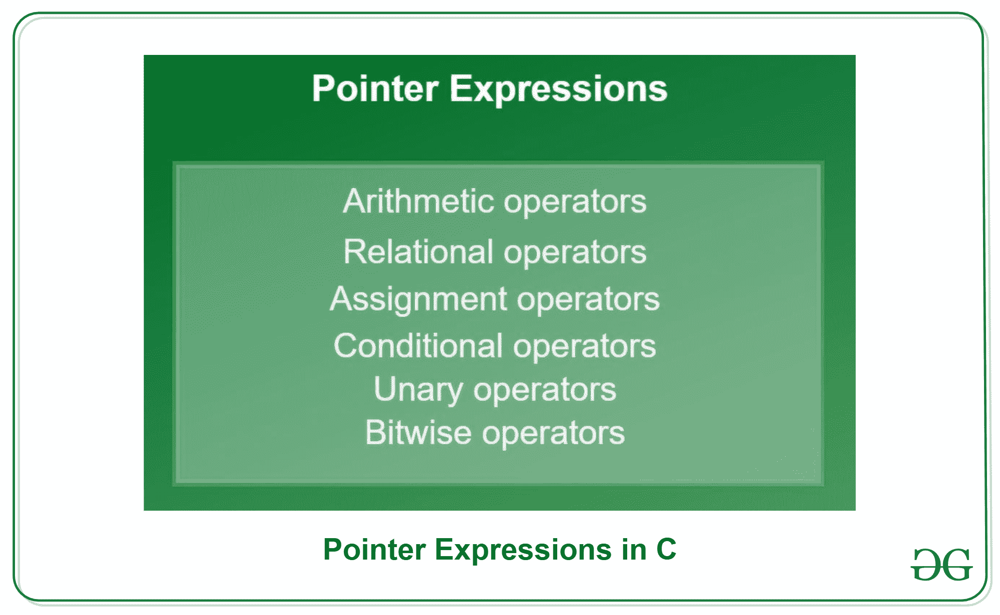
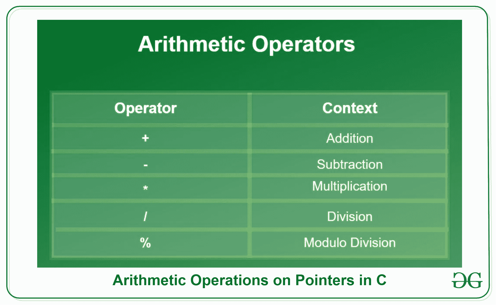
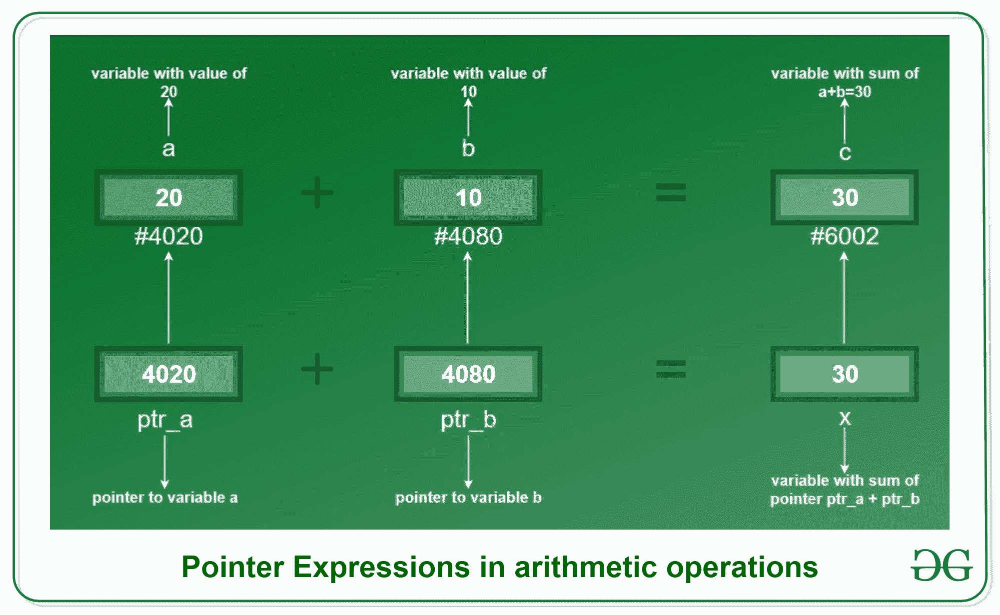
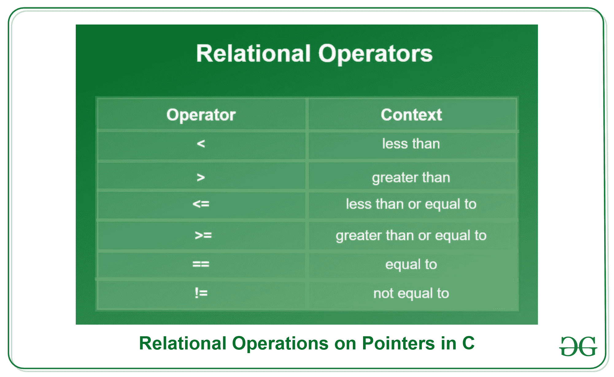
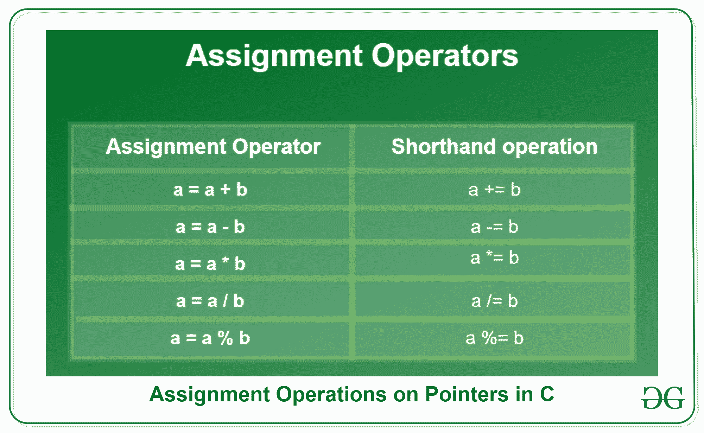
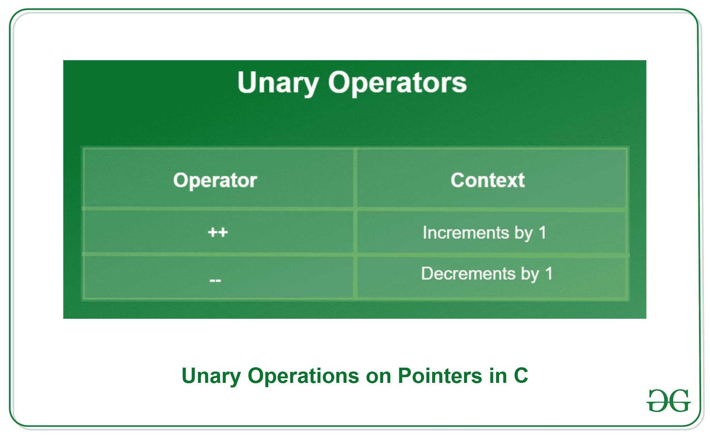
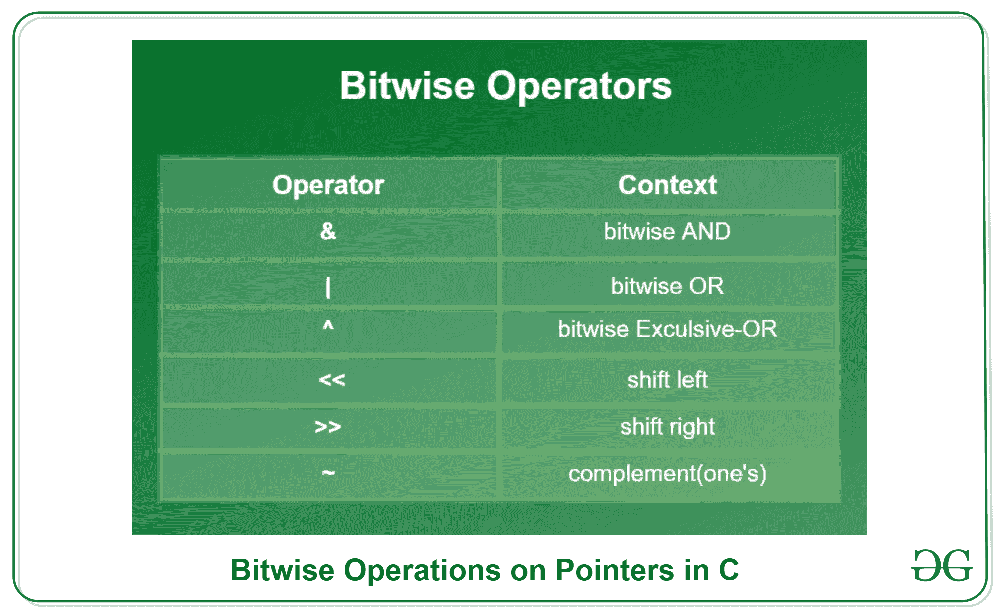

# C 中的指针表达式，带示例

> 原文:[https://www . geesforgeks . org/pointer-expressions-in-c-with-examples/](https://www.geeksforgeeks.org/pointer-expressions-in-c-with-examples/)

**先决条件:**[C 中的指针](https://www.geeksforgeeks.org/pointers-in-c-and-c-set-1-introduction-arithmetic-and-array/)

指针用于指向变量的地址位置。指针通过在指针名称前加一个**星号(*)** 来声明。
**语法:**

```
datatype *pointer_name;

```

当我们需要用变量的位置初始化指针时，我们在变量名前使用**和符号(& )** 。
T3】例:

```
// Declaration of integer variable
int var=10;

// Initialization of pointer variable
int *pointer=&var;
```

**符号(& )** 用于获取变量的地址。我们可以直接找到任何标识符的位置，只需在它前面加上一个&符号(&)。
T3】例:

```
// This code prints the address of x
#include <stdio.h>

int main()
{
    int x = 10;

    // Prints address of x
    printf(
        "Address of variable x = %p", &x);

    return 0;
}
```

**Output:**

```
Address of variable x = 0x7fff3b690fd4

```

[](https://media.geeksforgeeks.org/wp-content/uploads/20200210160732/Pointer-Expressions-in-C1.png) 
C 语言支持丰富的内置运算，如算术、关系、赋值、条件等。这可以在标识符上执行。就像任何其他变量一样，这些操作也可以在指针变量上**执行。**

**<u>算术运算符</u>**

我们可以使用算术运算符对指针变量执行算术运算。我们可以用一个指向整数变量的指针来加一个整数或减一个整数。给定的表格显示了可以对指针变量执行的算术运算符:
[](https://media.geeksforgeeks.org/wp-content/uploads/20200210160936/Arithmetic-Operations-on-Pointers-in-C1.png)

**示例:**

```
*ptr1 + *ptr2
*ptr1 * *ptr2
*ptr1 + *ptr2 - *ptr3

```

我们也可以使用整数直接执行算术表达式。让我们看看下面给出的例子，其中 p1 和 p2 是指针。

```
p1+10, p2-5, p1-p2+10, p1/2 

```

下图展示了表达式/运算符如何精确地处理指针。
[](https://media.geeksforgeeks.org/wp-content/uploads/20200210160550/Pointer-Expressions-in-arithmetic-operations.png)

如图所示，指针**‘pa’和‘Pb’**分别指向整数变量**‘a’和‘b’**。在整数变量和指针变量之间直接执行加法，结果分别存储在整数变量“c”和“x”中。两者的结果是一样的。

让我们用给定的代码更好地理解指针算术表达式:

```
// Program showing pointer expressions
// during Arithmetic Operations
#include <stdio.h>

int main()
{
    // Integer variables
    int a = 20, b = 10;

    // Variables for storing arithmetic
    // operations solution
    int add, sub, div, mul, mod;

    // Pointer variables for variables
    // a and b
    int *ptr_a, *ptr_b;

    // Initialization of pointers
    ptr_a = &a;
    ptr_b = &b;

    // Performing arithmetic Operations
    // on pointers
    add = *ptr_a + *ptr_b;
    sub = *ptr_a - *ptr_b;
    mul = *ptr_a * *ptr_b;
    div = *ptr_a / *ptr_b;
    mod = *ptr_a % *ptr_b;

    // Printing values
    printf("Addition = %d\n", add);
    printf("Subtraction = %d\n", sub);
    printf("Multiplication = %d\n", mul);
    printf("Division = %d\n", div);
    printf("Modulo = %d\n", mod);
    return 0;
}
```

**Output:**

```
Addition = 30
Subtraction = 10
Multiplication = 200
Division = 2
Modulo = 0

```

**注意:**执行除法时，请确保在指针的“/”和“*”之间放置一个空格，因为这两个空格组合在一起会形成多行注释(“/*”)。
T3】例:

```
 Incorrect: *ptr_a/*ptr_b;
 Correct:   *ptr_a / *ptr_b; 
 Correct:   (*ptr_a)/(*ptr_b);

```

**<u>关系运算符</u>**

关系运算通常用于比较变量的值，我们可以根据这些值做出决策。给定的表显示了可以对指针变量执行的关系运算符。
[](https://media.geeksforgeeks.org/wp-content/uploads/20200210161806/Relational-Operations-on-Pointers-in-C.png) 
**例:**

```
*ptr1 > *ptr2
*ptr1 < *ptr2

```

关系表达式的值为 0 或 1，为假或真。如果表达式为真，它将返回值 1，如果为假，它将返回值 0。

通过下面给出的代码，让我们更好地理解指针上的关系表达式:

```
// Program showing pointer expressions
// during Relational Operations
#include <stdio.h>
int main()
{
    // Initializing integer variables
    int a = 20, b = 10;

    // Declaring pointer variables
    int* ptr_a;
    int* ptr_b;

    // Initializing pointer variables
    ptr_a = &a;
    ptr_b = &b;

    // Performing relational operations
    // less than operator
    if (*ptr_a < *ptr_b) {
        printf(
            "%d is less than %d.", *ptr_a, *ptr_b);
    }

    // Greater than operator
    if (*ptr_a > *ptr_b) {
        printf(
            "%d is greater than %d.", *ptr_a, *ptr_b);
    }

    // Equal to
    if (*ptr_a == *ptr_b) {
        printf(
            "%d is equal to %d.", *ptr_a, *ptr_b);
    }

    return 0;
}
```

**Output:**

```
20 is greater than 10.

```

**输出:**

```
20 is greater than 10.

```

**<u>分配操作员</u>**

赋值运算符用于为标识符赋值。有多种速记操作可用。下面的表格显示了实际的赋值语句及其速记语句。
[](https://media.geeksforgeeks.org/wp-content/uploads/20200210162602/Assignment-Operations-on-Pointers-in-C.png) 
**例:**

```
*a=10
*b+=20
*z=3.5
*s=4.56743

```

借助下面给出的代码，让我们更好地理解赋值运算符:

```
// Program showing pointer expressions
// during Assignment Operations
#include <stdio.h>
int main()
{
    // Initializing integer variable
    int a = 30;

    // Declaring pointer variable
    int* ptr_a;

    // Initializing pointer using
    // assignment operator
    ptr_a = &a;

    // Changing the variable's value using
    // assignment operator
    *ptr_a = 50;

    // Printing value of 'a' after
    // updating its value
    printf("Value of variable a = %d", *ptr_a);

    return 0;
}
```

**Output:**

```
Value of variable a = 50

```

**<u>条件运算符</u>**

C 语言中只有一个最常用的条件运算符叫做三元运算符。三元运算符首先检查表达式，并根据其返回值返回 true 或 false，这将触发/选择另一个表达式。

**语法:**

```
expression1 ? expression2 : expression3;

```

**示例:**

```
c = (*ptr1 > *ptr2) ? *ptr1 : *ptr2;

```

*   如示例所示，假设*ptr1=20 和*ptr2=10，则表达式的条件变为真，因此它将返回真表达式的值，即*ptr1，因此变量“c”现在将包含值 20。
*   考虑相同的例子，假设*ptr1=30 和*ptr2=50，那么表达式的条件为假，因此它将返回假表达式的值，即*ptr2，因此变量“c”现在将包含值 50。

让我们通过给定的代码来理解这个概念:

```
// Program showing pointer expressions
// during Conditional Operations
#include <stdio.h>
int main()
{
    // Initializing integer variables
    int a = 15, b = 20, result = 0;

    // Declaring pointer variables
    int *ptr_a, *ptr_b;

    // Initializing pointer variables
    ptr_a = &a;
    ptr_b = &b;

    // Performing ternary operator
    result = ((*ptr_a > *ptr_b) ? *ptr_a : *ptr_b);

    // Printing result of ternary operator
    printf("%d is the greatest.", result);
    return 0;
}
```

**Output:**

```
20 is the greatest.

```

**<u>一元运算符</u>**

主要有两种运算符，如下所示。
[](https://media.geeksforgeeks.org/wp-content/uploads/20200210163637/Unary-Operations-on-Pointers-in-C.png)

**示例:**

```
(*ptr1)++
(*ptr1)--

```

让我们通过给定的代码来理解一元运算符的用法:

```
// Program showing pointer expressions
// during Unary Operations
#include <stdio.h>
int main()
{
    // Initializing integer variable
    int a = 34;

    // Declaring pointer variable
    int* ptr_a;

    // Initializing pointer variable
    ptr_a = &a;

    // Value of a before increment
    printf("Increment:\n");
    printf(
        "Before increment a = %d\n", *ptr_a);

    // Unary increment operation
    (*ptr_a)++;

    // Value of a after increment
    printf(
        "After increment a = %d", *ptr_a);

    // Value before decrement
    printf("\n\nDecrement:\n");
    printf(
        "Before decrement a = %d\n", *ptr_a);

    // unary decrement operation
    (*ptr_a)--;

    // Value after decrement
    printf("After decrement a=%d", *ptr_a);

    return 0;
}
```

**Output:**

```
Increment:
Before increment a = 34
After increment a = 35

Decrement:
Before decrement a = 35
After decrement a=34

```

**<u>逐位运算符</u>**

二进制运算符也称为按位运算符。它用于在位级操作数据。按位运算符不能用于浮点和双精度数据类型。下表显示了所有按位运算符:
[](https://media.geeksforgeeks.org/wp-content/uploads/20200210164649/Bitwise-Operations-on-Pointers-in-C.png)

**示例:**

```
*ptr1 & *ptr2
*ptr1 | *ptr2
*ptr1 ^ *ptr2

```

让我们通过给定的代码来理解这个概念:

```
// Program showing pointer expressions
// during Bitwise Operations
#include <stdio.h>
int main()
{
    // Declaring integer variable for
    // storing result
    int and, or, ex_or;

    // Initializing integer variable
    int a = 1, b = 2;

    // Performing bitwise operations
    // AND operation
    and = a & b;

    // OR operation
    or = a | b;

    // EX-OR operation
    ex_or = a ^ b;

    // Printing result of operations
    printf("\na AND b = %d", and);
    printf("\na OR b = %d", or);
    printf("\na Exclusive-OR b = %d", ex_or);
    return 0;
}
```

**Output:**

```
a AND b = 0
a OR b = 3
a Exclusive-OR b = 3

```