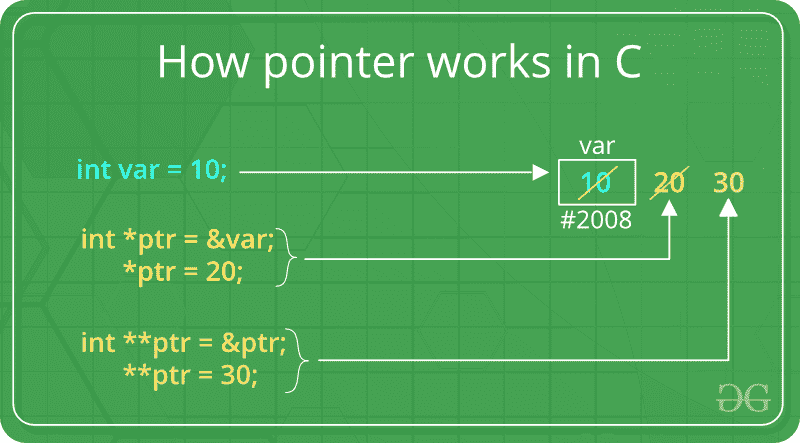

# 带示例的 C/C++ 中的指针

> 原文:[https://www.geeksforgeeks.org/pointers-c-examples/](https://www.geeksforgeeks.org/pointers-c-examples/)

指针是地址的符号表示。它们使程序能够模拟按引用调用，以及创建和操作动态数据结构。它在 C/C++ 中的一般声明具有以下格式:

**语法:**

```cpp
datatype *var_name; 
int *ptr;   //ptr can point to an address which holds int data

```



**如何使用指针？**

*   定义指针变量
*   使用返回变量地址的一元运算符(&)将变量地址赋给指针。
*   使用一元运算符(*)访问存储在地址中的值，该运算符返回位于其操作数指定的地址的变量值。

我们将数据类型与指针相关联的原因是**它知道数据存储在**中的字节数。当我们增加一个指针时，我们增加指针所指向的数据类型的大小。

[](https://media.geeksforgeeks.org/wp-content/uploads/pointers-in-c.png)

## C

```cpp
// C++ program to illustrate Pointers in C++
#include <stdio.h>

void geeks()
{
    int var = 20; 

    // declare pointer variable    
    int *ptr; 

    // note that data type of ptr and var must be same
    ptr = &var;    

    // assign the address of a variable to a pointer
    printf("Value at ptr = %p \n",ptr);
    printf("Value at var = %d \n",var);
    printf("Value at *ptr = %d \n", *ptr);     
}

// Driver program
int main()
{
    geeks();
}
```

## C++

```cpp
// C++ program to illustrate Pointers in C++

#include <bits/stdc++.h>
using namespace std;
void geeks()
{
    int var = 20; 

        //declare pointer variable    
    int *ptr; 

    //note that data type of ptr and var must be same
    ptr = &var;    

    // assign the address of a variable to a pointer
    cout << "Value at ptr = " << ptr << "\n";
    cout << "Value at var = " << var << "\n";
    cout << "Value at *ptr = " << *ptr << "\n";     
}
//Driver program
int main()
{
    geeks();
}
```

**Output:**

```cpp
Value at ptr = 0x7ffcb9e9ea4c
Value at var = 20
Value at *ptr = 20

```

**参考和指针**

有 3 种方法可以将 C++ 参数传递给函数:

*   按值调用
*   带指针参数的按引用调用
*   带有引用参数的引用调用

```cpp
// C++ program to illustrate call-by-methods in C++

#include <bits/stdc++.h>
using namespace std;
//Pass-by-Value
int square1(int n)
{
    //Address of n in square1() is not the same as n1 in main()
    cout << "address of n1 in square1(): " << &n << "\n";  

    // clone modified inside the function
    n *= n;
    return n;
}
//Pass-by-Reference with Pointer Arguments
void square2(int *n)
{
    //Address of n in square2() is the same as n2 in main()
    cout << "address of n2 in square2(): " << n << "\n";

    // Explicit de-referencing to get the value pointed-to
    *n *= *n;
}
//Pass-by-Reference with Reference Arguments
void square3(int &n)
{
    //Address of n in square3() is the same as n3 in main()
    cout << "address of n3 in square3(): " << &n << "\n";

    // Implicit de-referencing (without '*')
    n *= n;
}
void geeks()
{
    //Call-by-Value
    int n1=8;
    cout << "address of n1 in main(): " << &n1 << "\n";
    cout << "Square of n1: " << square1(n1) << "\n";
    cout << "No change in n1: " << n1 << "\n";

    //Call-by-Reference with Pointer Arguments
    int n2=8;
    cout << "address of n2 in main(): " << &n2 << "\n";
    square2(&n2);
    cout << "Square of n2: " << n2 << "\n";
    cout << "Change reflected in n2: " << n2 << "\n";

    //Call-by-Reference with Reference Arguments
    int n3=8;
    cout << "address of n3 in main(): " << &n3 << "\n";
    square3(n3);
    cout << "Square of n3: " << n3 << "\n";
    cout << "Change reflected in n3: " << n3 << "\n";

}
//Driver program
int main()
{
    geeks();
}
```

输出:

```cpp
address of n1 in main(): 0x7ffcdb2b4a44
address of n1 in square1(): 0x7ffcdb2b4a2c
Square of n1: 64
No change in n1: 8
address of n2 in main(): 0x7ffcdb2b4a48
address of n2 in square2(): 0x7ffcdb2b4a48
Square of n2: 64
Change reflected in n2: 64
address of n3 in main(): 0x7ffcdb2b4a4c
address of n3 in square3(): 0x7ffcdb2b4a4c
Square of n3: 64
Change reflected in n3: 64
```

在 C++ 中，默认情况下，参数是按值传递的，在被调用函数中所做的更改不会反映在传递的变量中。被调用的函数将更改复制到克隆中。
如果希望直接修改原始副本(尤其是在传递巨大对象或数组时)和/或避免克隆开销，我们使用传递引用。带引用参数的传递引用不需要任何笨拙的语法来引用和取消引用。

*   [C](https://www.geeksforgeeks.org/function-pointer-in-c/)中的函数指针
*   [功能指针](https://www.geeksforgeeks.org/how-to-declare-a-pointer-to-a-function/)

**作为指针的数组名称**

数组名包含数组第一个元素的地址，其作用类似于常量指针。这意味着，存储在数组名称中的地址不能更改。
例如，如果我们有一个名为 val 的数组，那么 **val** 和**T6【val【0】**可以互换使用。

## C

```cpp
// C program to illustrate call-by-methods
#include <stdio.h>

void geeks() 
{ 
    //Declare an array 
    int val[3] = { 5, 10, 20 }; 

    //declare pointer variable 
    int *ptr; 

    //Assign the address of val[0] to ptr 
    // We can use ptr=&val[0];(both are same) 
    ptr = val ; 
    printf("Elements of the array are: "); 
    printf("%d %d %d", ptr[0], ptr[1], ptr[2]); 
} 
//Driver program 
int main() 
{ 
    geeks(); 
}
```

## C++

```cpp
// C++ program to illustrate Array Name as Pointers in C++
#include <bits/stdc++.h>
using namespace std;
void geeks()
{
    //Declare an array
    int val[3] = { 5, 10, 20 };

    //declare pointer variable 
    int *ptr;

    //Assign the address of val[0] to ptr
    // We can use ptr=&val[0];(both are same)
    ptr = val ;
    cout << "Elements of the array are: ";
    cout << ptr[0] << " " << ptr[1] << " " << ptr[2];
}
//Driver program
int main()
{
    geeks();
}
```

```cpp
Output:
Elements of the array are: 5 10 20

```

[](https://media.geeksforgeeks.org/wp-content/uploads/Untitled-presentation-2.png) 
如果指针 ptr 作为参数被发送到一个函数，数组 val 可以以类似的方式被访问。

[指针对数组](https://www.geeksforgeeks.org/difference-pointer-array-c/)

**指针表达式和指针算法**

可以对指针执行一组有限的算术运算，这些指针是:

*   递增(++)
*   递减(—)
*   整数可以被添加到指针(+或+=)
*   可以从指针中减去一个整数(–或-=)
*   两个指针之间的差异(p1-p2)

(注意:除非在数组上执行，否则指针算术毫无意义。)

```cpp
// C++ program to illustrate Pointer Arithmetic in C++
#include <bits/stdc++.h>
using namespace std;
void geeks() 
{
    //Declare an array
    int v[3] = {10, 100, 200};

    //declare pointer variable 
    int *ptr;

    //Assign the address of v[0] to ptr
    ptr = v;

    for (int i = 0; i < 3; i++)
    {
            cout << "Value at ptr = " << ptr << "\n";
            cout << "Value at *ptr = " << *ptr << "\n";

            // Increment pointer ptr by 1 
            ptr++ ;
    }
}

//Driver program
int main()
{
    geeks();
}
```

```cpp
Output:
Value at ptr = 0x7fff9a9e7920
Value at *ptr = 10
Value at ptr = 0x7fff9a9e7924
Value at *ptr = 100
Value at ptr = 0x7fff9a9e7928
Value at *ptr = 200

```

[](https://media.geeksforgeeks.org/wp-content/uploads/Untitled-presentation-31.png) 
**高级指针符号**

考虑二维数值数组的指针表示法。考虑以下声明

```cpp
int nums[2][3]  =  { { 16, 18, 20 }, { 25, 26, 27 } };
```

**一般来说，nums[ i ][ j ]相当于*(nums+i)+j)**

[](https://media.geeksforgeeks.org/wp-content/uploads/Screenshot-222.png)

**指针和字符串文字**

字符串是包含空终止字符序列的数组。字符串文字是类型字符加上终止空字符的数组，每个元素都是 const char 类型(因为字符串的字符不能被修改)。

```cpp
const char * ptr = "geek";
```

这声明了一个数组，其文字表示为“geek”，然后指向其第一个元素的指针被分配给 ptr。如果我们假设“geek”存储在从地址 1800 开始的存储位置，我们可以将前面的声明表示为:

[](https://media.geeksforgeeks.org/wp-content/uploads/Screenshot-23.png)

由于指针和数组在表达式中的行为方式相同，ptr 可以用来访问字符串文字的字符。例如:

```cpp
char x = *(ptr+3);
char y = ptr[3];
```

这里，x 和 y 都包含存储在 1803 (1800+3)的 k。

**指向指针的指针**

在 C++ 中，我们可以创建一个指向指针的指针，该指针又可以指向数据或其他指针。在声明指针时，语法只要求每个间接层有一元运算符(*)。

```cpp
char a;
char *b;
char ** c;
a = ’g’;
b = &a;
c = &b;
```

这里 b 指向一个存储“g”的字符，c 指向指针 b。

**[【空指针】](https://www.geeksforgeeks.org/void-pointer-c-cpp/)**

这是 C++ 中可用的一种特殊类型的指针，表示缺少类型。void 指针是指向没有类型的值的指针(因此也是未确定长度和未确定解引用属性的指针)。
这意味着 void 指针具有很大的灵活性，因为它可以指向任何数据类型。这种灵活性是有回报的。这些指针不能被直接取消引用。在被取消引用之前，它们必须首先被转换成其他指向具体数据类型的指针类型。

```cpp
// C++ program to illustrate Void Pointer in C++
#include <bits/stdc++.h>
using namespace std;
void increase(void *data,int ptrsize)
{
    if(ptrsize == sizeof(char))
    {
        char *ptrchar;

        //Typecast data to a char pointer
        ptrchar = (char*)data;

        //Increase the char stored at *ptrchar by 1
        (*ptrchar)++ ;
        cout << "*data points to a char"<<"\n";
    }
    else if(ptrsize == sizeof(int))
    {
        int *ptrint;

        //Typecast data to a int pointer
        ptrint = (int*)data;

        //Increase the int stored at *ptrchar by 1
        (*ptrint)++ ;
        cout << "*data points to an int"<<"\n";
    }
}
void geek()
{
    // Declare a character 
    char c='x';

    // Declare an integer
    int i=10;

    //Call increase function using a char and int address respectively
    increase(&c,sizeof(c));
    cout << "The new value of c is: " << c <<"\n";
    increase(&i,sizeof(i));
    cout << "The new value of i is: " << i <<"\n";

}
//Driver program
int main()
{
    geek();
}
```

```cpp
Output:
*data points to a char
The new value of c is: y
*data points to an int
The new value of i is: 11

```

**无效指针**

指针应该指向有效的地址，但不一定指向有效的元素(比如数组)。这些被称为无效指针。未初始化的指针也是无效指针。

```cpp
int *ptr1;
int arr[10];
int *ptr2 = arr+20;
```

这里，ptr1 未初始化，因此它成为无效指针，而 ptr2 超出 arr 范围，因此它也成为无效指针。
(注意:无效指针不一定会引发编译错误)

**[空指针](https://www.geeksforgeeks.org/few-bytes-on-null-pointer-in-c/)**

空指针是一个不指向任何地方的指针，而不仅仅是一个无效地址。
以下是 2 种将指针赋值为空的方法；

```cpp
int *ptr1 = 0;
int *ptr2 = NULL; 
```

 **Related Articles:**

*   [不透明指针](https://www.geeksforgeeks.org/opaque-pointer/)
*   [远近巨大指针](https://www.geeksforgeeks.org/what-are-near-far-and-huge-pointers/)

**小测验**–[指针基础知识](https://www.geeksforgeeks.org/c-language-2-gq/pointers-gq/)、[高级指针](https://www.geeksforgeeks.org/c-language-2-gq/advanced-pointer-c-gq/)
 **参考:**https://www . NTU . edu . SG/home/ehchua/programming/CPP/cp4 _ pointerereference . html

本文由**阿比拉夫·卡里亚供稿。**如果你喜欢 GeeksforGeeks 并且愿意投稿，你也可以用 write.geeksforgeeks.org 写一篇文章或者把你的文章邮寄到 review-team@geeksforgeeks.org。看到你的文章出现在极客博客主页上，帮助其他极客。

如果你发现任何不正确的地方，或者你想分享更多关于上面讨论的话题的信息，请写评论。