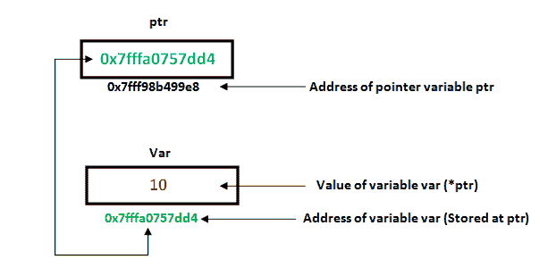

# C 和 C++中的指针|集合 1(介绍、算术和数组)

> 原文:[https://www . geesforgeks . org/pointers-in-c-and-c-set-1-introduction-算术与数组/](https://www.geeksforgeeks.org/pointers-in-c-and-c-set-1-introduction-arithmetic-and-array/)

指针存储变量地址或存储位置。

```cpp
// General syntax
datatype *var_name; 

// An example pointer "ptr" that holds
// address of an integer variable or holds
// address of a memory whose value(s) can
// be accessed as integer values through "ptr"
int *ptr; 
```

**使用指针:**


要在 C 语言中使用指针，我们必须理解下面两个运算符。

*   要访问指向指针的变量地址，我们使用一元运算符 **&** (和号)，返回该变量的地址。例如& x 给了我们变量 x 的地址

## C

```cpp
// The output of this program can be different
// in different runs. Note that the program
// prints address of a variable and a variable
// can be assigned different address in different
// runs.
#include <stdio.h>

int main()
{
    int x;

    // Prints address of x
    printf("%p", &x);

    return 0;
}
```

*   还有一个运算符是**一元*** (星号)，用于两个目的:
    *   要声明指针变量:在 C/C++中声明指针变量时，其名称前必须有一个*号。

## C

```cpp
// C program to demonstrate declaration of
// pointer variables.
#include <stdio.h>
int main()
{
    int x = 10;

    // 1) Since there is * in declaration, ptr
    // becomes a pointer variable (a variable
    // that stores address of another variable)
    // 2) Since there is int before *, ptr is
    // pointer to an integer type variable
    int *ptr;

    // & operator before x is used to get address
    // of x. The address of x is assigned to ptr.
    ptr = &x;

    return 0;
}
```

*   要访问存储在地址中的值，我们使用一元运算符(*)，该运算符返回位于操作数指定地址的变量的值。这也称为**取消引用**。

## C++

```cpp
// C++ program to demonstrate use of * for pointers in C++
#include <iostream>
using namespace std;

int main()
{
    // A normal integer variable
    int Var = 10;

    // A pointer variable that holds address of var.
    int *ptr = &Var;

    // This line prints value at address stored in ptr.
    // Value stored is value of variable "var"
    cout << "Value of Var = "<< *ptr << endl;

    // The output of this line may be different in different
    // runs even on same machine.
    cout << "Address of Var = " <<  ptr << endl;

    // We can also use ptr as lvalue (Left hand
    // side of assignment)
    *ptr = 20; // Value at address is now 20

    // This prints 20
    cout << "After doing *ptr = 20, *ptr is "<< *ptr << endl;

    return 0;
}

// This code is contributed by
// shubhamsingh10
```

## C

```cpp
// C program to demonstrate use of * for pointers in C
#include <stdio.h>

int main()
{
    // A normal integer variable
    int Var = 10;

    // A pointer variable that holds address of var.
    int *ptr = &Var;

    // This line prints value at address stored in ptr.
    // Value stored is value of variable "var"
    printf("Value of Var = %d\n", *ptr);

    // The output of this line may be different in different
    // runs even on same machine.
    printf("Address of Var = %p\n", ptr);

    // We can also use ptr as lvalue (Left hand
    // side of assignment)
    *ptr = 20; // Value at address is now 20

    // This prints 20
    printf("After doing *ptr = 20, *ptr is %d\n", *ptr);

    return 0;
}
```

*   **输出:**

```cpp
Value of Var = 10
Address of Var = 0x7fffa057dd4
After doing *ptr = 20, *ptr is 20
```

*   以下是上述程序的图示:



**指针表达式和指针运算**
可以对指针执行有限的一组算术运算。指针可以是:

*   递增(++)
*   递减(—)
*   整数可以被添加到指针(+或+=)
*   可以从指针中减去一个整数(–或-=)

除非在数组上执行，否则指针算术毫无意义。
注意:指针包含地址。添加两个地址没有意义，因为不知道它会指向什么。减去两个地址可以计算这两个地址之间的偏移量。

## 卡片打印处理机（Card Print Processor 的缩写）

```cpp
// C++ program to illustrate Pointer Arithmetic
// in C/C++
#include <bits/stdc++.h>

// Driver program
int main()
{
    // Declare an array
    int v[3] = {10, 100, 200};

    // Declare pointer variable
    int *ptr;

    // Assign the address of v[0] to ptr
    ptr = v;

    for (int i = 0; i < 3; i++)
    {
        printf("Value of *ptr = %d\n", *ptr);
        printf("Value of ptr = %p\n\n", ptr);

        // Increment pointer ptr by 1
        ptr++;
    }
}
```

```cpp
Output:Value of *ptr = 10
Value of ptr = 0x7ffcae30c710

Value of *ptr = 100
Value of ptr = 0x7ffcae30c714

Value of *ptr = 200
Value of ptr = 0x7ffcae30c718
```

[](https://media.geeksforgeeks.org/wp-content/uploads/Untitled-presentation-31.png)

**数组名作为指针**
数组名的作用类似于指针常量。这个指针常量的值是第一个元素的地址。
例如，如果我们有一个名为 val 的数组，那么 **val** 和**&val【0】**可以互换使用。

## 卡片打印处理机（Card Print Processor 的缩写）

```cpp
// C++ program to illustrate Array Name as Pointers in C++
#include <bits/stdc++.h>
using namespace std;

void geeks()
{
    // Declare an array
    int val[3] = { 5, 10, 15};

    // Declare pointer variable
    int *ptr;

    // Assign address of val[0] to ptr.
    // We can use ptr=&val[0];(both are same)
    ptr = val ;
    cout << "Elements of the array are: ";
    cout << ptr[0] << " " << ptr[1] << " " << ptr[2];

    return;
}

// Driver program
int main()
{
    geeks();
    return 0;
}
```

```cpp
Output:
Elements of the array are: 5 10 15
```


现在，如果这个 ptr 作为一个参数被发送给一个函数，那么数组 val 可以以类似的方式被访问。

**指针和多维数组**
考虑二维数值数组的指针符号。考虑以下声明

```cpp
int nums[2][3]  =  { {16, 18, 20}, {25, 26, 27} };
```

**一般来说，nums[i][j]相当于*(nums+i)+j)**

|  |  | [value] |
| --- | --- | --- |
|  | 【26】 |
| *(n+1)+2) | 【n[1][2] | 【27】 |

**Related Articles**: 

[**指针在 C/C++中的应用。**](https://www.geeksforgeeks.org/applications-of-pointers-in-c-cpp/)

**小测验**–[指针基础知识小测验](https://www.geeksforgeeks.org/c-language-2-gq/pointers-gq/)、[高级指针小测验](https://www.geeksforgeeks.org/c-language-2-gq/advanced-pointer-c-gq/)
**参考:**
[https://www . NTU . edu . SG/home/ehchua/programming/CPP/cp4 _ pointerereference . html](https://www.ntu.edu.sg/home/ehchua/programming/cpp/cp4_PointerReference.html)
本文由 **Abhirav Kariya 供稿。**如果你喜欢 GeeksforGeeks 并且愿意投稿，你也可以用 write.geeksforgeeks.org 写一篇文章或者把你的文章邮寄到 review-team@geeksforgeeks.org。看到你的文章出现在极客博客主页上，帮助其他极客。
如果你发现任何不正确的地方，或者你想分享更多关于上面讨论的话题的信息，请写评论。