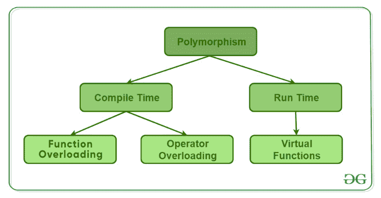

# c++ 中的多态性

> 原文:[https://www.geeksforgeeks.org/polymorphism-in-c/](https://www.geeksforgeeks.org/polymorphism-in-c/)

多态这个词意味着有许多形式。简单地说，我们可以将多态性定义为一条消息以多种形式显示的能力。多态性的一个现实例子，一个人同时可以有不同的特征。喜欢一个男人的同时是一个父亲，一个丈夫，一个员工。所以同一个人在不同的情况下有不同的行为。这叫做多态性。多态性被认为是面向对象编程的重要特征之一。

**在 C++ 中多态性主要分为两种类型:**

*   编译时多态性
*   运行时多态性



1.  **编译时多态性**:这种类型的多态性是通过函数重载或运算符重载实现的。

*   **[Function Overloading](https://www.geeksforgeeks.org/function-overloading-c/)**: When there are multiple functions with same name but different parameters then these functions are said to be **overloaded**. Functions can be overloaded by **change in number of arguments** or/and **change in type of arguments**.
    [Rules of Function Overloading](https://www.geeksforgeeks.org/function-overloading-in-c/)

    ```cpp
    // C++ program for function overloading
    #include <bits/stdc++.h>

    using namespace std;
    class Geeks
    {
        public:

        // function with 1 int parameter
        void func(int x)
        {
            cout << "value of x is " << x << endl;
        }

        // function with same name but 1 double parameter
        void func(double x)
        {
            cout << "value of x is " << x << endl;
        }

        // function with same name and 2 int parameters
        void func(int x, int y)
        {
            cout << "value of x and y is " << x << ", " << y << endl;
        }
    };

    int main() {

        Geeks obj1;

        // Which function is called will depend on the parameters passed
        // The first 'func' is called 
        obj1.func(7);

        // The second 'func' is called
        obj1.func(9.132);

        // The third 'func' is called
        obj1.func(85,64);
        return 0;
    } 
    ```

    **输出:**

    ```cpp
    value of x is 7
    value of x is 9.132
    value of x and y is 85, 64

    ```

    在上面的例子中，一个名为 *func* 的函数在三种不同的情况下有不同的行为，这就是多态的特性。

*   **[Operator Overloading](https://www.geeksforgeeks.org/operator-overloading-c/)**: C++ also provide option to overload operators. For example, we can make the operator (‘+’) for string class to concatenate two strings. We know that this is the addition operator whose task is to add two operands. So a single operator ‘+’ when placed between integer operands , adds them and when placed between string operands, concatenates them.
    **Example**:

    ```cpp
    // CPP program to illustrate
    // Operator Overloading
    #include<iostream>
    using namespace std;

    class Complex {
    private:
        int real, imag;
    public:
        Complex(int r = 0, int i =0)  {real = r;   imag = i;}

        // This is automatically called when '+' is used with
        // between two Complex objects
        Complex operator + (Complex const &obj) {
             Complex res;
             res.real = real + obj.real;
             res.imag = imag + obj.imag;
             return res;
        }
        void print() { cout << real << " + i" << imag << endl; }
    };

    int main()
    {
        Complex c1(10, 5), c2(2, 4);
        Complex c3 = c1 + c2; // An example call to "operator+"
        c3.print();
    }
    ```

    输出:

    ```cpp
    12 + i9

    ```

    在上面的例子中，运算符“+”是重载的。运算符“+”是加法运算符，可以将两个数字(整数或浮点)相加，但在这里，运算符用于执行两个虚数或复数的相加。要详细了解操作员过载，请访问[这个](https://www.geeksforgeeks.org/operator-overloading-c/)链接。

*   **[Runtime polymorphism](https://www.geeksforgeeks.org/virtual-functions-and-runtime-polymorphism-in-c-set-1-introduction/)**: This type of polymorphism is achieved by Function Overriding.
    *   **[Function overriding](https://www.geeksforgeeks.org/override-keyword-c/)** on the other hand occurs when a derived class has a definition for one of the member functions of the base class. That base function is said to be **overridden**.

        ```cpp
        // C++ program for function overriding

        #include <bits/stdc++.h>
        using namespace std;

        class base
        {
        public:
            virtual void print ()
            { cout<< "print base class" <<endl; }

            void show ()
            { cout<< "show base class" <<endl; }
        };

        class derived:public base
        {
        public:
            void print () //print () is already virtual function in derived class, we could also declared as virtual void print () explicitly
            { cout<< "print derived class" <<endl; }

            void show ()
            { cout<< "show derived class" <<endl; }
        };

        //main function
        int main() 
        {
            base *bptr;
            derived d;
            bptr = &d;

            //virtual function, binded at runtime (Runtime polymorphism)
            bptr->print(); 

            // Non-virtual function, binded at compile time
            bptr->show(); 

            return 0;
        } 
        ```

        输出:

        ```cpp
        print derived class
        show base class

        ```

        要详细了解运行时多态性，请访问[这个](https://www.geeksforgeeks.org/virtual-functions-and-runtime-polymorphism-in-c-set-1-introduction/)链接。

    本文由 [**哈什·阿加瓦尔**](https://www.facebook.com/harsh.agarwal.16752) 供稿。如果你喜欢 GeeksforGeeks 并想投稿，你也可以使用[contribute.geeksforgeeks.org](http://www.contribute.geeksforgeeks.org)写一篇文章或者把你的文章邮寄到 contribute@geeksforgeeks.org。看到你的文章出现在极客博客主页上，帮助其他极客。

    如果你发现任何不正确的地方，或者你想分享更多关于上面讨论的话题的信息，请写评论。