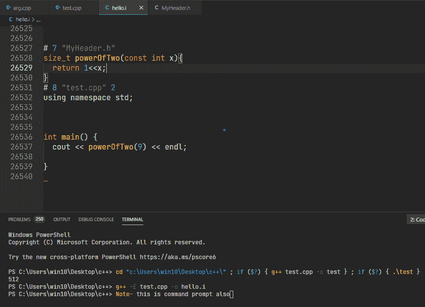

# CPP 文件的预处理器输出

> 原文:[https://www . geesforgeks . org/preprocessor-output-of-CPP-file/](https://www.geeksforgeeks.org/preprocessor-output-of-cpp-file/)

预处理是将源代码发送给编译器之前扩展或处理[预处理器](https://www.geeksforgeeks.org/cc-preprocessors/)指令的阶段。此类指令最常见的例子是[**#包括**](https://www.geeksforgeeks.org/stdincludes-c-stl/) **或**[**#定义**](https://www.geeksforgeeks.org/macros-and-its-types-in-c-cpp/) **。**预处理器输出有**。i"** 延伸。

这里创建了两个文件:

## C++

```cpp
// C++ program for the test.cpp
#include "MyHeader.h"
#include <iostream>
using namespace std;
#define VAL 9

// Driver Code
int main()
{
    // powerOfTwo function is defined
    // in “MyHeader.h”
    cout << powerOfTwo(VAL) << endl;

    return 0;
}
```

## MyHeader.h

```cpp
// Below is code for the header file
// named as "MyHeader.h"
#pragma once

// Function to find the value of 2^x
size_t powerOfTwo(const int x)
{

    // return the value
    return 1 << x;
}
```

现在在命令提示符下，可以通过两种方式对输出进行预处理:

**<u>方法 1–cmd.exe 境内</u> :** 不建议使用此方法。

```cpp
g++ -E test.cpp
```

这里输出不能显示为头文件 **iostream** 将扩展到 50000 行。这将在命令提示符下打印所有数据，这可能需要一些时间，因为 [cout](https://www.geeksforgeeks.org/basic-input-output-c/) 的打印速度非常慢。根据提示按任意键停止打印。命令提示符不会保留所有 50000 行。它有自己的极限，超过这个极限就看不到早期的输出了。

**<u>方法 2–创建显式文件”。我“</u> :**

使用下面给出的命令获得**你好。i**

```cpp
g++ -E test.cpp -o hello.i
```

**输出:**



**说明:**在上面的输出中，只有 26000 行。这很正常，因为**IOs stream**是一个很大的[头文件](https://www.geeksforgeeks.org/header-files-in-c-cpp-and-its-uses/)，并且还包括许多其他头文件，这些头文件确实包括其他头文件。 **#include** 指令只是复制各自头文件的内容。
如所注意到的，实际的程序位于 26527 行的最末端，但是它仍然给出正确行的错误消息。此外，多个文件的所有内容都被打包到 **hello.i** 中，但仍然会收到正确文件上下文的错误消息。

### **<u>这是怎么发生的</u>？**

```cpp
# 7 "MyHeader.h"
```

这是线路控制指令。它会告诉编译器下一行是文件 **MyHeader.h** 中的**第 7 行**。如果执行了上述代码，那么函数 **powerOfTwo()** 在第 7 行定义。还有，宏 **VAL** 完全被 9 代替。

### **<u>没什么有趣的事情</u> :**

*   可以使用以下命令编译预处理器输出文件:

```cpp
g++ hello.i -o test.exe
```

*   include 指令的预处理:

```cpp
// test.cpp
#include<iostream>

int main(){
  std::cout << "GeekForGeeks" << std::endl
  #include"MyHeader.h"
}
```

```cpp
// MyHeader.h
;
```

在上例中，分号由 **#include** 指令从 **MyHeader.h** 复制粘贴到 [cout](https://www.geeksforgeeks.org/basic-input-output-c/) 语句旁边的行。因此，这里不会产生错误。还有， **Myheader.h** 可以是文本文件，也可以是 python 文件，也可以是 HTML 文件不管是什么， **#include** 只会复制。