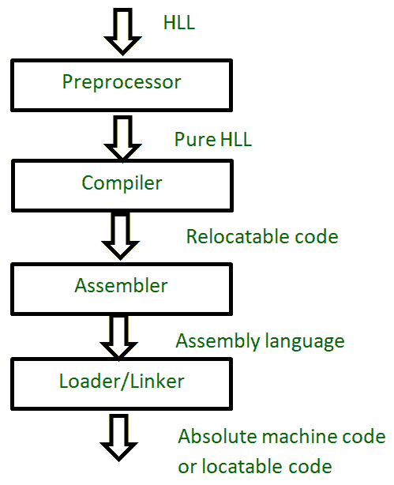
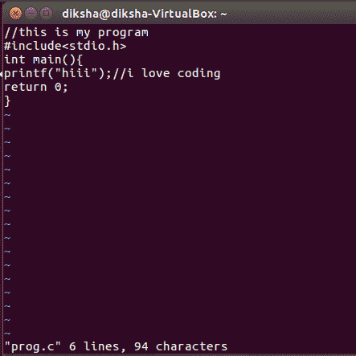
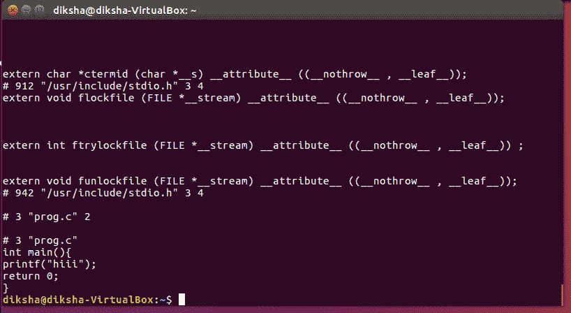

# 预处理器在 C 语言中是如何工作的？

> 原文:[https://www.geeksforgeeks.org/preprocessor-works-c/](https://www.geeksforgeeks.org/preprocessor-works-c/)

[编写 C 程序–幕后](https://www.geeksforgeeks.org/compiling-a-c-program-behind-the-scenes/)

预处理器是一种系统软件(一种设计用于在计算机硬件和应用程序上运行的计算机程序)。它执行高级语言(HLL)的预处理。预处理是语言处理系统的第一步。语言处理系统将高级语言翻译成机器级语言或绝对机器代码(即机器能理解的形式)。

*   The preprocessor doesn’t know about the scope rules of C. Preprocessor directives like #define come into effect as soon as they are seen and remain in effect until the end of the file that contains them; the program’s block structure is irrelevant.

    

    **预处理器主要对 HLL 代码执行三个任务:**

    1.  **Removing comments :** It removes all the comments. A comment is written only for the humans to understand the code. So, it is obvious that they are of no use to a machine. So, preprocessor removes all of them as they are not required in the execution and won’t be executed as well.

        这是如何在 linux 中看到一个删除了注释的文件):
        写一个 C 代码(让文件名为 *prog.c* )。使用命令**对其进行预处理**

        
        你会看到代码没有注释的输出。
        
        这个文件是用一个'保存的。I '扩展(prog.i ),它将被输入到编译器。

    2.  **文件包含:**包含我们程序需要的所有库文件。在 HLL，我们编写 **#include** ，这是一个给预处理器的指令，告诉它包含指定库文件的内容。例如，#include <stdio.h>会告诉预处理器包含库文件 stdio.h.
        中的所有内容这也可以用双引号–# include“stdio . h”
        **来写注:**如果文件名用尖括号括起来，则在标准编译器包含路径中搜索该文件。如果文件名用双引号括起来，搜索路径会扩展到包括当前的源目录。</stdio.h>
    3.  **[宏](https://www.geeksforgeeks.org/interesting-facts-preprocessors-c/)扩展:**宏可以作为小函数调用，不作为处理开销。如果我们必须编写一个需要递归调用(一次又一次)的函数(定义很小)，那么我们应该更喜欢宏而不是函数。
        所以，定义这些宏是由预处理器完成的。

        ```cpp
        #define SI 1000
        ```

        是一个宏的简单示例

        *   宏有两种类型:类对象(不取参数)和类函数(可以取参数)

            ```cpp
            // object-like macro
            #define <replacement token="" list="">// function-like macro          
            #define <identifier>(<parameter list="">) <replacement token="" list=""></replacement></parameter></identifier></replacement> 
            ```

        *   你可以用# undef 删除一个宏定义:

            ```cpp
            // delete the macro
            # undef *   We can write [multi-line macro](https://www.geeksforgeeks.org/multiline-macros-in-c/) same like function, but each statement ends with “\”. 

                ```
                #include <stdio.h> 

                #define MACRO(num, str) {\ 
                            printf("%d", num);\ 
                            printf(" is");\ 
                            printf(" %s number", str);\ 
                            printf("\n");\ 
                           }
                ```cpp 
            ```

本文由**迪卡莎**供稿。如果你喜欢 GeeksforGeeks 并想投稿，你也可以使用[contribute.geeksforgeeks.org](http://contribute.geeksforgeeks.org)写一篇文章或者把你的文章邮寄到 contribute@geeksforgeeks.org。看到你的文章出现在极客博客主页上，帮助其他极客。

如果你发现任何不正确的地方，或者你想分享更多关于上面讨论的话题的信息，请写评论。