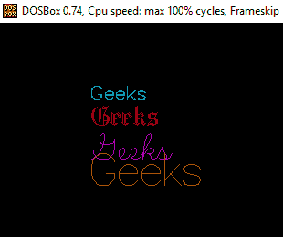

# 在 C

中打印不同字体和大小的彩色消息

> 原文:[https://www . geesforgeks . org/print-colored-message-differential-font-size-c/](https://www.geeksforgeeks.org/print-colored-message-different-font-size-c/)

在 C/C++中，我们可以使用 graphics.h 头文件来创建程序，该文件使用图形功能，如创建不同的对象、设置文本颜色、以不同的字体和大小打印消息、更改输出控制台的背景等。
在这里，我们将创建一个程序，该程序将以不同的字体样式和大小以彩色形式打印消息(“极客”)。下面列出了一些使用的功能:

*   **setcolor():** 它将设置光标颜色，因此输出屏幕上写入的任何内容都将具有与 setcolor()相同的颜色。
    功能原型:

```
setcolor(int)
```

*   **settext style():**设置文本字体样式、方向(水平/垂直)和字体大小。
    功能原型:

    ```
    settextstyle(int style, int orientation, int size);
    ```

    *   **outextxy():**它将在某个特定坐标(x，y)打印传递给它的消息。
    功能原型:

    ```
    settextstyle(int style, int orientation, int size);
    ```

    *   **More functions:**
    TextHeight():

    ```
    textheight();
    ```

    TextWidth():

    ```
    textwidth();
    ```

    SetUserCharSize():-

    ```
    setusercharsize(x1,y1,x2,y2);
    ```

    注意:给定的程序无法在 IDE 上运行，请在您的编译器上尝试

    ```
    // C program to print
    // message as colored characters
    #include<stdio.h>
    #include<graphics.h>
    #include<dos.h>

    // function for printing
    // message as colored character
    void printMsg()
    {
        // auto detection
        int gdriver = DETECT,gmode,i;

        // initialize graphics mode
        initgraph(&gdriver,&gmode,"C:\\Turboc3\\BGI");

        for (i=3; i<7; i++)
        {
            // setcolor of cursor
            setcolor(i);

            // set text style as
            // settextstyle(font, orientation, size)
            settextstyle(i,0,i);

            // print text at coordinate x,y;
            outtextxy(100,20*i,"Geeks");

            delay(500);
        } 
        delay(2000);
    }

    // driver program
    int main()
    {
        printMsg();
        return 0;
    }
    ```

    输出:

    ```
    

    ```

    本文由**[Shivam Pradhan(anuj _ charm)](https://www.facebook.com/anuj.charm)**供稿。如果你喜欢 GeeksforGeeks 并想投稿，你也可以使用[contribute.geeksforgeeks.org](http://www.contribute.geeksforgeeks.org)写一篇文章或者把你的文章邮寄到 contribute@geeksforgeeks.org。看到你的文章出现在极客博客主页上，帮助其他极客。

    如果你发现任何不正确的地方，或者你想分享更多关于上面讨论的话题的信息，请写评论。