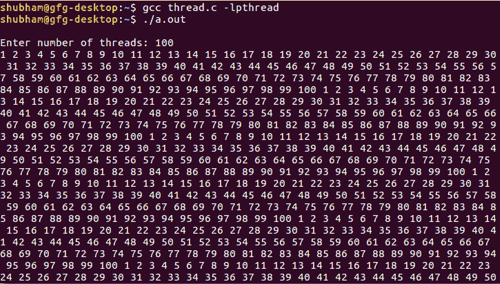

# 使用线程同步按顺序打印数字

> 原文:[https://www . geesforgeks . org/print-numbers-sequence-use-thread-synchronization/](https://www.geeksforgeeks.org/print-numbers-sequence-using-thread-synchronization/)

问题是使用 pthread 库同步 n 个线程。想法是计算线程数，在第一个线程中打印 1，在第二个线程中打印 2，在第三个线程中打印 3，…..在第 n 个线程中打印 n，并再次从线程 1 无限重复。
**先决条件:** [多线程](https://www.geeksforgeeks.org/multithreading-c-2/)

**示例:**

```cpp
Input : Thread count
Output : 1 2 3 ... thread count 1 2 3 ... thread 
count 1 2 3 ... thread count ....

Input : 5
Output : 1 2 3 4 5 1 2 3 4 5 1 2 3 4 5 1 2 3 4 5 
1 2 3 4 5 1 2 3 4 5 ....
```

下面是实现:

## 卡片打印处理机（Card Print Processor 的缩写）

```cpp
// C code to synchronize threads
#include <pthread.h>
#include <stdio.h>
#include <stdlib.h>
#include <unistd.h>

pthread_mutex_t mutex = PTHREAD_MUTEX_INITIALIZER;
pthread_cond_t* cond = NULL;

int threads;
volatile int cnt = 0;

// function to synchronize threads
void* foo(void* arg)
{
    // turn is a basically to identify a thread
    int turn = *(int*)arg;

    while (1) {
        pthread_mutex_lock(&mutex);

        // cnt is used to determine which thread should
        // enter into critical section(printf() statement)
        if (turn != cnt) {

            // put all thread except one thread in waiting
            // state
            pthread_cond_wait(&cond[turn], &mutex);
        }

        // it's a time to print turn can have
        // values starting from 0\. Hence + 1
        printf("%d ", turn + 1);

        // determine which thread need to be scheduled now
        if (cnt < threads - 1) {
            cnt++ ;
        }
        else {
            cnt = 0;
        }

        // weak up next thread
        pthread_cond_signal(&cond[cnt]);
        pthread_mutex_unlock(&mutex);
    }

    return NULL;
}

// Driver code
int main()
{
    pthread_t* tid;
    volatile int i;
    int* arr;

    printf("\nEnter number of threads: ");
    scanf("%d", &threads);

    // allocate memory to cond (conditional variable),
    // thread id's and array of size threads
    cond = (pthread_cond_t*)malloc(sizeof(pthread_cond_t)
                                   * threads);
    tid = (pthread_t*)malloc(sizeof(pthread_t) * threads);
    arr = (int*)malloc(sizeof(int) * threads);

    // Initialize cond (conditional variable)
    for (int i = 0; i < threads; i++) {
        if (pthread_cond_init(&cond[i], NULL) != 0) {
            perror("pthread_cond_init() error");
            exit(1);
        }
    }

    // create threads
    for (i = 0; i < threads; i++) {
        arr[i] = i;
        pthread_create(&tid[i], NULL, foo, (void*)&arr[i]);
    }

    // waiting for thread
    for (i = 0; i < threads; i++) {
        pthread_join(tid[i], NULL);
    }

    return 0;
}
```

**输出:**

