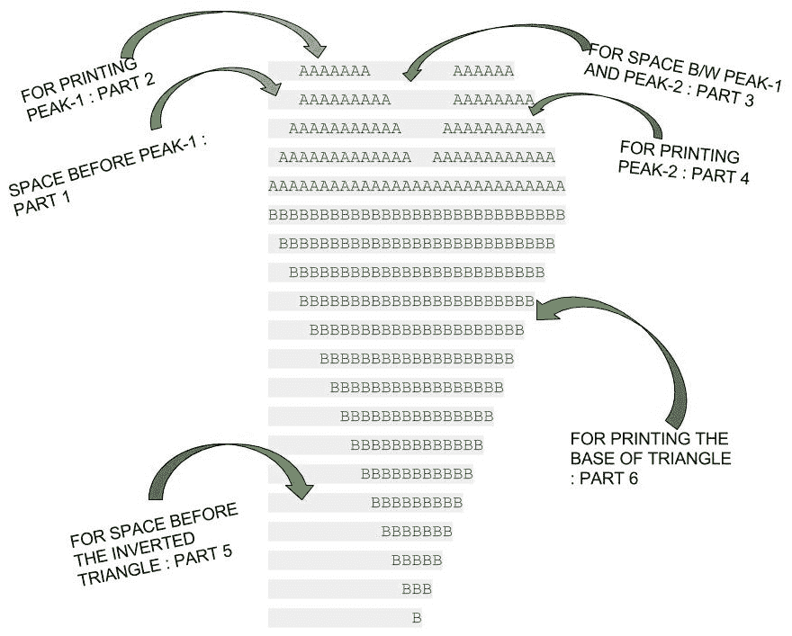

# 在 C 中打印心形图案

> 原文:[https://www.geeksforgeeks.org/printing-heart-pattern-c/](https://www.geeksforgeeks.org/printing-heart-pattern-c/)

如何在 C 语言中打印心型下方？

```cpp
    AAAAAAA        AAAAAA
   AAAAAAAAA      AAAAAAAA
  AAAAAAAAAAA    AAAAAAAAAA
 AAAAAAAAAAAAA  AAAAAAAAAAAA
AAAAAAAAAAAAAAAAAAAAAAAAAAAAA
BBBBBBBBBBBBBBBBBBBBBBBBBBBBB
 BBBBBBBBBBBBBBBBBBBBBBBBBBB
  BBBBBBBBBBBBBBBBBBBBBBBBB
   BBBBBBBBBBBBBBBBBBBBBBB
    BBBBBBBBBBBBBBBBBBBBB
     BBBBBBBBBBBBBBBBBBB
      BBBBBBBBBBBBBBBBB
       BBBBBBBBBBBBBBB
        BBBBBBBBBBBBB
         BBBBBBBBBBB
          BBBBBBBBB
           BBBBBBB
            BBBBB
             BBB
              B
```



## C++

```cpp
// C++ code to print a HEART Shape
#include<iostream>
using namespace std;

int main()
{
    // HERE, we have set the size of Heart, size = 15
    int a, b, size = 15;

    /* FOR THE APEX OF HEART */
    for (a = size/2; a <= size; a = a+2)
    {
        // FOR SPACE BEFORE PEAK-1 : PART 1
        for (b = 1; b < size-a; b = b+2)        
            cout<<" ";

        // FOR PRINTING PEAK-1 : PART 2
        for (b = 1; b <= a; b++)
            cout<<"A";

        // FOR SPACE B/W PEAK-1 AND PEAK-2 : PART 3
        for (b = 1; b <= size-a; b++)
            cout<<" ";

        // FOR PRINTING PEAK-2 : PART 4
        for (b = 1; b <= a-1; b++)
            cout<<"A";

        cout<<endl;
    }

    /*FOR THE BASE OF HEART ie. THE INVERTED TRIANGLE */

    for (a = size; a >= 0; a--)
    {
        // FOR SPACE BEFORE THE INVERTED TRIANGLE : PART 5 
        for (b = a; b < size; b++)
            cout<<" ";

        // FOR PRINTING THE BASE OF TRIANGLE : PART 6
        for (b = 1; b <= ((a * 2) - 1); b++)
            cout<<"B";

        cout<<endl;  
    }
}
// This code is contributed by Kunal Mali.
```

## C

```cpp
// C code to print a HEART Shape
#include<stdio.h>

int main()
{
    // HERE, we have set the size of Heart, size = 10
    int a, b, size = 15;

    /* FOR THE APEX OF HEART */
    for (a = size/2; a <= size; a = a+2)
    {
        // FOR SPACE BEFORE PEAK-1 : PART 1
        for (b = 1; b < size-a; b = b+2)       
            printf(" ");

        // FOR PRINTING PEAK-1 : PART 2
        for (b = 1; b <= a; b++)
            printf("A");

        // FOR SPACE B/W PEAK-1 AND PEAK-2 : PART 3
        for (b = 1; b <= size-a; b++)
            printf(" ");

        // FOR PRINTING PEAK-2 : PART 4
        for (b = 1; b <= a-1; b++)
            printf("A");

        printf("\n");
    }

    /*FOR THE BASE OF HEART ie. THE INVERTED TRIANGLE */

    for (a = size; a >= 0; a--)
    {
        // FOR SPACE BEFORE THE INVERTED TRIANGLE : PART 5
        for (b = a; b < size; b++)
            printf(" ");

        // FOR PRINTING THE BASE OF TRIANGLE : PART 6
        for (b = 1; b <= ((a * 2) - 1); b++)
            printf("B");

        printf("\n"); 
    }
}
```

## Java 语言(一种计算机语言，尤用于创建网站)

```cpp
// Java code to print a HEART Shape

class GFG {

public static void main(String arg[]) {

    // HERE, we have set the size of Heart, size = 10
    int a, b, size = 15;

    /* FOR THE APEX OF HEART */
    for (a = size / 2; a <= size; a = a + 2) {

    // FOR SPACE BEFORE PEAK-1 : PART 1
    for (b = 1; b < size - a; b = b + 2)
        System.out.print(" ");

    // FOR PRINTING PEAK-1 : PART 2
    for (b = 1; b <= a; b++)
        System.out.print("A");

    // FOR SPACE B/W PEAK-1 AND PEAK-2 : PART 3
    for (b = 1; b <= size - a; b++)
        System.out.print(" ");

    // FOR PRINTING PEAK-2 : PART 4
    for (b = 1; b <= a - 1; b++)
        System.out.print("A");

    System.out.print("\n");
    }

    /*FOR THE BASE OF HEART ie. THE INVERTED TRIANGLE */

    for (a = size; a >= 0; a--) {

    // FOR SPACE BEFORE THE INVERTED TRIANGLE : PART 5
    for (b = a; b < size; b++)
        System.out.print(" ");

    // FOR PRINTING THE BASE OF TRIANGLE : PART 6
    for (b = 1; b <= ((a * 2) - 1); b++)
        System.out.print("B");

    System.out.print("\n");
    }
}
}

// This code is contributed by Anant Agarwal.
```

## 蟒蛇 3

```cpp
# Python 3 code to print a HEART Shape

# HERE, we have set the size of Heart,
# size = 10
size = 15

# FOR THE APEX OF HEART
for a in range(int(size / 2), size + 1, 2):

    # FOR SPACE BEFORE PEAK-1 : PART 1
    for b in range(1, size - a, 2):
        print(" ", end = "")

    # FOR PRINTING PEAK-1 : PART 2
    for b in range(1, a + 1):
        print("A",end="")

    # FOR SPACE B/W PEAK-1 AND PEAK-2 :
    # PART 3
    for b in range(1, (size - a) + 1):
        print(" ", end = "")

    # FOR PRINTING PEAK-2 : PART 4
    for b in range(1, a):
        print("A", end = "")

    print("")

# FOR THE BASE OF HEART ie. THE INVERTED
# TRIANGLE
for a in range(size, -1, -1):

# FOR SPACE BEFORE THE INVERTED TRIANGLE:
# PART 5
    for b in range(a, size):
        print(" ", end = "")

    # FOR PRINTING THE BASE OF TRIANGLE:
    # PART 6
    for b in range(1, (a * 2)):
        print("B", end = "")
    print("")

# This code is contributed by Smitha.
```

## C#

```cpp
// Java code to print a HEART Shape
using System;

class GFG {

public static void Main() {

    // HERE, we have set the size of Heart, size = 10
    int a, b, size = 15;

    /* FOR THE APEX OF HEART */
    for (a = size / 2; a <= size; a = a + 2) {

    // FOR SPACE BEFORE PEAK-1 : PART 1
    for (b = 1; b < size - a; b = b + 2)
        Console.Write(" ");

    // FOR PRINTING PEAK-1 : PART 2
    for (b = 1; b <= a; b++)
        Console.Write("A");

    // FOR SPACE B/W PEAK-1 AND PEAK-2 : PART 3
    for (b = 1; b <= size - a; b++)
        Console.Write(" ");

    // FOR PRINTING PEAK-2 : PART 4
    for (b = 1; b <= a - 1; b++)
        Console.Write("A");

    Console.WriteLine();
    }

    /*FOR THE BASE OF HEART ie. THE INVERTED TRIANGLE */

    for (a = size; a >= 0; a--) {

    // FOR SPACE BEFORE THE INVERTED TRIANGLE : PART 5
    for (b = a; b < size; b++)
        Console.Write(" ");

    // FOR PRINTING THE BASE OF TRIANGLE : PART 6
    for (b = 1; b <= ((a * 2) - 1); b++)
        Console.Write("B");

    Console.WriteLine("");
    }
}
}

// This code is contributed by vt_m.
```

## 服务器端编程语言（Professional Hypertext Preprocessor 的缩写）

```cpp
<?php

// php code to print a HEART Shape

    // HERE, we have set the size
    // of Heart, size = 10
    $size = 15;

    // FOR THE APEX OF HEART
    for ($a = floor($size / 2); $a <= $size;
                                $a = $a + 2)
    {

        // FOR SPACE BEFORE PEAK-1 : PART 1
        for ($b = 1; $b < $size-$a;
                      $b = $b + 2)
            printf(" ");

        // FOR PRINTING PEAK-1 : PART 2
        for ($b = 1; $b <= $a; $b++)
            printf("A");

        // FOR SPACE B/W PEAK-1 AND PEAK-2 : PART 3
        for ($b = 1; $b <= $size-$a; $b++)
            printf(" ");

        // FOR PRINTING PEAK-2 : PART 4
        for ($b = 1; $b <= $a - 1; $b++)
            printf("A");

        printf("\n");
    }

    // FOR THE BASE OF HEART ie.
    // THE INVERTED TRIANGLE
    for ($a = $size; $a >= 0; $a--)
    {

        // FOR SPACE BEFORE THE
        // INVERTED TRIANGLE : PART 5
        for ($b = $a; $b < $size; $b++)
            printf(" ");

        // FOR PRINTING THE BASE
        // OF TRIANGLE : PART 6
        for ($b = 1; $b <= (($a * 2) - 1); $b++)
            printf("B");

        printf("\n");
    }

// This code is contributed by mits

?>
```

## java 描述语言

```cpp
<script>

// javascript code to print a HEART Shape  

    // HERE, we have set the size of Heart, size = 10
    var a, b, size = 15;

    /* FOR THE APEX OF HEART */
    for (a = parseInt(size / 2); a <= size; a = a + 2) {

    // FOR SPACE BEFORE PEAK-1 : PART 1
    for (b = 1; b < size - a; b = b + 2)
        document.write(" ");

    // FOR PRINTING PEAK-1 : PART 2
    for (b = 1; b <= a; b++)
        document.write("A");

    // FOR SPACE B/W PEAK-1 AND PEAK-2 : PART 3
    for (b = 1; b <= size - a; b++)
        document.write(" ");

    // FOR PRINTING PEAK-2 : PART 4
    for (b = 1; b <= a - 1; b++)
        document.write("A");

    document.write("<br>");
    }

    /*FOR THE BASE OF HEART ie. THE INVERTED TRIANGLE */

    for (a = size; a >= 0; a--) {

    // FOR SPACE BEFORE THE INVERTED TRIANGLE : PART 5
    for (b = a; b < size; b++)
        document.write(" ");

    // FOR PRINTING THE BASE OF TRIANGLE : PART 6
    for (b = 1; b <= ((a * 2) - 1); b++)
        document.write("B");

    document.write("<br>");
    }

// This code contributed by Princi Singh
</script>
```

**输出:**

```cpp
    AAAAAAA        AAAAAA
   AAAAAAAAA      AAAAAAAA
  AAAAAAAAAAA    AAAAAAAAAA
 AAAAAAAAAAAAA  AAAAAAAAAAAA
AAAAAAAAAAAAAAAAAAAAAAAAAAAAA
BBBBBBBBBBBBBBBBBBBBBBBBBBBBB
 BBBBBBBBBBBBBBBBBBBBBBBBBBB
  BBBBBBBBBBBBBBBBBBBBBBBBB
   BBBBBBBBBBBBBBBBBBBBBBB
    BBBBBBBBBBBBBBBBBBBBB
     BBBBBBBBBBBBBBBBBBB
      BBBBBBBBBBBBBBBBB
       BBBBBBBBBBBBBBB
        BBBBBBBBBBBBB
         BBBBBBBBBBB
          BBBBBBBBB
           BBBBBBB
            BBBBB
             BBB
              B
```

本文由**莫希特·古普塔供稿🙂**。如果你喜欢 GeeksforGeeks 并想投稿，你也可以使用[write.geeksforgeeks.org](https://write.geeksforgeeks.org)写一篇文章或者把你的文章邮寄到 review-team@geeksforgeeks.org。看到你的文章出现在极客博客主页上，帮助其他极客。
如果你发现任何不正确的地方，或者你想分享更多关于上面讨论的话题的信息，请写评论。