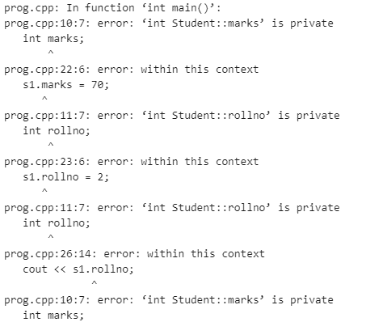

# c++中初始化的问题

> 原文:[https://www . geesforgeks . org/CPP 中初始化问题/](https://www.geeksforgeeks.org/problem-of-initialization-in-cpp/)

在本文中，我们将讨论 [C++](https://www.geeksforgeeks.org/c-plus-plus/) 中的初始化问题，一个[类](https://www.geeksforgeeks.org/c-classes-and-objects/)的数据成员默认具有私有作用域，因此不能直接在类外访问。因此在创建[对象](https://www.geeksforgeeks.org/c-classes-and-objects/)时，不能直接初始化对象的成员，这种无法初始化[数据成员](https://www.geeksforgeeks.org/g-fact-32/)的问题被称为初始化 的 [**问题。**](https://www.geeksforgeeks.org/g-fact-32/)

**示例:**在下面的示例中，用两个数据成员创建了一个类。这些数据成员没有明确定义的范围，因此默认情况下它们是私有的。稍后不能使用类的对象初始化私有数据成员。这里，如果使用类的对象初始化数据成员，那么它将显示一个错误。

## C++

```
// C++ program to demonstrate the
// above approach
#include <iostream>
using namespace std;

// Class declaring the data members
class Student {
    int marks;
    int rollno;
};

// Driver Code
int main()
{
    Student s1;

    // Member variables marks and
    // rollno cannot be initialized
    // outiside the class directly
    s1.marks = 70;
    s1.rollno = 2;

    cout << "Student Roll No: ";
    cout << s1.rollno;
    cout << "Student Marks: ";
    cout << s1.marks;

    return 0;
}
```

**输出:**



**解释:**现在和上面的代码一样，可以看到私有数据成员不能直接在类外初始化。

为了解决初始化的上述**问题，使用了[构造函数](https://www.geeksforgeeks.org/constructors-c/)的概念。它们是一种特殊的成员函数，在创建该类的对象时会自动调用。此外，它们的名称与类名相同。**

构造函数应该用于初始化类的成员变量，因为成员变量不能在单个语句中声明或定义。因此，在创建对象时，构造函数用于初始化类的数据成员。

下面是 C++程序来说明上面的概念:

## C++

```
// C++ program to demonstrate the
// above approach
#include <iostream>
using namespace std;

// Class to declare the
// data members
class Student {
    int marks = 95;
    int rollno = 1234;

    // Wrong way
};

// Driver Code
int main()
{
    Student s1;
    cout << s1.rollno;
    cout << s1.marks;

    return 0;
}
```