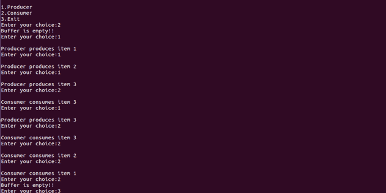

# C 区生产者消费者问题

> 原文:[https://www . geesforgeks . org/producer-consumer-problem-in-c/](https://www.geeksforgeeks.org/producer-consumer-problem-in-c/)

生产者-消费者问题是[多进程同步](https://www.geeksforgeeks.org/introduction-of-process-synchronization/)问题的一个例子。这个问题描述了两个过程，生产者和消费者共享一个公共的固定大小的缓冲区，并将其用作[队列](https://www.geeksforgeeks.org/queue-data-structure/)。

*   生产者的工作是生成数据，将其放入缓冲区，然后重新开始。
*   与此同时，消费者正在消耗数据(即从缓冲区中删除数据)，一次一个。

**问题:**给定常见的固定大小缓冲区，任务是确保生产者不能在缓冲区已满时向缓冲区添加数据，消费者不能从空缓冲区移除数据。

**解决方案:**如果缓冲区已满，生产者要么进入睡眠状态，要么丢弃数据。下一次消费者从缓冲区中移除一个项目时，它会通知生产者，生产者会再次开始填充缓冲区。以同样的方式，如果消费者发现缓冲区是空的，就可以进入睡眠状态。生产者下一次将数据放入缓冲区时，会唤醒沉睡的消费者。

**注意:**不充分的解决方案可能会导致[死锁](https://www.geeksforgeeks.org/introduction-of-deadlock-in-operating-system/)，此时两个进程都在等待被唤醒。

**方法:**思路是利用并行编程的概念和[临界区](https://www.geeksforgeeks.org/g-fact-70/)使用 [**OpenMP**](https://www.geeksforgeeks.org/openmp-introduction-with-installation-guide/) 在 [C 语言](https://www.geeksforgeeks.org/c-language-set-1-introduction/)中实现生产者-消费者问题。

下面是上述方法的实现:

## C

```cpp
// C program for the above approach

#include <stdio.h>
#include <stdlib.h>

// Initialize a mutex to 1
int mutex = 1;

// Number of full slots as 0
int full = 0;

// Number of empty slots as size
// of buffer
int empty = 10, x = 0;

// Function to produce an item and
// add it to the buffer
void producer()
{
    // Decrease mutex value by 1
    --mutex;

    // Increase the number of full
    // slots by 1
    ++full;

    // Decrease the number of empty
    // slots by 1
    --empty;

    // Item produced
    x++;
    printf("\nProducer produces"
           "item %d",
           x);

    // Increase mutex value by 1
    ++mutex;
}

// Function to consume an item and
// remove it from buffer
void consumer()
{
    // Decrease mutex value by 1
    --mutex;

    // Decrease the number of full
    // slots by 1
    --full;

    // Increase the number of empty
    // slots by 1
    ++empty;
    printf("\nConsumer consumes "
           "item %d",
           x);
    x--;

    // Increase mutex value by 1
    ++mutex;
}

// Driver Code
int main()
{
    int n, i;
    printf("\n1\. Press 1 for Producer"
           "\n2\. Press 2 for Consumer"
           "\n3\. Press 3 for Exit");

// Using '#pragma omp parallel for'
// can  give wrong value due to
// synchronisation issues.

// 'critical' specifies that code is
// executed by only one thread at a
// time i.e., only one thread enters
// the critical section at a given time
#pragma omp critical

    for (i = 1; i > 0; i++) {

        printf("\nEnter your choice:");
        scanf("%d", &n);

        // Switch Cases
        switch (n) {
        case 1:

            // If mutex is 1 and empty
            // is non-zero, then it is
            // possible to produce
            if ((mutex == 1)
                && (empty != 0)) {
                producer();
            }

            // Otherwise, print buffer
            // is full
            else {
                printf("Buffer is full!");
            }
            break;

        case 2:

            // If mutex is 1 and full
            // is non-zero, then it is
            // possible to consume
            if ((mutex == 1)
                && (full != 0)) {
                consumer();
            }

            // Otherwise, print Buffer
            // is empty
            else {
                printf("Buffer is empty!");
            }
            break;

        // Exit Condition
        case 3:
            exit(0);
            break;
        }
    }
}
```

**输出:**

[](https://media.geeksforgeeks.org/wp-content/uploads/20201221004348/ProducerConsumer.PNG)