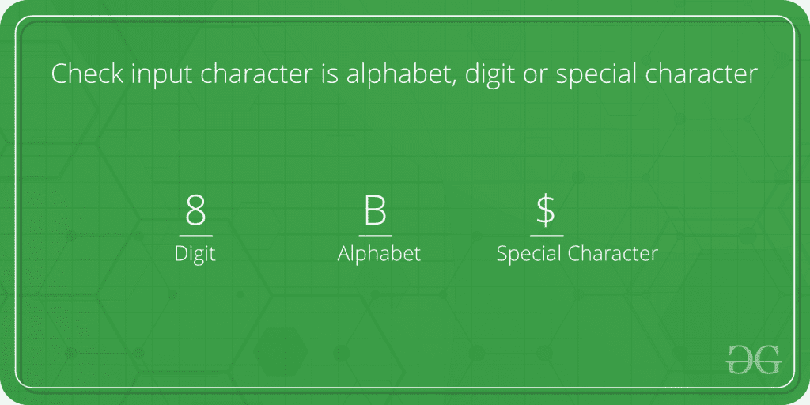

# 检查输入字符是字母、数字还是特殊字符

> 原文:[https://www . geesforgeks . org/program-check-input-character-alphabet-digit-special-character/](https://www.geeksforgeeks.org/program-check-input-character-alphabet-digit-special-character/)



所有字符，无论是字母、数字还是特殊字符，都有 ASCII 值。用户输入的字符将决定是字母、数字还是特殊字符。
ASCII 值范围-

*   大写字母 65–90
*   对于小字母 97–122
*   对于数字 48–57

**例:**

```cpp
Input : 8
Output : Digit

Input : E
Output : Alphabet
```

## C++

```cpp
// CPP program to find type of input character
#include <iostream>
using namespace std;

void charCheck(char input_char)
{
    // CHECKING FOR ALPHABET
    if ((input_char >= 65 && input_char <= 90)
        || (input_char >= 97 && input_char <= 122))
        cout << " Alphabet ";

    // CHECKING FOR DIGITS
    else if (input_char >= 48 && input_char <= 57)
        cout << " Digit ";

    // OTHERWISE SPECIAL CHARACTER
    else
        cout << " Special Character ";
}

// Driver Code
int main()
{
    char input_char = '{content}apos;;
    charCheck(input_char);
    return 0;
}
```

## Java 语言(一种计算机语言，尤用于创建网站)

```cpp
// Java program to find type of input character
import java.io.*;

class GFG {

    static void charCheck(char input_char)
    {
        // CHECKING FOR ALPHABET
        if ((input_char >= 65 && input_char <= 90)
            || (input_char >= 97 && input_char <= 122))
            System.out.println(" Alphabet ");

        // CHECKING FOR DIGITS
        else if (input_char >= 48 && input_char <= 57)
            System.out.println(" Digit ");

        // OTHERWISE SPECIAL CHARACTER
        else
            System.out.println(" Special Character ");
    }

    // Driver Code
    public static void main(String[] args)
    {
        char input_char = '{content}apos;;
        charCheck(input_char);
    }
}

// This code is contributed by vt_m.
```

## 蟒蛇 3

```cpp
# python program to find type of
# input character

def charCheck(input_char):

    # CHECKING FOR ALPHABET
    if ((int(ord(input_char)) >= 65 and
        int(ord(input_char)) <= 90) or
        (int(ord(input_char)) >= 97 and
        int(ord(input_char)) <= 122)):
        print( " Alphabet ")

    # CHECKING FOR DIGITS
    elif (int(ord(input_char)) >= 48 and
            int(ord(input_char)) <= 57):
        print(" Digit ")

    # OTHERWISE SPECIAL CHARACTER
    else:
        print(" Special Character ")

# Driver Code
input_char = '{content}apos;
charCheck(input_char)

# This code is contributed by Sam007.
```

## C#

```cpp
// C# program to find type of
// input character
using System;

class GFG {

    // Function to check type
    // of input character
    static void charCheck(char input_char)
    {
        // Checking for Alphabet
        if ((input_char >= 65 && input_char <= 90)
            || (input_char >= 97 && input_char <= 122))
            Console.WriteLine(" Alphabet ");

        // Checking for Digits
        else if (input_char >= 48 && input_char <= 57)
            Console.WriteLine(" Digit ");

        // Otherwise Special Character
        else
            Console.WriteLine("Special Character");
    }

    // Driver Code
    public static void Main()
    {
        char input_char = '{content}apos;;
        charCheck(input_char);
    }
}

// This code is contributed by vt_m.
```

## 服务器端编程语言（Professional Hypertext Preprocessor 的缩写）

```cpp
<?php
// PHP program to find type
// of input character

function charCheck($input_char)
{
    // CHECKING FOR ALPHABET
    if (($input_char >= 65 && $input_char <= 90)
        || ($input_char >= 97 && $input_char <= 122))
        echo " Alphabet ";

    // CHECKING FOR DIGITS
    else if ($input_char >= 48 &&
            $input_char <= 57)
    echo " Digit ";

    // OTHERWISE SPECIAL CHARACTER
    else                                   
    echo " Special Character ";
}

// Driver Code
$input_char = '{content}apos;;
charCheck($input_char);

// This code is contributed by Sam007
?>
```

## java 描述语言

```cpp
<script>
      // JavaScript program to find type of input character
      function charCheck(input)
      {
        var input_char = input.charCodeAt(0);

        // CHECKING FOR ALPHABET
        if (
          (input_char >= 65 && input_char <= 90) ||
          (input_char >= 97 && input_char <= 122)
        )
          document.write(" Alphabet ");

        // CHECKING FOR DIGITS
        else if (input_char >= 48 && input_char <= 57)
          document.write(" Digit ");

        // OTHERWISE SPECIAL CHARACTER
        else document.write(" Special Character ");
      }

      // Driver Code
      var input_char = "{content}quot;;
      charCheck(input_char);

      // This code is contributed by rdtank.
    </script>
```

**输出:**

```cpp
 Special Character 
```