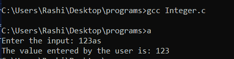
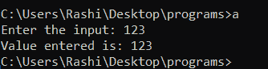

# 仅允许整数输入的程序

> 原文:[https://www . geesforgeks . org/仅允许整数输入的程序/](https://www.geeksforgeeks.org/program-that-allows-integer-input-only/)

给定一个输入值 **N** ，任务是只允许从用户那里获取整数输入。

现在，如果用户输入整数以外的任何输入，即字符或符号，程序将不会接受。下面是实现这种方法的 [C 程序](https://www.geeksforgeeks.org/c-language-set-1-introduction/):

## C

```
// C program for the above approach
#include <stdio.h>

// Driver Code
int main()
{
    int a;
    printf("Enter the input: ");

    // Take the input from console
    scanf("%d", &a);

    // Display the output
    printf("The value entered by the user is: ");
    printf("%d", a);

    return 0;
}
```

**输出:**



**说明:**在上面的程序中，如果输入的是一个字符值，那么 [scanf()函数](https://www.geeksforgeeks.org/scanf-and-fscanf-in-c-simple-yet-poweful/)会接受输入，但不会在输出屏幕上打印任何东西，或者它会忽略该字符，只打印整数。所以，为了避免这个问题，我们来讨论一下如何编写一个只接受整数输入的程序。以下是相同的步骤:

**步骤:**以下程序涉及的步骤为:

1.  **第 1 步:**用户创建一个名为**getintegeronily()**的函数，并将其分配给 int x。
2.  **第二步:**在该功能中，输入的输入将经过一个[边做边循环](https://www.geeksforgeeks.org/c-c-do-while-loop-with-examples/)，其中 [if 语句](https://www.geeksforgeeks.org/decision-making-c-c-else-nested-else/)检查整数的 [ASCII 码](https://www.geeksforgeeks.org/program-print-ascii-value-character/)。如果 ASCII 码与整数 ASCII 码匹配，屏幕上将显示输入。

```
do
{
    If( ch>=48 && ch<=57)
}

Here ch is the input to be enter and 48 to 57 is the 
ASCII Code of 0 to 9 respectively. 
```

*   **第三步:**要使单个数字成为一个数字，将数字相乘并加上输入的整数。

> num = num * 10+(ch–48)
> 这里 num * 10 将改变整数的位置值使
> 成为数字，并且(ch–48)将通过减去其 ASCII 码来添加整数。

*   **第 4 步:**为了打破循环，添加了一个 if 语句，这样循环就不会进入无限循环。

```
if(ch == 13)
break;

Here 13 is the ASCII code of carriage return which breaks and 
return the input value.
```

*   **第五步:**返回功能将存储在 **num** 中的整数返回到 **x** 中，输出打印在屏幕上。

```
printf("you have entered %d", x)
```

下面是实现上述方法的 C 程序:

## C

```
// C program for the above approach
#include <stdio.h>

// Driver Code
int main()
{
    int x = 0;
    x = getIntegerOnly();
    printf("\nvalue entered is: %d", x);
}

// Function to check if the user
// entered value is integer or not
int getIntegerOnly()
{
    int num = 0, ch;
    printf("Enter the input: ");
    do {
        ch = getch();

        // Checks the ASCII code of '
        // digits 0 to 9
        if (ch >= 48 && ch <= 57) {
            printf("%c", ch);

            // To make a digit
            num = num * 10 + (ch - 48);
        }

        // 13 is carriage return it breaks
        // and return the input
        if (ch == 13)
            break;
    } while (1);

    return (num);
}
```

**输出:**



**说明:**执行程序时可以观察到，程序只是接受整数输入，并在屏幕上打印输入。