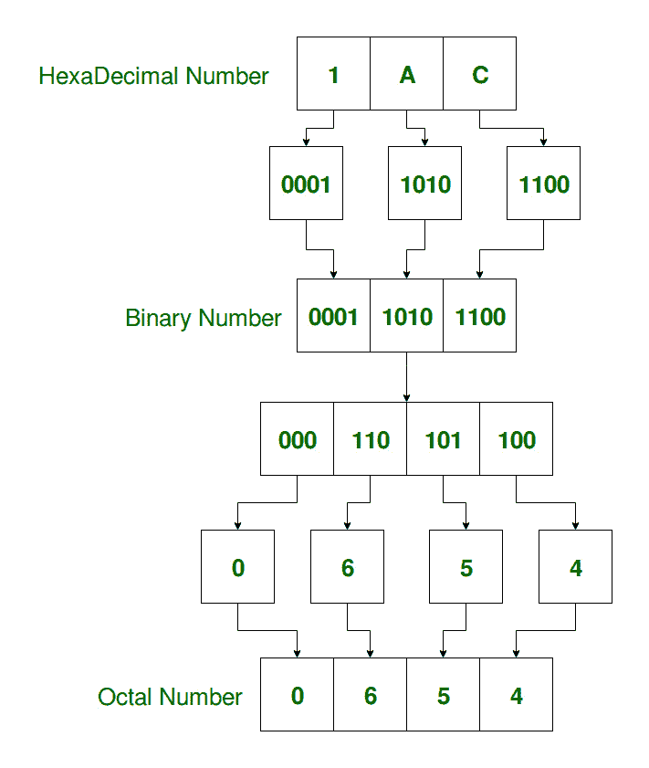

# 将十六进制转换为八进制的程序

> 原文:[https://www . geesforgeks . org/program-to-convert-十六进制-八进制/](https://www.geeksforgeeks.org/program-to-convert-hexadecimal-to-octal/)

给定一个十六进制数，任务是将其转换成八进制数。
**例:**

```
Input: Hexadecimal = 1AC
Output: Binary = 0654
Explanation:
    Equivalent binary value of 1: 0001
    Equivalent binary value of A: 1010
    Equivalent binary value of C: 1100

    Grouping in terms of 3: 000 110 101 100

    Equivalent octal value of 000: 0
    Equivalent octal value of 110: 6
    Equivalent octal value of 101: 5
    Equivalent octal value of 100: 4

Input: Hexadecimal = 5D1F
Output: Octal = 56437

```

**方法:**
十六进制数是以 16 为基数的位置数字系统，使用十六个不同的符号。
八进制数或简称 oct 是基数-8 的数字，使用数字 0 到 7。八进制数字可以由二进制数字组成，方法是将连续的二进制数字分成三组(从右边开始)。
T5】转换步骤

1.  为给定的十六进制数的每个数字找到等价的二进制数。如果任何二进制等价物短于 4 位，则在左边加上 0。
2.  将二进制数字分成组，每组从右到左包含 3 位或数字。如果最后一组包含少于 3 位，则向左添加 0。
3.  找出每个二进制组的八进制等价物。



**以下是上述方法的实施:**

## C++

```
// C++ program to convert
// Hexadecimal to Octal

#include <bits/stdc++.h>
using namespace std;

// Function to convert HexaDecimal to Binary
long long int hex_to_bin(char hex[])
{
    long long int bin, place;
    int i = 0, rem, val;

    bin = 0ll;
    place = 0ll;

    // Hexadecimal to binary conversion
    for (i = 0; hex[i] != '\0'; i++) {
        bin = bin * place;

        switch (hex[i]) {
        case '0':
            bin += 0;
            break;
        case '1':
            bin += 1;
            break;
        case '2':
            bin += 10;
            break;
        case '3':
            bin += 11;
            break;
        case '4':
            bin += 100;
            break;
        case '5':
            bin += 101;
            break;
        case '6':
            bin += 110;
            break;
        case '7':
            bin += 111;
            break;
        case '8':
            bin += 1000;
            break;
        case '9':
            bin += 1001;
            break;
        case 'a':
        case 'A':
            bin += 1010;
            break;
        case 'b':
        case 'B':
            bin += 1011;
            break;
        case 'c':
        case 'C':
            bin += 1100;
            break;
        case 'd':
        case 'D':
            bin += 1101;
            break;
        case 'e':
        case 'E':
            bin += 1110;
            break;
        case 'f':
        case 'F':
            bin += 1111;
            break;
        default:
            cout << "Invalid hexadecimal input.";
        }

        place = 10000;
    }

    return bin;
}

// Function to convert Binary to Octal
long long int bin_to_oct(long long bin)
{
    long long int octal, place;
    int i = 0, rem, val;

    octal = 0ll;
    place = 0ll;

    place = 1;

    // Binary to octal conversion
    while (bin > 0) {
        rem = bin % 1000;

        switch (rem) {
        case 0:
            val = 0;
            break;
        case 1:
            val = 1;
            break;
        case 10:
            val = 2;
            break;
        case 11:
            val = 3;
            break;
        case 100:
            val = 4;
            break;
        case 101:
            val = 5;
            break;
        case 110:
            val = 6;
            break;
        case 111:
            val = 7;
            break;
        }

        octal = (val * place) + octal;
        bin /= 1000;

        place *= 10;
    }

    return octal;
}

// Function to Convert
// Hexadecimal Number to Octal Number
long long int hex_to_oct(char hex[])
{
    long long int octal, bin;

    // convert HexaDecimal to Binary
    bin = hex_to_bin(hex);

    // convert Binary to Octal
    octal = bin_to_oct(bin);

    return octal;
}

// driver code
int main()
{

// Get the hexadecimal number
    char hex[20] = "1AC";

// convert hexadecimal to octal
    cout << "Equivalent Octal Value = " << hex_to_oct(hex);

    return 0;
}

//This code is contributed by shubhamsingh10
```

## C

```
// C program to convert
// Hexadecimal to Octal

#include <math.h>
#include <stdio.h>
#include <string.h>

// Function to convert HexaDecimal to Binary
long long int hex_to_bin(char hex[])
{
    long long int bin, place;
    int i = 0, rem, val;

    bin = 0ll;
    place = 0ll;

    // Hexadecimal to binary conversion
    for (i = 0; hex[i] != '\0'; i++) {
        bin = bin * place;

        switch (hex[i]) {
        case '0':
            bin += 0;
            break;
        case '1':
            bin += 1;
            break;
        case '2':
            bin += 10;
            break;
        case '3':
            bin += 11;
            break;
        case '4':
            bin += 100;
            break;
        case '5':
            bin += 101;
            break;
        case '6':
            bin += 110;
            break;
        case '7':
            bin += 111;
            break;
        case '8':
            bin += 1000;
            break;
        case '9':
            bin += 1001;
            break;
        case 'a':
        case 'A':
            bin += 1010;
            break;
        case 'b':
        case 'B':
            bin += 1011;
            break;
        case 'c':
        case 'C':
            bin += 1100;
            break;
        case 'd':
        case 'D':
            bin += 1101;
            break;
        case 'e':
        case 'E':
            bin += 1110;
            break;
        case 'f':
        case 'F':
            bin += 1111;
            break;
        default:
            printf("Invalid hexadecimal input.");
        }

        place = 10000;
    }

    return bin;
}

// Function to convert Binary to Octal
long long int bin_to_oct(long long bin)
{
    long long int octal, place;
    int i = 0, rem, val;

    octal = 0ll;
    place = 0ll;

    place = 1;

    // Binary to octal conversion
    while (bin > 0) {
        rem = bin % 1000;

        switch (rem) {
        case 0:
            val = 0;
            break;
        case 1:
            val = 1;
            break;
        case 10:
            val = 2;
            break;
        case 11:
            val = 3;
            break;
        case 100:
            val = 4;
            break;
        case 101:
            val = 5;
            break;
        case 110:
            val = 6;
            break;
        case 111:
            val = 7;
            break;
        }

        octal = (val * place) + octal;
        bin /= 1000;

        place *= 10;
    }

    return octal;
}

// Function to Convert
// Hexadecimal Number to Octal Number
long long int hex_to_oct(char hex[])
{
    long long int octal, bin;

    // convert HexaDecimal to Binary
    bin = hex_to_bin(hex);

    // convert Binary to Octal
    octal = bin_to_oct(bin);

    return octal;
}

// driver code
int main()
{

// Get the hexadecimal number
    char hex[20] = "1AC";

// convert hexadecimal to octal
    printf("Equivalent Octal Value = %lld",
 hex_to_oct(hex));

    return 0;
}
```

## Java 语言(一种计算机语言，尤用于创建网站)

```
// Java program to convert
// Hexadecimal to Octal
class hex_to_oct
{
// declaring main method.
public static void main(String[] args)
{
    int dec = 0;

    // taking 1AC as an example of hexadecimal Number.
    String hexa = "1AC";
    int c = hexa.length() - 1;

    // finding the decimal equivalent of the
    // hexa decimal number
    for(int i = 0; i < hexa.length() ; i ++ )
    {
        //extracting each character from the string.
        char ch = hexa.charAt(i);
        switch (ch)
        {
            case '0':
            case '1':
            case '2':
            case '3':
            case '4':
            case '5':
            case '6':
            case '7':
            case '8':
            case '9':
                dec = dec + Integer.parseInt(Character.toString(ch))*
                                                (int)Math.pow(16,c);
                c--;
                break;
            case 'a':
            case 'A':
                dec = dec + 10 * (int)Math.pow(16, c);
                c--;
                break;
            case 'b':
            case 'B':
                dec = dec + 11 * (int)Math.pow(16, c);
                c--;
                break;
            case 'c':
            case 'C':
                dec = dec + 12 * (int)Math.pow(16, c);
                c--;
                break;
            case 'd':
            case 'D':
                dec = dec + 13 * (int)Math.pow(16, c);
                c--;
                break;
            case 'e':
            case 'E':
                dec = dec + 14 * (int)Math.pow(16, c);
                c--;
                break;
            case 'f':
            case 'F':
                dec = dec + 15 * (int)Math.pow(16, c);
                c--;
                break;
            default:
                System.out.println("Invalid hexa input");
                break;
        }
    }

    // String oct to store the octal equivalent of a hexadecimal number.
    String oct ="";

    //converting decimal to octal number.
    while(dec > 0)
    {
        oct = dec % 8 + oct;
        dec = dec / 8;
    }

    // Printing the final output.
    System.out.println("Equivalent Octal Value = "+oct);
}
}

// This code is contributed by Animesh_Gupta 

```

## 计算机编程语言

```
# importing math package
import math
hex = "1AC"

# variable oct to store
# octal equivalent of hexa decimal
# number returned from the method
oct = ""
dec = i = 0
c = len(hex) - 1

# loop to extract each digit of number
while i < len(hex):

    # digit extracted
    d = hex[i]
    if d == '0' or d == '1' or d == '2' or \
        d == '3' or d == '4' or d == '5':
        dec = dec + int(d) * int(math.pow(16, c))
    elif d == '6' or d == '7' or d == '8' or d == '9':
        dec = dec + int(d) * int(math.pow(16, c))
    elif (d == 'A') or (d == 'a'):
        dec = dec + 10 * int(math.pow(16, c))
    elif (d == 'B') or (d == 'b'):
        dec = dec + 11 * int(math.pow(16, c))
    elif (d == 'C') or (d == 'c'):
        dec = dec + 12 * int(math.pow(16, c))
    elif (d == 'D') or (d == 'd'):
        dec = dec + 13 * int(math.pow(16, c))
    elif (d == 'E') or (d == 'e'):
        dec = dec + 14 * int(math.pow(16, c))
    elif (d == 'F') or (d == 'f'):
        dec = dec + 15 * int(math.pow(16, c))
    else:
        print("invalid input")
        break
    i+= 1
    c -= 1

# loop to find octal equivalent
# stored in dec i.e.
# conversion of decimal to octal.
while (dec > 0):
    oct = "".join([str(int(dec % 8)) , oct])
    dec = int(dec / 8)

# printing the final result
print("Equivalent Octal Value =",oct)

# This code is contributed by 29AjayKumar
```

## C#

```
// C# program to convert
// Hexadecimal to Octal
using System;
class GFG{

// Driver code
public static void Main(string[] args)
{
  int dec = 0;

  // taking 1AC as an example
  // of hexadecimal Number.
  string hexa = "1AC";
  int c = hexa.Length - 1;

  // Finding the decimal
  // equivalent of the
  // hexa decimal number
  for(int i = 0; i < hexa.Length ; i ++ )
  {
    // Extracting each character
    // from the string.
    char ch = hexa[i];
    switch (ch)
    {
      case '0':
      case '1':
      case '2':
      case '3':
      case '4':
      case '5':
      case '6':
      case '7':
      case '8':
      case '9':
        dec = dec + Int32.Parse(ch.ToString())*
                               (int)Math.Pow(16, c);
        c--;
        break;
      case 'a':
      case 'A':
        dec = dec + 10 * (int)Math.Pow(16, c);
        c--;
        break;
      case 'b':
      case 'B':
        dec = dec + 11 * (int)Math.Pow(16, c);
        c--;
        break;
      case 'c':
      case 'C':
        dec = dec + 12 * (int)Math.Pow(16, c);
        c--;
        break;
      case 'd':
      case 'D':
        dec = dec + 13 * (int)Math.Pow(16, c);
        c--;
        break;
      case 'e':
      case 'E':
        dec = dec + 14 * (int)Math.Pow(16, c);
        c--;
        break;
      case 'f':
      case 'F':
        dec = dec + 15 * (int)Math.Pow(16, c);
        c--;
        break;
      default:
        Console.Write("Invalid hexa input");
        break;
    }
  }

  // String oct to store the octal
  // equivalent of a hexadecimal number.
  string oct = "";

  // converting decimal
  // to octal number.
  while(dec > 0)
  {
    oct = dec % 8 + oct;
    dec = dec / 8;
  }

  // Printing the final output.
  Console.Write("Equivalent Octal Value = " +
                 oct);
}
}

// This code is contributed by rutvik_56
```

**输出:**

```
Equivalent Octal Value = 654

```