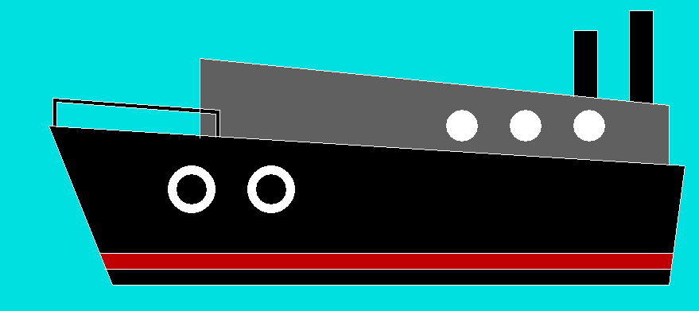

# 使用图形创建船舶的程序

> 原文:[https://www . geesforgeks . org/program-to-create-a-ship-using-graphics/](https://www.geeksforgeeks.org/program-to-create-a-ship-using-graphics/)

在 Turbo C 图形中， [**graphics.h**](https://www.geeksforgeeks.org/include-graphics-h-codeblocks/) 函数用于绘制不同的形状，如圆形、矩形等，以不同的格式(不同的字体和颜色)显示文本(任何消息)。通过使用 graphics.h，我们可以制作程序、动画和游戏。这些对初学者很有用。

**使用的功能:**

*   [**线(a1，b1，a2，b2)**](https://www.geeksforgeeks.org/draw-line-c-graphics/?ref=rp)**:**graphics . h 头文件中的一个函数，从(a1，b1)点到(a2，B2)点绘制一条线。
*   [**【圆(A，b，r)**](https://www.geeksforgeeks.org/draw-circle-c-graphics/)**:**graphics . h 头文件中的一个函数，画一个以(A，b)为中心，r 为半径的圆。
*   [**【setfillstyle(图案，颜色)**](https://www.geeksforgeeks.org/setfillstyle-floodfill-c/)**:**graphics . h 头文件中的一个函数，通过它我们可以给出一个绘图的图案以及一个特定的颜色。
*   [**【漫填(A，b，c)**](https://www.geeksforgeeks.org/setfillstyle-floodfill-c/)**:**graphics . h 头文件中的一个函数，通过它我们可以在以(A，b)为中心，c 为边框颜色的特定有界区域中进行着色。

**进场:**

*   第一步是使用 **setfillstyle()** 和 **floodfill()** 功能将**背景染成青色。**
*   然后，使用**直线()功能**做一条直线，该功能将作为船舶的楼层。
*   下一步是使用**线()**功能制作其他线，制作一艘完整的船。
*   使用**圆()**功能实现救生衣，一共实现了四个圆。这里一共实现了两件救生衣。使用 **setfillstyle()** 和 **floodfill()** 功能将其涂成白色。
*   然后，使用相同的 line()函数制作一个 rail，并使用 setfillstyle()和 floodfill()函数将其着色为黑色。
*   使用 line()函数制作一个小屋，并使用 setfillstyle()和 floodfill()函数将其着色为浅灰色。
*   使用 circle()函数创建三个窗口，并使用 setfillstyle()和 floodfill()函数将其涂成白色。
*   然后，使用 line()函数制作两个烟囱，并使用 setfillstyle()和 floodfill()函数将其涂成黑色。
*   最后一步是使用 line()函数进行一些设计，并使用 setfillstyle()和 floodfill()函数将其涂成红色。

下面是实现上述方法的 C 程序:

## C

```cpp
// C program for the above approach

#include <conio.h>
#include <graphics.h>
#include <stdio.h>

// Driver Code
void main()
{
    int gd = DETECT, gm;

    // Initialize of gdriver
    // with DETECT macros
    initgraph(&gd, &gm,
              "C:\\turboc3\\bgi");

    // Set Background Color Cyan
    setfillstyle(SOLID_FILL,
                 CYAN);
    floodfill(50, 50, 15);

    // Base Line
    line(300, 600, 1000, 600);

    // Lower Line
    line(290, 580, 1003, 580);

    // Upper Line
    line(285, 560, 1005, 560);

    // Left Tangent
    line(300, 600, 220, 400);

    // Right Tangent
    line(1000, 600, 1020, 450);

    // Connector Line
    line(220, 400, 1020, 450);
    setfillstyle(SOLID_FILL,
                 BLACK);
    floodfill(250, 420, 15);
    floodfill(350, 590, 15);
    setfillstyle(SOLID_FILL,
                 RED);
    floodfill(350, 570, 15);

    // First Life Jacket
    setfillstyle(SOLID_FILL,
                 WHITE);
    circle(400, 480, 30);
    circle(400, 480, 20);
    floodfill(375, 480, 15);

    // Second Life Jacket
    circle(500, 480, 30);
    circle(500, 480, 20);
    floodfill(475, 480, 15);

    // Ralling
    setfillstyle(SOLID_FILL,
                 BLACK);
    line(230, 400, 230, 370);
    line(225, 400, 225, 365);
    line(230, 370, 430, 385);
    line(225, 365, 435, 380);
    line(430, 385, 430, 415);
    line(435, 380, 435, 415);
    floodfill(227, 367, 15);

    // Cabin
    setfillstyle(SOLID_FILL,
                 DARKGRAY);
    line(410, 415, 410, 315);
    line(410, 315, 1000, 374);
    line(1000, 374, 1000, 450);
    floodfill(950, 390, 15);
    floodfill(425, 410, 15);
    setfillstyle(SOLID_FILL,
                 WHITE);

    // First Window
    circle(900, 400, 20);
    floodfill(890, 400, 15);

    // Second Window
    circle(820, 400, 20);
    floodfill(810, 400, 15);

    // Third Window
    circle(740, 400, 20);
    floodfill(730, 400, 15);

    // First Chimnney
    setfillstyle(SOLID_FILL,
                 BLACK);
    line(880, 363, 880, 280);
    line(880, 280, 910, 280);
    line(910, 280, 910, 365);
    floodfill(890, 290, 15);

    // Second Chimnney
    line(950, 369, 950, 255);
    line(950, 255, 980, 255);
    line(980, 255, 980, 374);
    floodfill(960, 265, 15);

    // Hold a screen for a
    // while
    getch();

    // Close the initialized
    /// gdriver
    closegraph();
}
```

**输出:**

