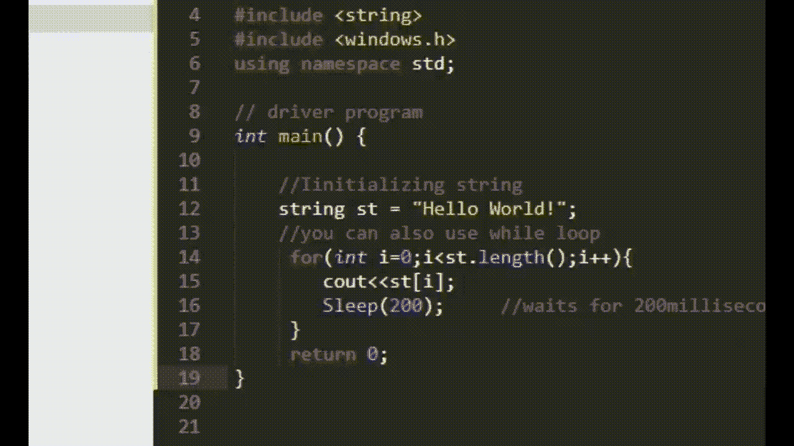
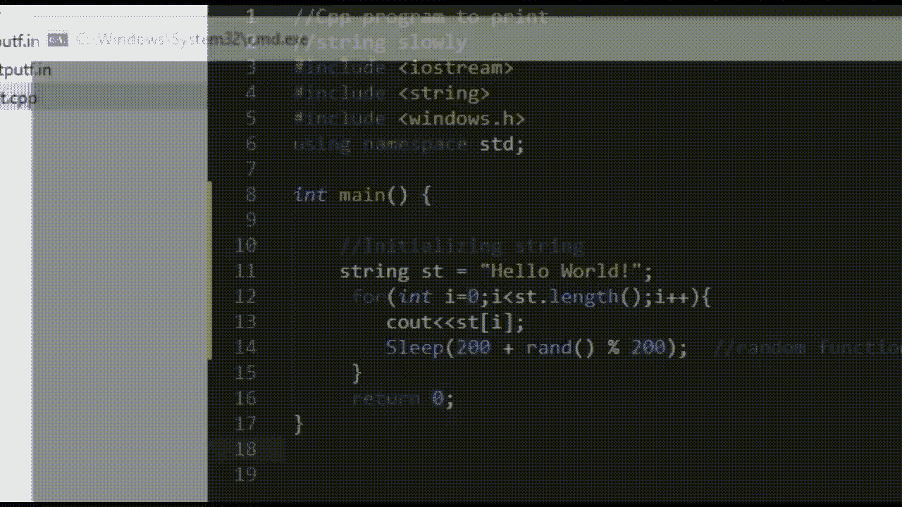

# 用 C++在控制台上缓慢显示字符的程序

> 原文:[https://www . geesforgeks . org/program-to-display-characters-在 cpp 控制台上缓慢运行/](https://www.geeksforgeeks.org/program-to-display-characters-slowly-on-the-console-in-cpp/)

任务是编写一个 [C++程序](https://www.geeksforgeeks.org/c-plus-plus/)，在控制台上慢慢显示给定字符串的字符。

**方法:**给定的问题可以用 C++中的 [sleep()函数](https://www.geeksforgeeks.org/sleep-command-in-linux-with-examples/)来解决。

**头文件:**

*   <windows.h>为窗户</windows.h>
*   <unistd.h>对于 Linux</unistd.h>

**语法:**

> 睡眠(时间 _ 毫秒)

**随机函数:**c++中的 [rand()函数](https://www.geeksforgeeks.org/rand-and-srand-in-ccpp/)生成范围为**【0、**[**RAND _ MAX**](https://www.geeksforgeeks.org/generating-random-number-range-c/)**的随机数。如果使用 **rand()函数**生成随机数，而没有先调用 **srand()** ，程序每次执行时将创建相同的数字序列。**

****语法:****

> **rand(请参阅)**

****程序 1:****

**下面是使用 sleep 函数在 C++控制台上缓慢显示字符的实现:**

## **C++**

```cpp
// C++ program for the above approach

#include <iostream>
#include <string>
#include <windows.h>
using namespace std;

// Driver Code
int main()
{
    // Initialize the string
    string S = "Hello World!";

    // Traverse the given string S
    for (int i = 0; i < S[i]; i++) {

        cout << S[i];

        // Waits for 200 milliseconds
        Sleep(200);
    }

    return 0;
}
```

****输出:****

**[](https://media.geeksforgeeks.org/wp-content/uploads/20210303234708/op.gif)**

****程序 2:****

**下面是使用 sleep 函数和 random 函数在 C++控制台上缓慢显示字符的实现:**

## **C++**

```cpp
// C++ program for the above approach

#include <iostream>
#include <string>
#include <windows.h>
using namespace std;

// Driver Code
int main()
{
    string S = "Hello World!";

    for (int i = 0; i < S.length(); i++) {
        cout << S[i];

        // random function generates
        // random values
        Sleep(200 + rand() % 200);
    }

    return 0;
}
```

****输出:****

**[](https://media.geeksforgeeks.org/wp-content/uploads/20210303235933/op2.gif)**