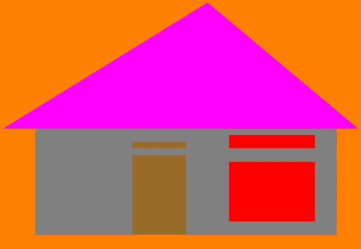

# 用 C++中的 OpenGL 绘制小屋的程序

> 原文:[https://www . geesforgeks . org/program-to-draw-a-hut-in-use-OpenGL-in-CPP/](https://www.geeksforgeeks.org/program-to-draw-a-hut-in-using-opengl-in-cpp/)

在本文中，我们将讨论如何使用两种基本形状，即三角形和矩形，在 [OpenGL](https://www.geeksforgeeks.org/getting-started-with-opengl/) 中创建小屋的正面视图。

**方法:**按照以下步骤解决问题:

*   使用函数**明胶(& argc，argv)** 初始化工具包。
*   使用功能**设置显示模式并指定配色方案**。
*   使用功能**设定窗口大小(1200，740)** 。
*   使用功能**设置窗口的起始位置。**
*   使用功能 **glutCreateWindow(“基本小屋状结构”)**初始化窗口并设置标题。
*   初始化 **myInit()** 功能，并执行以下步骤:
    *   使用功能 **glClearColor(1.0，0.5，0.0，1.0)** 将背景颜色设置为橙色。
    *   使用功能**指定显示区域 gluportho2d(0.0，400.0，0.0，400.0)** 。
*   初始化 **myDisplay()** 功能，并执行以下步骤:
    *   使用**功能**清除屏幕。
    *   小屋的矩形部分可以使用功能 **glPointSize(4.0)** 绘制。
    *   将绘图颜色设置为 **glColor3f(0.5f，0.5f，0.5f)** 。
    *   使用多边形命令创建房屋的两个窗口、门、顶部三角形和主矩形，并使用以下函数设置它们的顶点:
        *   glBegin（GL_POLYGON）;
        *   glVertex2i ( x，y)；
    *   使用函数 **glColor3f(R，G，B)** 对上述步骤中的多边形进行着色。

下面是上述方法的实现:

## C++

```
// C++ program for the above approach

#include <GL\glut.h>
#include <iostream>
#include <windows.h>
using namespace std;

// Function to initialize the drivers
void myInit(void)
{
    // Clear all the screen color
    glClearColor(1.0, 0.5, 0.0, 1.0);

    // Sets background color to orang
    glMatrixMode(GL_PROJECTION);

    glLoadIdentity();

    // Specify the display area
    gluOrtho2D(0.0, 400.0, 0.0, 400.0);
}

// Function to display the Hut like
// structure on the console
void myDisplay(void)
{
    // Clear the screen buffer
    glClear(GL_COLOR_BUFFER_BIT);

    glPointSize(4.0);

    // Rectangular part of hut
    glColor3f(0.5f, 0.5f, 0.5f);

    // Begin the polygon
    glBegin(GL_POLYGON);

    // Create the polygon
    glVertex2i(40, 40);
    glVertex2i(320, 40);

    glVertex2i(40, 200);
    glVertex2i(320, 200);

    glVertex2i(40, 200);
    glVertex2i(40, 40);

    glVertex2i(320, 200);
    glVertex2i(320, 40);

    glEnd();

    // Right Window Update
    glColor3f(1.0f, 0.0f, 0.0f);

    // Begin the polygon
    glBegin(GL_POLYGON);

    // Create the polygon
    glVertex2i(220, 60);
    glVertex2i(300, 60);

    glVertex2i(220, 150);
    glVertex2i(300, 150);

    glVertex2i(220, 60);
    glVertex2i(220, 150);

    glVertex2i(300, 150);
    glVertex2i(300, 60);

    glEnd();

    // Right Window Update part 2
    glColor3f(1.0f, 0.0f, 0.0f);

    // Begin the polygon
    glBegin(GL_POLYGON);

    // Create the polygon
    glVertex2i(220, 170);
    glVertex2i(300, 170);

    glVertex2i(220, 190);
    glVertex2i(300, 190);

    glVertex2i(220, 170);
    glVertex2i(220, 190);

    glVertex2i(300, 190);
    glVertex2i(300, 170);

    glEnd();

    // Door
    glColor3f(0.60f, 0.42f, 0.16f);

    // Begin the polygon
    glBegin(GL_POLYGON);

    // Create the polygon
    glVertex2i(130, 40);
    glVertex2i(130, 160);

    glVertex2i(130, 160);
    glVertex2i(180, 160);

    glVertex2i(180, 100);
    glVertex2i(180, 40);

    glVertex2i(120, 40);
    glVertex2i(170, 40);

    glEnd();

    // Create Door Part 2
    glColor3f(0.60f, 0.42f, 0.16f);

    // Begin the polygon
    glBegin(GL_POLYGON);

    // Create the polygon
    glVertex2i(130, 170);
    glVertex2i(130, 180);

    glVertex2i(130, 180);
    glVertex2i(180, 180);

    glVertex2i(180, 170);
    glVertex2i(180, 180);

    glVertex2i(130, 170);
    glVertex2i(180, 170);

    glEnd();

    // Hut's top triangle part
    glColor3f(1.0f, 0.0f, 1.0f);

    // Begin the polygon
    glBegin(GL_POLYGON);

    // Create the polygon
    glVertex2i(10, 200);
    glVertex2i(340, 200);

    glVertex2i(200, 390);

    glVertex2i(10, 200);
    glVertex2i(200, 390);

    glEnd();

    // Sends all output to display
    glFlush();
}

// Driver Code
int main(int argc, char** argv)
{
    // Initialize the init function
    glutInit(&argc, argv);

    // Initialize the toolkit;
    glutInitDisplayMode(
        GLUT_SINGLE | GLUT_RGB);

    // Sets the display mode and
    // specify the colour scheme
    glutInitWindowSize(1200, 740);

    // Specify the window size
    glutInitWindowPosition(0, 0);

    // Sets the starting position
    // for the window
    glutCreateWindow("Basic hut like"
                     " structure");

    // Creates the window and
    // sets the title
    glutDisplayFunc(myDisplay);
    myInit();

    // Additional initializations
    glutMainLoop();

    // Go into a loop until event
    // occurs
    return 0;
}
```

**输出:**

[](https://media.geeksforgeeks.org/wp-content/uploads/20210205231409/article823.png)