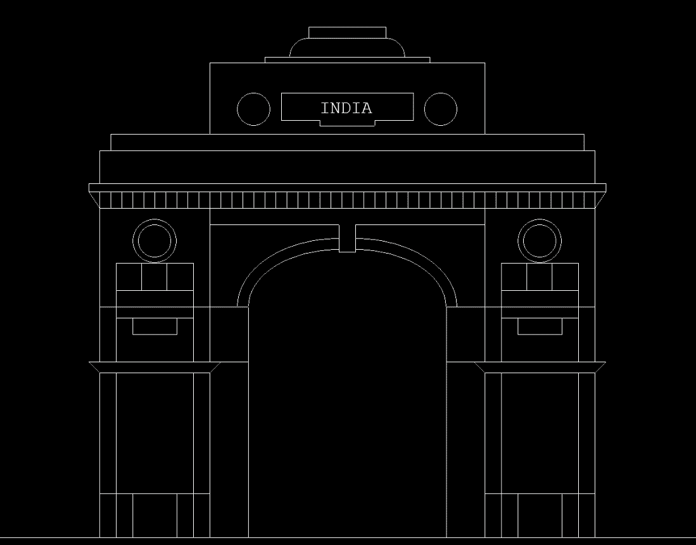

# 用 C 语言计算机绘图绘制印度门的程序

> 原文:[https://www . geesforgeks . org/program-to-draw-India-gate-use-computer-graphics-in-c/](https://www.geeksforgeeks.org/program-to-draw-india-gate-using-computer-graphics-in-c/)

p >在 [C 图形](https://www.geeksforgeeks.org/add-graphics-h-c-library-gcc-compiler-linux/)中， [graphics.h](https://www.geeksforgeeks.org/include-graphics-h-codeblocks/) 功能用于绘制不同的形状，如圆形、矩形等，以不同的格式(不同的字体和颜色)显示文本(任何消息)。通过使用 **graphics.h** 可以制作程序、动画和游戏。

**使用的功能:**

*   [**矩形(l，t，r，b)**](https://www.geeksforgeeks.org/draw-rectangle-c-graphics/?ref=rp)**:**graphics . h 头文件中的一个函数，用于从左(l)到右(r)以及从上(t)到下(b)绘制一个矩形。
*   [**线(a1，b1，a2，b2)**](https://www.geeksforgeeks.org/draw-line-c-graphics/?ref=rp)**:**graphics . h 头文件中的一个函数，用于绘制从(a1，b1)点到(a2，B2)点的线。
*   [**圆(A，b，r)**](https://www.geeksforgeeks.org/draw-circle-c-graphics/)**:**graphics . h 头文件中的一个函数，用来画一个以(A，b)为中心，r 为半径的圆。
*   [**【outextxy(int x，int y，char * string)**](https://www.geeksforgeeks.org/outtextxy-function-c/)**:**graphics . h 头文件中的一个函数，通过它可以打印任何语句，其中，x，y 是点的坐标，第三个参数包含要显示的字符串的地址。
*   [**【settextstyle(int font，int direction，int font _ size)**](https://www.geeksforgeeks.org/settextstyle-function-c/)**:**graphics . h 头文件中的一个函数，通过它可以创建可打印文本的样式，其中 font 参数指定文本的字体。方向可以是**水平方向**(从左到右)或垂直方向(从下到上)。
*   [**椭圆(int x，int y，int start_angle，int end_angle，int x_radius，int y_radius)**](https://www.geeksforgeeks.org/draw-ellipse-c-graphics/) **:** 来自 graphics.h 头文件的一个函数，其中 **x，y** 是[椭圆](https://www.geeksforgeeks.org/p5-js-ellipse-function/)的位置。x_radius 和 y_radius 决定表格 x 和 y 的半径，start_angle 是角度的起点，end_angle 是角度的终点。角度值可以在 0 到 360 度之间变化。
*   [**弧(x，y，start_ang，end_ang，r)**](https://www.geeksforgeeks.org/arc-function-c/)**:**graphics . h 头文件中的一个函数，它以(x，y)为中心绘制一条弧，start_ang 为其起始角，end_ang 为其终止角，r 为半径。

**方法:**按照以下步骤解决这个问题:

*   首先，使用**线()功能**定义基线。
*   调用左()函数来定义和实现印度门左侧的装饰。在左()函数中，首先，使用**矩形()函数**定义一个矩形，该矩形将作为底部矩形，并将使用**线()函数**进行装饰。然后使用 rectangle()函数实现另一个矩形，即上侧矩形。在这里，使用**线()**和**圆()功能**进行装饰。
*   调用 right()函数，在坐标改变的情况下，对左侧执行上述相同的步骤。
*   调用中间 <u>()</u> 功能实现中间部分的装饰。这里，使用**椭圆 <u>()</u> 功能**实现一些弧线。另外，使用**线 <u>()</u> 功能**也可以做一些其他的装饰。
*   调用向上 <u>()</u> 功能。这里，使用**矩形 <u>()</u> 功能**实现一些矩形。这里，使用 while 循环来实现带有 **line()功能**的连续线条，以达到装饰的目的。这里，实现一些不同大小的矩形来装饰。
*   在 up <u>()</u> 功能中，用**圆()和 line()功能**在一个矩形中做一些装饰。在带有**线()功能**的特殊矩形<u>T5 中间，写下**【印度】**，这在现实中是很常见的。还有两个圆弧用**圆弧 <u>()</u> 功能**实现，做上装饰。</u>

下面是上述方法的实现:

## C

```
// C program for the above approach

#include <conio.h>
#include <graphics.h>
#include <stdio.h>

// Used Function Declaration
void left();
void right();
void mid();
void up();

void up()
{
    int u = 520;
    rectangle(500, 370, 1400, 400);

    // Defining A loop To Draw
    // Many Lines
    while (u <= 1400) {
        line(u, 370, u, 400);
        u = u + 20;
    }

    rectangle(480, 355, 1420, 370);
    line(500, 400, 480, 370);
    line(1400, 400, 1420, 370);
    rectangle(500, 355, 1400, 295);
    rectangle(520, 265, 1380, 295);

    // Main Rectangle To Write
    // India
    rectangle(700, 135, 1200, 265);
    circle(780, 220, 30);
    circle(1120, 220, 30);
    line(830, 190, 1070, 190);
    line(830, 190, 830, 240);
    line(830, 240, 900, 240);
    line(1070, 190, 1070, 240);
    line(1070, 240, 1000, 240);
    line(1000, 240, 1000, 250);
    line(900, 240, 900, 250);
    line(900, 250, 1000, 250);

    // Writing India
    settextstyle(8, 0, 4);
    outtextxy(900, 200, "INDIA");
    rectangle(800, 125, 1100, 135);
    rectangle(880, 70, 1020, 90);
    arc(880, 125, 90, 180, 35);
    arc(1020, 125, 0, 90, 35);
}

// Function to draw the middle part
// of the India Gate
void mid()
{
    line(700, 400, 1200, 400);
    line(700, 430, 935, 430);
    line(965, 430, 1200, 430);
    line(935, 480, 935, 430);
    line(965, 480, 965, 430);
    line(935, 480, 965, 480);

    // Left side arcs
    ellipse(935, 580, 90,
            180, 165, 105);
    ellipse(935, 580, 90,
            180, 185, 125);

    // Right Side Arcs
    ellipse(965, 580, 0,
            90, 165, 105);
    ellipse(965, 580, 0,
            90, 185, 125);

    // Left Side Vertical Line
    line(770, 1000, 770, 580);

    // Right Side Vertical Line
    line(1130, 1000, 1130, 580);
}

// Function to draw the left part
// of the India Gate
void left()
{
    // Left Base Rectangle
    rectangle(500, 700,
              700, 1000);

    // Lower Inner Rectangle
    rectangle(530, 700,
              670, 1000);
    rectangle(560, 920,
              640, 1000);
    line(500, 920, 700, 920);
    line(500, 700, 700, 700);
    line(480, 680, 770, 680);
    line(500, 700, 480, 680);
    line(700, 700, 720, 680);

    // Left Upper Rectangle
    rectangle(500, 400,
              700, 680);

    // Upper Inner Rectangle
    rectangle(530, 500,
              670, 680);
    line(530, 550, 670, 550);
    line(576, 500, 576, 550);
    line(622, 500, 622, 550);
    line(500, 580, 770, 580);
    line(530, 600, 670, 600);
    rectangle(560, 600,
              640, 630);
    circle(600, 460, 40);
    circle(600, 460, 30);
}

// Function to draw the right part
// of the India Gate
void right()
{
    // Right Base Rectangle
    rectangle(1200, 700,
              1400, 1000);

    // Lower Inner Rectangle
    rectangle(1230, 700,
              1370, 1000);
    rectangle(1260, 920,
              1340, 1000);
    line(1200, 920, 1400, 920);
    line(1200, 700, 1400, 700);
    line(1130, 680, 1420, 680);
    line(1200, 700, 1180, 680);
    line(1400, 700, 1420, 680);

    // Right Upper Ractangle
    rectangle(1200, 400,
              1400, 680);

    // Upper Inner Rectangle
    rectangle(1230, 500,
              1370, 680);
    line(1230, 550, 1370, 550);
    line(1276, 500, 1276, 550);
    line(1322, 500, 1322, 550);
    line(1130, 580, 1400, 580);
    line(1230, 600, 1370, 600);
    rectangle(1260, 600,
              1340, 630);
    circle(1300, 460, 40);
    circle(1300, 460, 30);
}

// Driver Code
void main()
{
    int gd = DETECT, gm;

    // Initialize of gdriver with
    // DETECT macros
    initgraph(&gd, &gm,
              "C:\\turboc3\\bgi");

    // Base Line
    line(200, 1000, 2000, 1000);

    // Function Call
    left();

    // Function Call
    right();

    // Function Call
    mid();

    // Function Call
    up();

    // Holding The Screen For A While
    getch();

    // Close the initialized gdriver
    closegraph();
}
```

**输出:**

[](https://media.geeksforgeeks.org/wp-content/uploads/20210609155514/INDIAGATE.png)