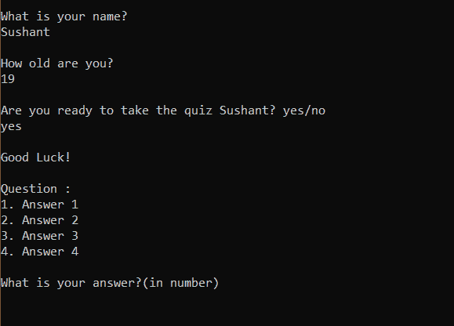
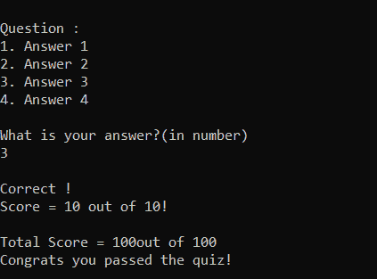

# c++中的问答游戏

> 原文:[https://www.geeksforgeeks.org/quiz-game-in-c/](https://www.geeksforgeeks.org/quiz-game-in-c/)

在本文中，任务是创建一个问答游戏，用户将被提问，每个问题的结果，无论是正确的还是错误的，都会显示更新的分数。

下面是同样的实现:

## C++

```
// C++ program for the above approach
#include <iostream>
#include <string>
using namespace std;

int Guess;
int Total;

// Question Class
class Question {
private:
    string Question_Text;
    string Answer_1;
    string Answer_2;
    string Answer_3;
    string Answer_4;
    int Correct_Answer;
    int Question_Score;

public:
    // Setter Function
    void setValues(string, string,
                   string, string,
                   string, int, int);

    // Function to ask questions
    void askQuestion();
};

// Driver code
int main()
{
    cout << "\n\n\t\t\t\tTHE DAILY QUIZ"
         << endl;
    cout << "\nPress Enter to start "
         << "the quiz... " << endl;

    // Input
    cin.get();

    string Name;
    int Age;

    // Input the details
    cout << "What is your name?"
         << endl;
    cin >> Name;
    cout << endl;

    cout << "How old are you?"
         << endl;
    cin >> Age;
    cout << endl;

    string Respond;
    cout << "Are you ready to take"
         << " the quiz " << Name
         << "? yes/no" << endl;
    cin >> Respond;

    if (Respond == "yes") {
        cout << endl;
        cout << "Good Luck!" << endl;
    }
    else {
        cout << "Okay Good Bye!" << endl;
        return 0;
    }

    // Objects of Question Class
    Question q1;
    Question q2;
    Question q3;
    Question q4;
    Question q5;
    Question q6;
    Question q7;
    Question q8;
    Question q9;
    Question q10;

    // 3 is the position of
    // correct answer
    q1.setValues("Question : ", "Answer 1",
                 "Answer 2", "Answer 3",
                 "Answer 4", 3, 10);
    q2.setValues("Question : ", "Answer 1",
                 "Answer 2", "Answer 3",
                 "Answer 4", 3, 10);
    q3.setValues("Question : ", "Answer 1",
                 "Answer 2", "Answer 3",
                 "Answer 4", 3, 10);
    q4.setValues("Question : ", "Answer 1",
                 "Answer 2", "Answer 3",
                 "Answer 4", 3, 10);
    q5.setValues("Question : ", "Answer 1",
                 "Answer 2", "Answer 3",
                 "Answer 4", 3, 10);
    q6.setValues("Question : ", "Answer 1",
                 "Answer 2", "Answer 3",
                 "Answer 4", 3, 10);
    q7.setValues("Question : ", "Answer 1",
                 "Answer 2", "Answer 3",
                 "Answer 4", 3, 10);
    q8.setValues("Question : ", "Answer 1",
                 "Answer 2", "Answer 3",
                 "Answer 4", 3, 10);
    q9.setValues("Question : ", "Answer 1",
                 "Answer 2", "Answer 3",
                 "Answer 4", 3, 10);
    q10.setValues("Question : ", "Answer 1",
                  "Answer 2", "Answer 3",
                  "Answer 4", 3, 10);

    q1.askQuestion();
    q2.askQuestion();
    q3.askQuestion();
    q4.askQuestion();
    q5.askQuestion();
    q6.askQuestion();
    q7.askQuestion();
    q8.askQuestion();
    q9.askQuestion();
    q10.askQuestion();

    // Display the total score
    cout << "Total Score = " << Total
         << "out of 100" << endl;

    // Display the results

    // If the player pass the quiz
    if (Total >= 70) {
        cout << "Congrats you passed the"
             << " quiz!" << endl;
    }

    // Otherwise
    else {
        cout << "Alas! You failed the quiz."
             << endl;
        cout << "Better luck next time."
             << endl;
    }
    return 0;
}

// Function to set the values of
// the questions
void Question::setValues(
    string q, string a1,
    string a2, string a3,
    string a4, int ca, int pa)
{
    Question_Text = q;
    Answer_1 = a1;
    Answer_2 = a2;
    Answer_3 = a3;
    Answer_4 = a4;
    Correct_Answer = ca;
    Question_Score = pa;
}

// Function to ask questions
void Question::askQuestion()
{
    cout << endl;

    // Print the questions
    cout << Question_Text << endl;
    cout << "1\. " << Answer_1 << endl;
    cout << "2\. " << Answer_2 << endl;
    cout << "3\. " << Answer_3 << endl;
    cout << "4\. " << Answer_4 << endl;
    cout << endl;

    // Display the answer
    cout << "What is your answer?(in number)"
         << endl;
    cin >> Guess;

    // If the answer is correct
    if (Guess == Correct_Answer) {
        cout << endl;
        cout << "Correct !" << endl;

        // Update the correct score
        Total = Total + Question_Score;
        cout << "Score = " << Question_Score
             << " out of "
             << Question_Score
             << "!" << endl;
        cout << endl;
    }

    // Otherwise
    else {
        cout << endl;
        cout << "Wrong !" << endl;
        cout << "Score = 0"
             << " out of "
             << Question_Score
             << "!" << endl;
        cout << "Correct answer = "
             << Correct_Answer
             << "." << endl;
        cout << endl;
    }
}
```

**输出:**

[](https://media.geeksforgeeks.org/wp-content/uploads/20210107011124/1.png)[](https://media.geeksforgeeks.org/wp-content/uploads/20210107011125/2.png)[](https://media.geeksforgeeks.org/wp-content/uploads/20210107011126/3.png)