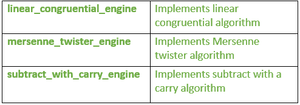
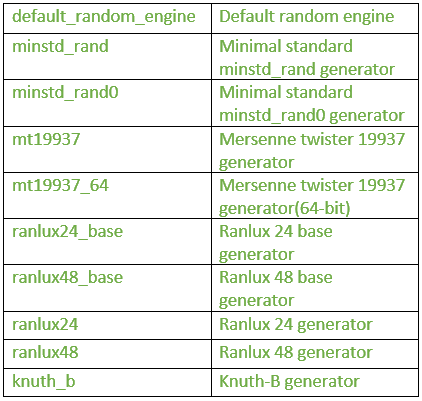
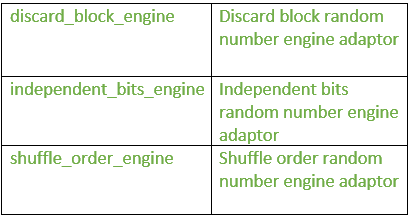

# c++中的随机头|集合 1(生成器)

> 原文:[https://www . geesforgeks . org/random-header-c-set-1 generator/](https://www.geeksforgeeks.org/random-header-c-set-1generators/)

这个报头引入了随机数生成工具。这个库允许使用生成器和分布的组合产生随机数。

*   **生成器**:生成均匀分布的数字的对象。
*   [**分布**](https://www.geeksforgeeks.org/random-header-set-2-distributions/) :将生成器生成的数字序列转换为遵循特定随机变量分布(如均匀分布、正态分布或二项式分布)的数字序列的对象。

**发电机**

**I .伪随机数引擎:**它们使用一种基于初始种子生成随机数的算法。这些是:



**1。线性 _ 同余 _ 引擎**:是 STL 库中最简单的生成随机无符号整数的引擎。接下来是:

```
 x = (a.x +c) mod m 
Where x= current state value  
            a = multiplier parameter ; if m is not zero, 
            this parameter should be lower than m.
            c = increment parameter ; if m is not zero, 
            this parameter should be lower than m.
            m = modulus parameter 
```

*   **运算符():**它生成随机数。
*   **min:** 给出成员运算符()返回的最小值。
*   **max:** 给出成员运算符()返回的最大值。

## C++

```
// C++ program to illustrate
// the use of operator(), max and min
// in linear_congruential_engine
#include <iostream>
#include <chrono>
#include <random>
using namespace std;

// driver program
int main ()
{

    // finds the time between the system clock
    //(present time) and clock's epoch
    unsigned seed = chrono::system_clock::now().time_since_epoch().count();

    // minstd_rand0 is a standard
    // linear_congruential_engine
    minstd_rand0 generator (seed);

    // generates the random number
    cout << generator() << " is a random number between ";

    //use of min and max functions
    cout << generator.min() << " and " << generator.max();

    return 0;
}
```

**输出:**

```
211182246 is a random number between 1 and 2147483646
```

**2。mersenne_twister_engine:** 是基于 Mersenne Twister 算法的随机数引擎。它在区间[0，(2^w)-1].)内产生高质量的无符号整数随机数
其中‘w’是字长:状态序列中每个字的位数。

*   **运算符():**它生成随机数。
*   **min:** 返回成员运算符()返回的最小值，对于 mersenne_twister_engine，该值始终为零。
*   **max:** 返回成员运算符()返回的最大值，对于 mersenne_twister_engine 为 2w-1(其中 w 为字长)。

## C++

```
// C++ program to illustrate the use of
// operator(), min and max
// in mersenne_twister_engine
#include <iostream>
#include <chrono>
#include <random>
using namespace std;

// Driver program
int main ()
{

    // finds the time between the system clock
    // (present time) and clock's epoch
    unsigned seed = chrono::system_clock::now().time_since_epoch().count();

    // mt19937 is a standard mersenne_twister_engine
    mt19937 generator (seed);

    // use of operator()
    cout << generator() << " is a random number between ";

    // use of max and min
    cout << generator.min() << " and " << generator.max();

    return 0;
}
```

**输出:**

```
3348201622 is a random number between 0 and 4294967295
```

**3。减法 _with_carry_engine:** 它是一个产生无符号整数的伪随机数发生器引擎。
使用的算法是滞后的[斐波那契发生器](https://en.wikipedia.org/wiki/Lagged_Fibonacci_generator)，具有 r 个整数元素的状态序列，加上一个进位值。

*   **运算符()**:生成随机数。
*   **max** :返回成员运算符()返回的最大值，即(2^w)-1 代表减法 _with_carry_engine，其中‘w’为字长。
*   **min** :返回成员运算符()返回的最小值，对于减法 _with_carry_engine 始终为零。

## C++

```
// C++ program to illustrate the use of
// operator(), min and max
// in subtract_with_carry_engine
#include <iostream>
#include <chrono>
#include <random>
using namespace std;

// Driver program
int main ()
{

    // finds the time between the system clock
    // (present time) and clock's epoch
    unsigned seed = chrono::system_clock::now().time_since_epoch().count();

    subtract_with_carry_engine<unsigned, 24, 10, 24> generator (seed);

    // use of operator()
    cout << generator() << " is a random number between ";

    // use of min and max
    cout << generator.min() << " and " << generator.max();

    return 0;
}
```

**输出:**

```
8606455 is a random number between 0 and 16777215
```

**二。随机数发生器**:是产生非确定性随机数的随机数发生器。

*   **random_device** :是真随机数发生器。
*   **运算符()**:返回一个新的随机数。
*   **min** :返回成员运算符()返回的最小值，对于 random_device 始终为零。
*   **max** :返回成员运算符()返回的最大值。

## C++

```
// C++ program to illustrate the use of
// operator(), min and max
// in random_device
#include <iostream>
#include <random>
using namespace std;

//Driver program
int main ()
{
    random_device example;

    cout << "default random_device characteristics:" << endl;

    // use of min
    cout << "minimum: " << example.min() << endl;

    // use of max
    cout << "maximum: " << example.max() << endl;

    // use of entropy
    cout << "entropy: " << example.entropy() << endl;

    // use of operator()
    cout << "a random number: " << example() << endl;

    return 0;
}
```

**输出:**

```
default random_device characteristics:
minimum: 0
maximum: 4294967295
entropy: 0
a random number: 3705944883
```

**三。伪随机数引擎(实例化)**:这些是生成器引擎和适配器的特定实例化:



**1。default_random_engine** :这是一个生成伪随机数的随机数引擎类。

*   **min** :返回运算符()给定的最小值。
*   **最大值**:返回运算符()给出的最大值。
*   **运算符()**:返回一个新的随机数。
    该函数将内部状态改变 1，根据给定的算法修改状态值:

```
 x= (a.x + c)mod m
 Where x= current state value
 a and c = respective class template parameters
 m = class template parameter 
```

## C++

```
// C++ program to illustrate the use of 
// operator(), min and max
// in default_random_engine 
#include <iostream>
#include <chrono>
#include <random>
using namespace std;

// Driver program 
int main ()
{

    // finds the time between the system clock
    // (present time) and clock's epoch 
    unsigned seed = chrono::system_clock::now().time_since_epoch().count();

    // minstd_rand0 is a standard linear_congruential_engine
    minstd_rand0 generator (seed); 

    // generates the random number
    cout << generator() << " is a random number between ";

    // Use of min and max
    cout << generator.min() << " and " << generator.max();

    return 0;
}
```

**输出:**

```
201066682 is a random number between 1 and 2147483646
```

**2。minsdd _ rand:**它生成伪随机数；它类似于[线性同余发生器](https://en.wikipedia.org/wiki/Linear_congruential_generator)

*   **运算符():**返回一个新的随机数。该函数将内部状态更改一，这将根据以下算法修改状态值:

```
x = (a.x + c) mod m
where x= current state value
a ,c and m=class template parameter
```

*   **min:** 返回成员运算符()给出的最小值。
*   **max:** 返回成员运算符()给出的最大值，对于 linear _ congruential _ engine 为(modulus)。

## C++

```
// C++ program to illustrate
// the use of operator(), max and min
// in minstd_rand
#include <iostream>
#include <chrono>
#include <random>
using namespace std;

//Driver program
int main ()
{

   // finds the time between the system clock
  //(present time) and clock's epoch   
  unsigned seed = chrono::system_clock::now().time_since_epoch().count();

  // minstd_rand0 is a standard
  //linear_congruential_engine
  minstd_rand0 generator (seed);

  // use of operator()
  cout << generator() << " is a random number between ";

  //use of max and min
  cout << generator.min() << " and " << generator.max();

  return 0;
}
```

**输出:**

```
489592737 is a random number between 1 and 2147483646
```

**3。mt19937:** 是 Mersenne Twister 19937 发电机。它是一个 32 位数字的伪随机发生器，状态大小为 19937 位。

*   **运算符():**它生成一个随机数。该函数通过使用在选定元素上产生扭曲的转换算法来改变内部状态。
*   **max:** 返回运算符()给出的最大值。
*   **min:** 返回运算符()给出的最小值。

## C++

```
// C++ program to illustrate the 
// use of operator(),min and max 
// in mt19937
#include <iostream>
#include <chrono>
#include <random>
using namespace std;

// Driver program
int main ()
{

  // finds the time between the system clock
  //(present time) and clock's epoch     
  unsigned seed = chrono::system_clock::now().time_since_epoch().count();

  // mt19937 is a standard 
  //mersenne_twister_engine
  mt19937 generator (seed);  

  //use of operator()
  cout << generator() << " is a random number between ";

  //use of max and min
  cout << generator.min() << " and " << generator.max();

  return 0;
}
```

**输出:**

```
1445431990 is a random number between 0 and 4294967295
```

**4。ranlux24_base:** 是 Ranlux 24 base 生成器。这是一个 24 位数字的带进位减法伪随机发生器，通常用作 ranlux24 发生器的基本引擎。

*   **运算符():**返回一个新的随机数。
    该函数通过调用其转换算法来改变内部状态，该算法对元素应用带进位的减法运算。
*   **max:** 返回运算符()给出的最大值。
*   **min:** 返回运算符()给出的最小值。

## C++

```
// C++ program to illustrate 
// the use of operator(),min and max
// in ranlux24_base
#include <iostream>
#include <chrono>
#include <random>
using namespace std;

//Driver program
int main ()
{

  // finds the time between the system clock
  //(present time) and clock's epoch      
  unsigned seed = chrono::system_clock::now().time_since_epoch().count();
  subtract_with_carry_engine<unsigned,24,10,24> generator (seed);

  //use of operator()
  cout << generator() << " is a random number between ";

  //use of max and min
  cout << generator.min() << " and " << generator.max();

  return 0;
}
```

**输出:**

```
7275352 is a random number between 0 and 16777215
```

类似的格式也适用于其他示例。

**IV。发动机适配器**



**1。discard_block_engine:** 它是一个引擎适配器类模板，通过仅使用它产生的序列中每个“p”元素块的“r”元素来适配一个**伪随机数生成器引擎**类型，丢弃其余的。
适配器保留当前块中已产生的元素数量的内部计数。

标准发电机 **ranlux24** 和 **ranlux48** 使用此适配器适配一台**减法带进位发动机**。

*   **运算符():**返回一个新的随机数。
*   **max:** 返回运算符()给出的最大值。
*   **min:** 返回运算符()给出的最小值。

## C++

```
// C++ program to illustrate
// the use of operator(),min and max
// in the discard_block_engine
#include <iostream>
#include <chrono>
#include <random>
using namespace std;

//Driver program
int main ()
{

  // finds the time between the system clock
  //(present time) and clock's epoch   
  unsigned seed = chrono::system_clock::now().time_since_epoch().count();

  // ranlux24 is a standard instantitation 
  //of discard_block_engine:
  ranlux24 generator (seed);

  //use of operator()
  cout << generator() << " is a random number between ";

  //use of max and min
  cout << generator.min() << " and " << generator.max();

  return 0;
}
```

**输出:**

```
8132325 is a random number between 0 and 16777215
```

**2。independent_bits_engine:** 是一个引擎适配器类模板，它适配一个**伪随机数生成器引擎**类型来产生具有特定位数(w)的随机数。

*   **运算符():**返回一个新的随机数。
    引擎的转换算法根据需要多次调用基本引擎的运算符()成员，以获得足够的有效位来构造随机值。
*   **max:** 返回运算符()给出的最大值。
*   **min:** 返回运算符()给出的最小值。

## C++

```
// C++ program to illustrate
// the use of operator(),min and max
// in independent_bits_engine
#include <iostream>
#include <chrono>

// It imports the symbol names in 
// std namespace and possibly in Global namespace.
#include <cstdint>
#include <random>
using namespace std;

//Driver program
int main ()
{

  // finds the time between the system clock
  //(present time) and clock's epoch    
  unsigned seed = chrono::system_clock::now().time_since_epoch().count();

  //use of independent_bits_engine
  independent_bits_engine<mt19937,64,uint_fast64_t> generator (seed);

  //use of operator()
  cout << generator() << " is a random number between ";

  //use of max and min
  cout << generator.min() << " and " << generator.max();

  return 0;
}
```

**输出:**

```
13551674127875514537 is a random number between 0 and 184467
```

**3。shuffle_order_engine:** 这是一个引擎适配器类模板，它适配了一个**伪随机数生成器引擎**类型，以便以不同的顺序传递数字。
该对象在内部保存一个由 k 个生成的数字组成的缓冲区，当被请求时，在缓冲区中返回一个随机选择的数字，用从其基本引擎获得的值替换它。

*   **运算符():**返回一个新的随机数。
    引擎的转换算法从内部表中选取一个值(该值由函数返回)，并用从其基本引擎获得的新值替换它。
*   **max:** 返回运算符()给出的最大值。
*   **min:** 返回运算符()给出的最小值。

## C++

```
// C++ program to illustrate
// the use of operator(),min and max
// in shuffle_order_engine
#include <iostream>
#include <chrono>
#include <random>
using namespace std;

int main ()
{

  // finds the time between the system clock
  //(present time) and clock's epoch    
  unsigned seed = chrono::system_clock::now().time_since_epoch().count();

  // ranlux24 is a standard instantitation
  // of discard_block_engine:
  ranlux24 generator (seed);

  //use of operator()
  cout << generator() << " is a random number between ";

  //use of max and min
  cout << generator.min() << " and " << generator.max();

  return 0;
}
```

**输出:**

```
9213395 is a random number between 0 and 16777215
```