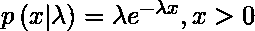
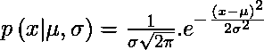
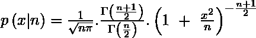

# c++中的随机头|集合 3(分布)

> 原文:[https://www . geesforgeks . org/random-header-c-set-3-distributes/](https://www.geeksforgeeks.org/random-header-c-set-3-distributions/)

我们已经在[第 1 集](https://www.geeksforgeeks.org/random-header-c-set-1generators/)中讨论了发电机。我们还在[第二集](https://www.geeksforgeeks.org/random-header-set-2-distributions/)中讨论了三个分布。在这篇文章中，将讨论更多的分布。

**IV。基于费率的分配:**

| 泊松分布 | 泊松分布 |
| 指数分布 | 指数分布 |
| 伽马分布 | γ分布 |
| 威布尔分布 | 威布尔分布 |
| 极值分布 | 极值分布 |

**1。泊松分布:**是根据泊松分布产生整数的分布，由以下概率质量函数给出:


*   **运算符()**:它返回一个遵循分布参数的新随机数。*   **min** :返回运算符()给出的取值范围的最大下界，在本例中始终为零。*   **max** :返回运算符()给定值范围的最小上限。*   **重置**:它重置分布，这样对象的后续使用就不依赖于它已经产生的值。*   **param**: It gets or sets the distribution parameter object .

    ```cpp
    // Illustrating the use of operator() in 
    // poisson_distribution 
    #include <iostream>
    #include <chrono>
    #include <random>
    using namespace std;

    // Driver Program
    int main()
    {
      // construct a trivial random generator 
      // engine from a time-based seed:
      unsigned seed = 
         chrono::system_clock::now().time_since_epoch().count();
      default_random_engine generator (seed);

      poisson_distribution<int> distribution (7.1);

      cout << "Poisson-distribution(mean=5.0): ";
      for (int i=0; i<10; ++i)

        // use of operator()
        cout << distribution(generator) << " ";

      cout << endl;

      return 0;
    }
    ```

    输出:

    ```cpp
    Poisson-distribution(mean=5.0): 11 5 5 9 10 6 15 3 6 5 

    ```

    **2。指数分布**:根据指数分布产生浮点值的随机数分布，由
    给出

    *   **运算符()**:它生成根据概率函数分布的随机数。*   **max** :返回运算符()给定范围的最小上限。*   **max** :返回运算符()给定范围的最大下界，对于 _ distribution 总是零。*   **重置**:它重置分布，这样在后续的使用中，结果不依赖于它已经产生的值。*   **param**: It gets or sets the distribution parameter object .

    ```cpp
    // Illustrating the use of  operator() in 
    // exponential_distribution 
    #include <iostream>
    #include <chrono>
    #include <thread>
    #include <random>
    using namespace std;

    // Driver program
    int main()
    {
      // It constructs a trivial random 
      // generator engine from a time-based seed
      int seed = 
        chrono::system_clock::now().time_since_epoch().count();
      default_random_engine generator (seed);

      exponential_distribution<double> distribution (1.0);

      cout << "Hi's separated by 2 seconds, on average: \n";
      for (int i=0; i<5; ++i) 
      {      
        // use of operator()
        double number = distribution(generator);
        chrono::duration<double> period (number);

        // It makes the thread sleep 
        // for the time period(i.e. number)
        this_thread::sleep_for( period );
        cout << "Hi,Geeks!!" << endl;
      }

      return 0;
    }
    ```

    输出:

    ```cpp
    Hi's separated by 2 seconds, on average: 
    Hi,Geeks!!
    Hi,Geeks!!

    ```

    **3。伽马分布**:根据伽马分布产生浮点值的随机数分布，由
    给出

    *   **运算符()**:它返回一个遵循分布参数的新随机数。*   **min** :返回成员运算符()给定范围的最大下界，对于 gamma_distribution，该下界始终为零。*   **max** :返回运算符()给定范围的最小上限。*   **重置**:它重置分布，这样在后续的使用中，结果不依赖于它已经产生的值。*   **param**: It gets or sets the distribution parameter object .

    ```cpp
    // Illustrating the use of reset in gamma_distribution
    #include <iostream>
    #include <random>
    using namespace std;

    // Driver program
    int main()
    {     
      // Random number generator
      default_random_engine generator;
      gamma_distribution<double> distribution(1.0,2.0);

      // prints first random number
      cout << distribution(generator) << endl;

      // use of reset 
      distribution.reset();

      // prints the second random number 
      // independent of first
      cout << distribution(generator) << endl;

      return 0;
    }
    ```

    输出:

    ```cpp
    1.14392
    2.23359

    ```

    **4。威布尔分布**:是根据双参数威布尔分布产生浮点值的随机数分布，由
    给出

    *   **运算符()**:它返回一个遵循分布参数的新随机数。*   **min** :返回算子()给定范围的最大下界，对于威布尔分布总是零。*   **max** :返回运算符()给定范围的最小上限。*   **重置**:它重置分布，这样在后续的使用中，结果不依赖于它已经产生的值。*   **param**: It gets or sets the distribution parameter object .

    ```cpp
    // Illustrating the use of min and max
    // in weibull_distribution
    #include <iostream>
    #include <chrono>
    #include <random>
    using namespace std;

    // Driver program
    int main ()
    {   
      // It constructs a trivial random 
      // generator engine from a time-based seed
      unsigned seed = 
        chrono::system_clock::now().time_since_epoch().count();
      default_random_engine generator (seed);

      weibull_distribution<double> distribution (2.0,1.0);

      cout << distribution(generator) 
           << " is a random number between ";

      // use of min and max
      cout << generator.min() << " and " << generator.max();

      return 0;
    }
    ```

    输出:

    ```cpp
    1.54229 is a random number between 1 and 2147483646

    ```

    **5。extreme_value_distribution** :是根据一个 I 型极值分布产生浮点值的随机数分布，由:
    给出

    *   **运算符()**:它生成根据概率函数分布的随机数。*   **min** :返回成员运算符()给定范围的最大下界。*   **max** :返回成员运算符()给定范围的最小上限。*   **重置**:它重置分布，这样在后续的使用中，结果不依赖于它已经产生的值。*   **param**: It gets or sets the distribution parameter object .

    ```cpp
    // Illustrating the use of param in 
    // extreme_value_distribution
    #include <iostream>
    #include <random>
    using namespace std;

    // Driver program
    int main()
    {
      default_random_engine generator;
      extreme_value_distribution<double> d1(2.0,4.0);
      extreme_value_distribution<double> d2(d1.param());

      // prints the first value
      cout << d1(generator) << endl;

      // prints the second independent value 
      cout << d2(generator) << endl;

      return 0;
    }
    ```

    输出:

    ```cpp
    9.8351
    3.95306

    ```

    **V .与正态分布相关**

    | 正态分布 | 正态分布 |
    | 对数正态分布 | 对数正态分布 |
    | 卡方分布 | 卡方分布 |
    | 柯西分布 | 柯西分布 |
    | 费希尔分布 | 费希尔分布 |
    | 学生分布 | 学生 t 分布 |

    **1。正态分布**:根据正态分布产生浮点值的随机数分布，由
    给出

    ```cpp
    where:
     (µ) :mean 
     sigma :standard deviation

    ```

    *   **运算符()**:它生成根据概率函数分布的随机数。*   **min** :返回运算符()给定范围的最大下限。*   **max** :返回运算符()给定范围的最小上限。*   **重置**:它重置分布，这样在后续的使用中，结果不依赖于它已经产生的值。*   **param**: It gets or sets the distribution parameter object .

    ```cpp
    // Illustrating the use of operator()
    // in normal_distribution 
    #include <iostream>
    #include <chrono>
    #include <random>
    using namespace std;

    // Driver program
    int main()
    {
      // It constructs a trivial random 
      // generator engine from a time-based seed
      unsigned seed = 
       chrono::system_clock::now().time_since_epoch().count();
      default_random_engine generator (seed);

      // Initializes the normal distribution
      normal_distribution<double> distribution (1.0,2.0);

      cout << "Normal-distribution(1.0,2.0):" << endl;
      for (int i=0; i<5; i++)  
        // Use of  operator()
        cout << distribution(generator) << endl;

      return 0;
    }
    ```

    输出:

    ```cpp
    Normal-distribution(1.0,2.0):
    1.59499
    -0.458303
    1.34411
    0.138838
    3.03433

    ```

    **2。对数正态分布**:是根据对数正态分布产生浮点值的随机数分布，由
    给出

    *   **运算符()**:它生成一个遵循这个分布的随机数。*   **min** :返回运算符()给定范围的最大下界，对数正态分布总是零。*   **max** :返回运算符()给定范围的最小上限。*   **重置**:它重置分布，这样在后续的使用中，结果不依赖于它已经产生的值。*   **param**: It gets or sets the distribution parameter object .

    ```cpp
    // Illustrating the use of reset in 
    // lognormal_distribution
    #include <iostream>
    #include <random>
    using namespace std;

    // Driver program
    int main()
    {
      // the random number generator
      default_random_engine generator;
      lognormal_distribution<double> distribution(1.0,2.0);

      // prints first value:
      cout << distribution(generator) << endl;

      // Use of reset
      distribution.reset();

      // prints second value independent of first
      cout << distribution(generator) << endl;

      return 0;
    }
    ```

    输出:

    ```cpp
    2.12989
    10.6822

    ```

    **3。卡方分布**:根据卡方分布产生浮点值的随机数分布，由
    给出

    ```cpp
    where,
    n : degrees of freedom and n>0,
    n/2 : shape parameter

    ```

    *   **运算符()**:它生成根据概率函数分布的随机数。*   **min** :返回运算符()给定范围的最大下界，对于卡方分布始终为零。*   **max** :返回运算符()给定范围的最小上限。*   **重置**:它重置分布，这样在后续的使用中，结果不依赖于它已经产生的值。*   **param**: It gets or sets the distribution parameter object .

    ```cpp
    // Illustrating the use of operator() in 
    // chi_squared_distribution 
    #include <iostream>
    #include <chrono>
    #include <random>
    using namespace std;

    // Driver program
    int main()
    {
      // It constructs a trivial random 
      // generator engine from a time-based seed
      unsigned seed = 
       chrono::system_clock::now().time_since_epoch().count();
      default_random_engine generator (seed);

      chi_squared_distribution<double> distribution (4.0);

      cout << "chi-squared-distribution(4.0):" << endl;
      for (int i=0; i<5; i++)

        // use of operator()
        cout << distribution(generator) << endl;

      return 0;
    }
    ```

    输出:

    ```cpp
    chi-squared-distribution(4.0):
    2.18701
    6.86953
    1.77983
    9.79626
    5.04758

    ```

    **4。柯西分布**:根据柯西分布产生浮点值的随机数分布，由下式给出:

    ![ p \left ( x | a,b \right ) = \frac{1}{\pi b . \left [ 1 +  \left ( \frac{x-a}{b} \right )^{2} \right ] } ](img/f2680f72d39cbf984568361ce45462d5.png "Rendered by QuickLaTeX.com")

    ```cpp
    where,
    a and b are distribution parameters

    ```

    *   **运算符()**:它生成根据概率函数分布的随机数。*   **min** :返回运算符()给定范围的最大下限。*   **max** :返回运算符()给定范围的最小上限。*   **重置**:它重置分布，这样在后续的使用中，结果不依赖于它已经产生的值。*   **param**: It gets or sets the distribution parameter object .

    ```cpp
    // Illustrating the use of param
    // in cauchy_distribution
    #include <iostream>
    #include <random>
    using namespace std;

    // Driver program
    int main()
    {
      default_random_engine generator;
      cauchy_distribution<double> d1(0.0,1.0);
      cauchy_distribution<double> d2(d1.param());

      // prints the first value
      cout << d1(generator) << endl;

      // prints the second value
      cout << d2(generator) << endl;

      return 0;
    }
    ```

    输出:

    ```cpp
    0.438486
    7.65462

    ```

    **5。fisher_f_distribution** :是根据一个 Fisher F-distribution 产生浮点值的随机数分布，由:
    
    给出，它通过划分 m 和 n 个自由度的两个独立卡方分布产生随机数。

    *   **运算符()**:它生成根据概率函数分布的随机数。*   **min** :返回运算符()给定范围的最大下界，对于 fisher_f_distribution，该下界始终为零。*   **max** :返回运算符()给定范围的最小上限。*   **重置**:它重置分布，这样在后续的使用中，结果不依赖于它已经产生的值。*   **param**: It gets or sets the distribution parameter object .

    ```cpp
    // Illustrating the use of 
    // operator() in fisher_f_distribution 
    #include <iostream>
    #include <chrono>
    #include <random>
    using namespace std;

    // Driver program
    int main()
    {
      // It constructs a trivial random generator engine
      // from a time-based seed
      unsigned seed = 
        chrono::system_clock::now().time_since_epoch().count();
      default_random_engine generator (seed);

      fisher_f_distribution<double> distribution (1.0,2.0);

      cout << "fisher-f-distribution(1.0,2.0):" << endl;
      for (int i=0; i<5; i++)

        // use of operator()
        cout << distribution(generator) << endl;

      return 0;
    }
    ```

    输出:

    ```cpp
    fisher-f-distribution(1.0,2.0):
    0.208066
    2.76882
    0.0305701
    0.96243
    0.444256

    ```

    **6。学生 t 分布**:根据学生 t 分布产生浮点值的随机数分布，由
    给出

    ```cpp
    where,
    n is the distribution parameter

    ```

    *   **运算符()**:它生成根据概率函数分布的随机数。*   **min** :返回运算符()给定范围的最大下限。*   **max** :返回运算符()给定范围的最小上限。*   **重置**:它重置分布，这样在后续的使用中，结果不依赖于它已经产生的值。*   **param**: It gets or sets the distribution parameter object .

    ```cpp
    // Illustrating the use of min and max
    // in student_t_distribution
    #include <iostream>
    #include <chrono>
    #include <random>
    using namespace std;

    // Driver program
    int main ()
    {     
      // It constructs a trivial random 
      // generator engine from a time-based seed
      unsigned seed = 
       chrono::system_clock::now().time_since_epoch().count();
      default_random_engine generator (seed);

      student_t_distribution<double> distribution (8.0);

      cout << distribution(generator) 
           << " is a random number between ";

      // use of min and max
      cout << generator.min() << " and " << generator.max();

      return 0;
    }
    ```

    输出:

    ```cpp
    0.00906058 is a random number between 1 and 2147483646
    ```

    本文由**香巴拉维·辛格**供稿。如果你喜欢 GeeksforGeeks 并想投稿，你也可以使用[contribute.geeksforgeeks.org](http://www.contribute.geeksforgeeks.org)写一篇文章或者把你的文章邮寄到 contribute@geeksforgeeks.org。看到你的文章出现在极客博客主页上，帮助其他极客。

    如果你发现任何不正确的地方，或者你想分享更多关于上面讨论的话题的信息，请写评论。