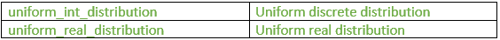
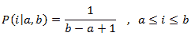
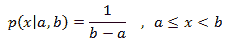
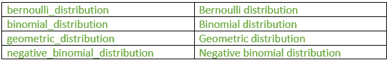
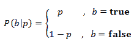
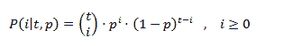
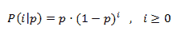
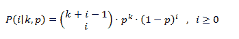
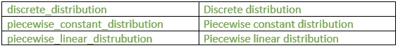
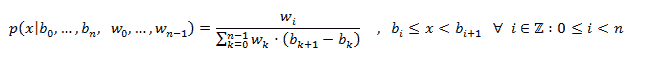

# 随机标题|集合 2(分布)

> 原文:[https://www . geesforgeks . org/random-header-set-2-distributes/](https://www.geeksforgeeks.org/random-header-set-2-distributions/)

[第 1 组(发电机)](https://www.geeksforgeeks.org/random-header-c-set-1generators/)

**分布**

**一、制服:** [](https://media.geeksforgeeks.org/wp-content/uploads/uniform3.png)

1.  **uniform _ int _ distribution:**产生随机整数值 I，均匀分布在封闭区间[a，b]上，由以下概率质量函数描述:
    [](https://media.geeksforgeeks.org/wp-content/uploads/function1.png)

*   **运算符():**它生成根据概率函数分布的随机数。
*   **min:** 它返回运算符()返回的值范围的最大下限，这是 uniform_int_distribution 的分布参数“a”。
*   **max:** 它返回运算符()返回的值范围的最小上限，这是 uniform_int_distribution 的分布参数“b”。
*   **重置:**它重置分布，以便在后续使用中，结果不依赖于它已经产生的值。

```cpp
// C++ program to illustrate
// the use of operator()
// in uniform_int_distribution
#include <iostream>
#include <random>
using namespace std;

// Driver program
int main()
{

    // Constructing a trivial random generator engine 
    unsigned s = 2;

    // The random number generator
    default_random_engine generator (s);

    uniform_int_distribution<int> distribution(1,10);
    cout << "Some random numbers between 1 and 10";
    for (int i = 0; i < 10; ++ i)
        cout << distribution(generator) ;

    cout << endl;

    return 0;
}
```

输出:

```cpp
Some random numbers between 1 and 10: 1 3 6 10 1 5 1 4 4 9 

```

```cpp
// C++ program to illustrate
// the use of reset
// in uniform_int_distribution
#include <iostream>
#include <random>
using namespace std;

//Driver program
int main()
{

    //the random number generator
    default_random_engine generator;

    // Initialising the uniform distribution
    uniform_int_distribution<int> distribution(1, 1000);

    // First random number is generated
    cout << distribution(generator) << endl;

    //Resets the distribution
    distribution.reset();

    // Second random number is 
    //generated independent of previous number
    cout << distribution(generator) << endl;

    return 0;
}
```

输出:

```cpp
1
132

```

*   **uniform_real_distribution:** It is the random number distribution that produces floating-point values , which is described by the following probability density function:
    [](https://media.geeksforgeeks.org/wp-content/uploads/uniform_real.gif)
    *   **运算符():**它返回一个遵循分布参数的新随机数。
    *   **min:** 它返回运算符()返回的值范围的最大下限，这是 uniform_real_distribution 的分布参数“a”。
    *   **max:** 它返回运算符()返回的值范围的最小上限，这是 uniform_real_distribution 的分布参数“b”。
    *   **重置:**它重置分布，以便在后续使用中，结果不依赖于它已经产生的值。

    ```cpp
    // C++ program to illustrate
    // the use of operator()
    // in uniform_int_distribution
    #include <iostream>
    #include <random>
    using namespace std;

    // Driver program
    int main()
    {

        // Constructing a trivial random generator engine 
        unsigned s = 2;

        // The random number generator
        default_random_engine generator (s);

        uniform_int_distribution<int> distribution(1,10);
        cout << "Random numbers between 1 and 10";
        for (int i = 0; i< 10; ++ i)
            cout << distribution(generator) ;

        cout << endl;

        return 0;
    }
    ```

    输出:

    ```cpp
    some random numbers between 0.0 and 10.0: 
    0.150031
    9.77072
    3.36669
    7.06447
    5.11455
    8.43061
    1.93792
    7.78965
    8.31532
    5.14354

    ```

    ```cpp
    // C++ program to illustrate
    // the use of reset
    // in uniform_real_distribution
    #include <iostream>
    #include <random>
    using namespace std;

    // Driver program
    int main()
    {
        default_random_engine generator;
        uniform_real_distribution<double> distribution(0.0,100.0);

        // It prints two independent values:
        // First random number is generated
        cout << distribution(generator) << endl;

        //Resets the distribution
        distribution.reset();

        // Second random number is 
        //generated independent of previous number
        cout << distribution(generator) << endl;

        return 0;
    }
    ```

    输出:

    ```cpp
    13.1538
    45.865

    ```

    **二。与伯努利试验有关的:**
    [](https://media.geeksforgeeks.org/wp-content/uploads/related-to-bernoulli-trials1.png)

    1.  **bernoulli_distribution:** It is the random number distribution that produces bool values according to a Bernoulli distribution, given by the following probability mass function:
        [](https://media.geeksforgeeks.org/wp-content/uploads/function2.png)
        *   **运算符():**返回一个新的随机数。
        *   **min:** 它返回运算符()返回的值范围的最大下限，对于 bernoulli_distribution，该值为 false。
        *   **max:** 它返回运算符()返回的值范围的最小上界，对于 bernoulli_distribution，该值为真。

        ```cpp
        // C++ program to illustrate
        // the bernoulli_distribution
        #include <iostream>
        #include <random>
        using namespace std;

        //Driver program
        int main()
        {
            const int temp=500;

            //The random number generator
            default_random_engine generator;

            //Initialising the bernoulli distribution
            bernoulli_distribution distribution(0.7);

            // count number of trues
            int count=0; 

            for (int i = 0; i < temp; ++ i) 
            {

                // checking for true condition 
                if (distribution(generator)) 
                count++ ;
            }

            cout << "bernoulli_distribution (0.7) x 500:" << endl;
            cout << "true: " << count << endl;
            cout << "false: " << temp-count << endl;

            return 0;
        }
        ```

        输出:

        ```cpp
        bernoulli_distribution (0.7) x 500:
        true:  360
        false: 140

        ```

        ```cpp
        // C++ program to
        // illustrate the use of reset
        #include <iostream>
        #include <random>
        using namespace std;

        //Driver program
        int main()
        {
            // Random number generator
            default_random_engine generator;

            // Initialising the bernoulli distribution
            bernoulli_distribution distribution;

            // print two independent values:
            cout << distribution(generator) << endl;

            // use of reset
            // Generates second output without
            // the effect of first output 
            distribution.reset();
            cout << distribution(generator) << endl;

        return 0;
        }
        ```

        输出:

        ```cpp
        1
        1

        ```

    2.  **binomial_distribution:** It is the random number distribution that produces integers according to a binomial discrete distribution, which is given by this probability mass function:
        [](https://media.geeksforgeeks.org/wp-content/uploads/binomial_distribution.png)
        *   **运算符():**它生成一个新的随机数。
        *   **max:** 返回运算符()给定范围的最小上界，对于二项式分布，这是分布参数 t。
        *   **min:** 返回成员运算符()给定范围的最大下界，对于二项式分布，该下界始终为零。
        *   **重置:**它重置分布，以便对象的后续使用不依赖于它已经产生的值。

        ```cpp
        // C++ program to illustrate
        // the use of binomial_distribution
        #include <iostream>
        #include <chrono>
        #include <random>
        using namespace std;

        int main()
        {

            // construct a trivial random 
            //generator engine from a time-based seed:
            unsigned seed = chrono::system_clock::now().time_since_epoch().count();
            default_random_engine generator (seed);

            // Initialising binomial distribution
            binomial_distribution<int> distribution (15, 0.4);

            cout << "some binomial results (t=15, p=0.4): ";
            for (int i = 0; i < 15; ++ i)
            {

                // Use of operator()
                cout << distribution(generator) << " ";
            }
            cout << endl;

            return 0;
        }
        ```

        输出:

        ```cpp
        some binomial results (t=15, p=0.4): 7 6 7 8 4 6 7 6 9 3 5 6 4 6 7 

        ```

        ```cpp
        // C++ program to illustrate
        // the use of binomial_distribution
        #include <iostream>
        #include <chrono>
        #include <random>
        using namespace std;

        int main()
        {

            // construct a trivial random 
            //generator engine from a time-based seed:
            unsigned seed = chrono::system_clock::now().time_since_epoch().count();
            default_random_engine generator (seed);

            // Initialising binomial distribution
            binomial_distribution<int> distribution (15, 0.4);

            cout << "some binomial results (t=15, p=0.4): ";
            for (int i = 0; i < 15; ++ i)
            {

                // Use of operator()
                cout << distribution(generator) << " ";
            }
            cout << endl;

            return 0;
        }
        ```

        输出:

        ```cpp
        57
        52

        ```

    3.  **geometric_distribution:** It is a random number distribution that produces integers according to a geometric discrete distribution, given by the following probability mass function:
        [](https://media.geeksforgeeks.org/wp-content/uploads/geometric_distribution.png)
        *   **运算符():**它返回一个遵循分布参数的新随机数。
        *   **max:** 返回运算符()给定范围的最小上限。
        *   **min:** 返回运算符()给出的最小值。
        *   **重置:**它重置分布，以便对象的后续使用不依赖于它已经产生的值。

        ```cpp
        // C++ program to illustrate
        //the use of geometric_distribution 
        #include <iostream>
        #include <chrono>
        #include <string>
        #include <random>
        using namespace std;

        int main()
        {
            // construct a trivial random
            // generator engine from a time-based seed:
            int seed = chrono::system_clock::now().time_since_epoch().count();
            default_random_engine generator (seed);

            // Initialises the geometric distribution
            geometric_distribution<int> distribution (1.0 / 5);

            cout << "Plus sign is 5 spaces away from the next :" << endl;
            for (int i = 0; i < 10 ; ++ i) 
            {
                int number = distribution(generator);
                cout << string (number,' ') << "+";
            }

        return 0;
        }
        ```

        输出:

        ```cpp
        each plus sign is 5 spaces away from the next :
                    ++ + +   +  ++     +        ++

        ```

        ```cpp
        // C++ program to illustrate 
        // the use of reset
        #include <iostream>
        #include <random>
        using namespace std;

        // Driver program
        int main()
        {

            // Random number generator 
            default_random_engine generator;

            // Initialising the geometric distribution
            geometric_distribution<int> distribution(0.3);

            // Prints two independent values:
            // Generates the first value
            cout << distribution(generator) << endl;

            // Use of reset
            distribution.reset();

            // Generates second value
            cout << distribution(generator) << endl;

            return 0;
        }
        ```

        输出:

        ```cpp
        0
        1

        ```

    4.  **negative_binomial_distribution:** It is a random number distribution that produces integers according to a negative binomial discrete distribution (also known as Pascal distribution), given by the following probability mass function:
        [](https://media.geeksforgeeks.org/wp-content/uploads/negative.png)
        *   **运算符():**它返回一个遵循分布参数的新随机数。
        *   **max:** 返回运算符()给定范围的最小上限。
        *   **min:** 返回运算符()给出的最小值，对于负二项分布，该值始终为零。
        *   **重置:**它重置分布，以便对象的后续使用不依赖于它已经产生的值。

        ```cpp
        // C++ program to illustrate
        // the use of operator() in
        // negative_binomial_distribution 
        #include <iostream>
        #include <chrono>
        #include <random>
        using namespace std;

        // Driver program
        int main()
        {
            // construct a trivial random 
            // generator engine from a time-based seed:
            unsigned seed = chrono::system_clock::now().time_since_epoch().count();
            default_random_engine generator (seed);

            // Initialising negative binomial distribution
            negative_binomial_distribution<int> distribution (6,0.7);

            cout << "Negative binomial results (t=6, p=0.7): ";
            for (int i = 0; i < 15; ++ i)
                {
                    // Use of operator
                    cout << distribution(generator) << " ";
                }

            cout << endl;

            return 0;
        }
        ```

        输出:

        ```cpp
        Negative binomial results (t=6, p=0.7): 2 6 3 1 4 1 4 1 2 0 7 3 4 4 4 

        ```

        ```cpp
        // C++ program to illustrate
        // the use of reset in
        // negative_binomial_distribution::
        #include <iostream>
        #include <random>
        using namespace std;

        // Driver program
        int main()
        {

            // Random number generator 
            default_random_engine generator;

            // Initialising the negative binomial distribution
            negative_binomial_distribution<int> distribution(20, 0.5);

            // print two independent values:
            // Generates the first value
            cout << distribution(generator) << endl;

            // Use of reset
            distribution.reset();

            // Generates the second value
            cout << distribution(generator) << endl;

            return 0;
        }
        ```

        输出:

        ```cpp
        23
        30

        ```

**三。按件分配:**
[](https://media.geeksforgeeks.org/wp-content/uploads/piecewise1.png)

1.  **discrete_distribution:** It is a random number distribution that produces integer values according to a discrete distribution.
    *   **运算符():**它返回一个遵循分布参数的新随机数。
    *   **max:** 返回运算符()给定范围的最小上限。
    *   **min:** 返回运算符()给定范围的最大下限。
    *   **重置:**它重置分布，以便对象的后续使用不依赖于它已经产生的值。

    ```cpp
    // C++ program to illustrate the
    // use of operator() in
    // discrete_distribution
    #include <iostream>
    #include <random>
    using namespace std;

    int main()
    {

        // number of experiments
        int n = 10000; 

        // maximum number of stars to distribute
        int m = 100; 

        // Random number generator
        default_random_engine generator;

        //Initialising discrete distribution
        discrete_distribution<int> distribution { 2, 2, 1, 1, 2, 2, 1, 1, 2, 2 };

        int p[10] = {};

        // use of operator()
        for (int i = 0; i < n; i++) 
        {
            int number = distribution(generator);
            p[number]++ ;
        }

        cout << "a discrete_distribution:" << endl;
        for (int i = 0; i < 10; ++ i)
        {
            cout << i << ": " << string(p[i]*m/n,'*') << endl;
        }

        return 0;
    }
    ```

    输出:

    ```cpp
    a discrete_distribution:
    0: ************
    1: *************
    2: *****
    3: ******
    4: ************
    5: ************
    6: ******
    7: ******
    8: ************
    9: ************

    ```

    ```cpp
    // C++ program to illustrate
    //the use of reset in
    //discrete_distribution
    #include <iostream>
    #include <random>
    using namespace std;

    // Driver program
    int main()
    {

        // Random number generator 
        default_random_engine generator;

        // Initialising the discrete distribution
        discrete_distribution<int> distribution {20,20,30,40};

        // print two independent values:
        // Generates the first value
        cout << distribution(generator) << endl;

        // Use of reset
        distribution.reset();

        // Generates the secong value
        cout << distribution(generator) << endl;

        return 0;
    }
    ```

    输出:

    ```cpp
    0
    2

    ```

2.  **piecewise_constant_distribution:** It is a random number distribution that produces floating-point values that are uniformly distributed over each of a sequence of contiguous subintervals, given by following probability density function:
    [](https://media.geeksforgeeks.org/wp-content/uploads/piecwise-constant.png)
    *   **运算符():**它返回一个遵循分布参数的新随机数。
    *   **max:** 返回运算符()给定范围的最小上限。
    *   **min:** 返回运算符()给定范围的最大下限。
    *   **重置:**它重置分布，以便对象的后续使用不依赖于它已经产生的值。

    ```cpp
    // C++ program to illustrate the
    // use of reset in
    // piecewise_constant_distribution
    #include <iostream>
    #include <random>
    using namespace std;

    // Driver program
    int main()
    {

        // Random number generator
        default_random_engine generator;

        // Initialisind piecewise_constant_distribution
        piecewise_constant_distribution<double> distribution 
                    ( 4, 0.0, 10.0, [](double x){return x;} );

        // print two independent values:
        // Generates the first value
        // Use of operator()
        cout << distribution(generator) << endl;

        // Use of reset
        distribution.reset();

        // Generates second value
        cout << distribution(generator) << endl;

        return 0;
    }
    ```

    输出:

    ```cpp
    3.4205
    6.6692

    ```

3.  **piecewise_linear_distribution:** It is a random number distribution that produces floating-point values that are distributed over a sequence of contiguous subintervals.
    *   **运算符():**它返回一个遵循分布参数的新随机数。
    *   **max:** 返回运算符()给定范围的最小上限。
    *   **min:** 返回运算符()给定范围的最大下限。
    *   **重置:**它重置分布，以便对象的后续使用不依赖于它已经产生的值。

    ```cpp
    // C++ program to illustrate the
    // use of reset in
    // piecewise_linear_distribution
    #include <iostream>
    #include <random>
    using namespace std;

    // Driver program
    int main()
    {

        // Random number generator
        default_random_engine generator;

        // Initialising piecewise_linear_distribution
        piecewise_linear_distribution<double>
            distribution ( 5, 0.0, 10.0, [](double x){return x+1.0;} );

        // print two independent values:
        // generates first value
        // use of operator()
        cout << distribution(generator) << endl;

        // Use of reset
        distribution.reset();

        // generates second value
        cout << distribution(generator) << endl;

        return 0;
    }
    ```

    输出:

    ```cpp
    2.48143
    6.07656

    ```

本文由**香巴拉维·辛格**供稿。如果你喜欢 GeeksforGeeks 并想投稿，你也可以使用[contribute.geeksforgeeks.org](http://contribute.geeksforgeeks.org)写一篇文章或者把你的文章邮寄到 contribute@geeksforgeeks.org。看到你的文章出现在极客博客主页上，帮助其他极客。

如果你发现任何不正确的地方，或者你想分享更多关于上面讨论的话题的信息，请写评论。