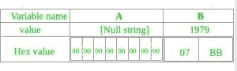
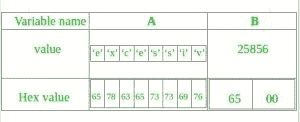

# c++ 程序崩溃的原因

> 原文:[https://www.geeksforgeeks.org/reasons-c-program-crash/](https://www.geeksforgeeks.org/reasons-c-program-crash/)

我们有时会遇到 C++ 程序异常崩溃的情况。以下是一些可能导致 C++ 异常崩溃的原因。

*   **[分段故障](https://www.geeksforgeeks.org/core-dump-segmentation-fault-c-cpp/) :** 是程序崩溃的主要原因。这些都可能是造成这种原因的原因:
    *   试图访问系统中不存在的内存位置。
    *   There may be an attempt to write on a **read only memory** location.

        ```cpp
        // CPP program to demonstrate
        int main()
        {
           char *str; 

           /* Stored in read only part of data segment */
           str = "GfG";     

           /* Problem:  trying to modify read only memory */
           *(str+1) = 'n'; 
           return 0;
        }
        ```

        输出:

        ```cpp
        Segmentation fault (core dumped)
        ```

    *   可能有人试图访问**受保护的内存位置**，如**内核内存**
    *   **[Stack Overflow](https://www.geeksforgeeks.org/heap-overflow-stack-overflow/):** There may case of **non terminating recursion** with memory location.

        ```cpp
        // C program to demonstrate stack overflow
        // by creating a non-terminating recursive
        // function.
        #include<stdio.h>

        void fun(int x)
        {
            if (x == 1)
               return;
            x = 6;
            fun(x);
        }

        int main()
        {
           int x = 5;
           fun(x);
        }
        ```

        输出:

        ```cpp
        Segmentation fault (core dumped)
        ```

*   **[缓冲区溢出:](https://www.geeksforgeeks.org/buffer-overflow-attack-with-example/)** 这是一种异常现象，程序在向缓冲区写入数据时，会超出缓冲区的边界并覆盖相邻的内存位置。

    *   Consider below C++ program.

        ```cpp
        // C++ code to demonstrate buffer
        // overflow.
        #include <bits/stdc++.h>
        using namespace std;

        // driver code
        int main()
        {
            char A[8] = "";
            unsigned short B = 1979;
            strcpy(A, "excessive");
            return 0;
        }
        ```

        输出:

        ```cpp
        *** stack smashing detected ***: /home/gfg/a terminated
        Aborted (core dumped)
        ```

        程序有两个在内存中相邻的变量:一个 8 字节长的字符串缓冲区 A 和一个两字节[大端](https://www.geeksforgeeks.org/little-and-big-endian-mystery/)整数 b。

        > char A[8]= " "；
        > 无符号短 B = 1979

        最初，A 只包含零字节，B 包含数字 1979。
        
        现在，程序试图将 ASCII 编码的空终止字符串“过量”存储在 A 缓冲区中。

        > strcpy(A，“过度”)；

        该字符串长度为 9 个字符，编码为 10 个字节，包括空终止符，但 A 只能接受 8 个字节。由于未能检查字符串的长度，它还会覆盖 B 的值:

        

        b 的值现在无意中被字符串的一部分组成的数字所取代。在本例中，“e”后跟零字节将变成 25856。

        这种溢出称为**缓冲区溢出**。

        *   **[内存泄漏:](https://www.geeksforgeeks.org/what-is-memory-leak-how-can-we-avoid/)**
    如果我们通过某个程序分配一些内存，让它保持原样。过了一段时间，将会有大量的内存被分配但没有被使用，所以过了一段时间，这将会缺少内存。因此程序开始崩溃。

    ```cpp
    // C program to demonstrate heap overflow
    // by continuously allocating memory
    #include<stdio.h>

    int main()
    {
        for (int i=0; i<10000000; i++)
        {
           // Allocating memory without freeing it
           int *ptr = (int *)malloc(sizeof(int));
        }
    }
    ```

    *   **异常**
    *   Divide by zero.

        ```cpp
        // C++ code to demonstrate divide by 0.
        #include <bits/stdc++.h>
        using namespace std;

        // driver code
        int main()
        {
            int x = 10;
            int y = 0;
            cout << x/y;
            return 0;
        }
        ```

        输出:

        ```cpp
        Floating point exception (core dumped)
        ```