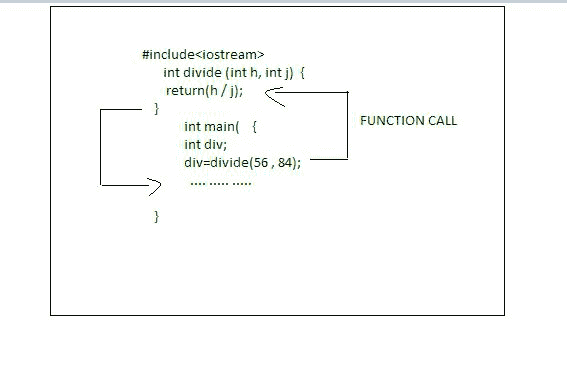

# 从函数语句往复

> 原文:[https://www . geesforgeks . org/往复-从-a-function-statement/](https://www.geeksforgeeks.org/reciprocating-from-a-function-statement/)

可以说，调用一个[函数](https://www.geeksforgeeks.org/functions-in-c/)是必要的，从一个函数返回同样是必要的，因为它不仅在函数的实现中结束，而且将命令传递给调用函数。当遇到的一个[返回语句](https://www.geeksforgeeks.org/return-statement-in-c-cpp-with-examples/)或函数中的另一个最后的语句被实现时，函数结束。

**要求声明:**退货声明通过以下两种方式值得:

*   第一种情况是，当遇到返回声明并且命令传递回作为主调用者的操作设备时，会导致与函数的即时背离。
*   它的第二个用途是向调用代码返回值。尽管函数中有一个返回声明并不重要，但大多数函数都依赖于返回的声明来终止实现，因为必须返回一个值，或者使代码变得简单、容易、更系统和更符合逻辑。

一个函数可能包含各种返回声明。其中唯一的一个被实现了，因为一遇到返回值，函数的实现就停止了。下面是 [C++ 程序](https://www.geeksforgeeks.org/c-plus-plus/)的实现来演示上面的概念:

**程序:**下面是检查一个给定字符是否包含在[字符串](https://www.geeksforgeeks.org/c-string-class-and-its-applications/)中并找到其位置的程序:

## C++

```cpp
// C++ program to illustrate the
// above approach
#include <iostream>
using namespace std;

// Declaring a function
int divide(int h, int j)
{
    return (h / j);
}

// Driver Code
int main()
{
    int div;

    // Calling the function and
    // storing the returned value
    // in sum
    div = divide(56, 84);

    cout << " 56 / 84 = "
         << div << endl;
    return 0;
}
```

**Output:**

```cpp
56 / 84 = 0

```

**说明:**在上面的程序中， [div()函数](https://www.geeksforgeeks.org/div-function-c/)是预先拥有的，用来发现两个数的除法。调用函数时传递了两个整数 56 和 84。函数的返回值保留在变量 divide 中，然后打印出来。



**注:**

*   ***除*** 是 **int** 类型的变量，因为 **div()** 的返回值是 int 类型的。
*   [作废功能](https://www.geeksforgeeks.org/return-void-functions-c/)不返回值。

**程序 2:** 下面是返回一个函数和两个[参数](https://www.geeksforgeeks.org/difference-between-argument-and-parameter-in-c-c-with-examples/)的程序:

## C++

```cpp
// C++ program to illustrate the
// above approach
#include <iostream>
using namespace std;

// Function to calculate the sum
int myFunction(int v) { return 6 + v; }

// Driver Code
int main()
{
    int N = 8;
    cout << myFunction(N);

    return 0;
}
```

**Output:**

```cpp
14

```

**说明:**这说明程序返回了一个有两个参数的函数的和。