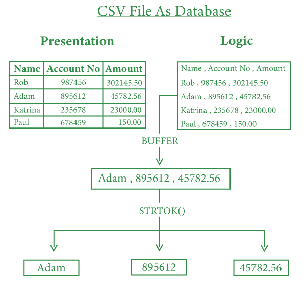

# C

中 CSV 文件的关系数据库

> 原文:[https://www . geesforgeks . org/relational-database-from-CSV-files-in-c/](https://www.geeksforgeeks.org/relational-database-from-csv-files-in-c/)

在 [C 编程](https://www.geeksforgeeks.org/c/)中，运行时使用[数组](https://www.geeksforgeeks.org/introduction-to-arrays/)和[字符串](https://www.geeksforgeeks.org/string-data-structure/)进行[数据存储](https://www.geeksforgeeks.org/data-storage-and-its-sorts/)，该数据存储是易失性的，并在内存中获取内存。而是将数据永久存储在可进一步操作的硬盘中。所以，想法是使用 CSV 文件进行数据存储和操作。不仅是 CSV，像 **dat** 、 **txt** 、 **bin** 这样的其他文件也可以用于数据操作。但 [CSV](https://www.geeksforgeeks.org/difference-between-csv-and-excel/) 文件顾名思义(**C**omma**S**epaided**V**alues)以表格格式存储数据，在制作完善的结构上节省了大量时间。

在关系数据库中，数据以表格格式存储，因此通过使用 CSV 文件，可以创建数据库。

下面是一个 CSV 文件的示例:

[](https://media.geeksforgeeks.org/wp-content/uploads/20200923142905/csv.jpg)

关于文件处理的概念，请参考 C 文章中的[基本文件处理。](https://www.geeksforgeeks.org/basics-file-handling-c/)

创建一个字符数组(可称为字符串)的缓冲区，该缓冲区获取文件中存在的所有数据，并使用文件指针和 [fgets()](https://www.geeksforgeeks.org/fgets-gets-c-language/) 提取数据。使用两个变量行和列来维护每个条目的唯一标识。

由于字符串中包含逗号**、“**来分隔值，所以思路是使用 [**strtok()** 函数](https://www.geeksforgeeks.org/strtok-strtok_r-functions-c-examples/)来拆分值。这个函数使用一个分隔符分割一个字符串，这里我们使用**'，'**。

### <u>数据提取</u>:

数据提取处理打开一个现有的 CSV 文件，并在控制台上提取和打印整个数据。

**进场:**

1.  使用文件指针打开 CSV 文件。
2.  将整个文件数据提取到 char 缓冲区数组中。
3.  现在用**值 0** 初始化行和列变量。
4.  打印用逗号分隔的数据，并增加列变量。
5.  当到达行条目的末尾时，将列变量初始化为 0 并增加行变量。
6.  重复步骤 4 和 5，直到指针到达文件的末尾。
7.  关闭文件。

下面是同样的程序:

## C

```cpp
// C program for the above approach
#include <conio.h>
#include <stdio.h>
#include <string.h>

// Driver Code
int main()
{
    // Substitute the full file path
    // for the string file_path
    FILE* fp = fopen("file_path", "r");

    if (!fp)
        printf("Can't open file\n");

    else {
        // Here we have taken size of
        // array 1024 you can modify it
        char buffer[1024];

        int row = 0;
        int column = 0;

        while (fgets(buffer,
                     1024, fp)) {
            column = 0;
            row++;

            // To avoid printing of column
            // names in file can be changed
            // according to need
            if (row == 1)
                continue;

            // Splitting the data
            char* value = strtok(buffer, ", ");

            while (value) {
                // Column 1
                if (column == 0) {
                    printf("Name :");
                }

                // Column 2
                if (column == 1) {
                    printf("\tAccount No. :");
                }

                // Column 3
                if (column == 2) {
                    printf("\tAmount :");
                }

                printf("%s", value);
                value = strtok(NULL, ", ");
                column++;
            }

            printf("\n");
        }

        // Close the file
        fclose(fp);
    }
    return 0;
}
```

### <u>数据添加</u>:

数据添加处理打开一个现有的 CSV 文件，获取要添加到文件中的数据的用户输入，然后将这些数据添加到 CSV 文件中。

**进场:**

1.  在追加模式下使用文件指针打开 CSV 文件，这将把指针放在文件的末尾。
2.  在临时变量中接受用户的输入。
3.  使用[**【fprintf()**](https://www.geeksforgeeks.org/fprintf-in-c/)并根据变量的顺序和逗号分隔变量。
4.  关闭文件。

**示例:**

## C

```cpp
// C program for the above approach
#include <conio.h>
#include <stdio.h>
#include <string.h>

// Driver Code
int main()
{
    // Substitute the file_path string
    // with full path of CSV file
    FILE* fp = fopen("file_path", "a+");

    char name[50];
    int accountno, amount;

    if (!fp) {
        // Error in file opening
        printf("Can't open file\n");
        return 0;
    }

    // Asking user input for the
    // new record to be added
    printf("\nEnter Account Holder Name\n");
    scanf("%s", &name);
    printf("\nEnter Account Number\n");
    scanf("%d", &accountno);
    printf("\nEnter Available Amount\n");
    scanf("%d", &amount);

    // Saving data in file
    fprintf(fp, "%s, %d, %d\n", name,
            accountno, amount);

    printf("\nNew Account added to record");

    fclose(fp);
    return 0;
}
```

**输出:**

<video class="wp-video-shortcode" id="video-513904-1" width="640" height="360" preload="metadata" controls=""><source type="video/mp4" src="https://media.geeksforgeeks.org/wp-content/uploads/20201113131825/output.mp4?_=1">[https://media.geeksforgeeks.org/wp-content/uploads/20201113131825/output.mp4](https://media.geeksforgeeks.org/wp-content/uploads/20201113131825/output.mp4)</video>

### **<u>CSV 文件的优势</u> :**

*   不同于。txt 和。以表格格式存储数据的 dat 文件。
*   易于通过用户直接交互或程序来组织数据。
*   广泛应用于金融行业，通过互联网存储和传输数据。
*   轻松转换成其他文件和格式。
*   可以导入或导出到各种平台和接口。