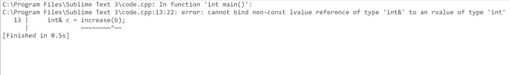

# c++ 14 中的返回式演绎，带示例

> 原文:[https://www . geesforgeks . org/return-type-演绎-in-c14-with-examples/](https://www.geeksforgeeks.org/return-type-deduction-in-c14-with-examples/)

在本文中，我们将讨论 C++ 14 中的返回类型演绎。使用 **C++ 14** 中的**自动**返回类型，编译器将尝试自动推导返回类型。

**程序 1:**

## C++ 14

```cpp
// C++ 14 program to illustrate the
// return type deduction
#include <iostream>
using namespace std;

// Function to multiply the two
// numbers a and b
auto multiply(int a, int b)
{

    // Return the product
    return a * b;
}

// Driver Code
int main()
{
    int a = 4, b = 5;

    // Function Call
    cout << multiply(a, b);

    return 0;
}
```

**Output:**

```cpp
20

```

**<u>解释</u> :** 在上面的程序中，**乘法(int a，int b)** 函数编译器将执行乘法。作为传递的参数 **4** 和 **5** ，编译器将返回 **20** ，由于其[数据类型](https://www.geeksforgeeks.org/c-data-types/)为整数，编译器将自动将类型推导为整数，并将返回 20 为整数。

**程序 2:**

## C++ 14

```cpp
// C++ 14 program to illustrate the
// return type deduction
#include <iostream>
using namespace std;

// Function to increment the
// value of a
auto increase(int& a)
{
    // Increment a
    a++ ;

    // Return the updated value
    return a;
}

// Driver Code
int main()
{
    int b = 10;

    // Function Call
    int& c = increase(b);

    // Print the value b and c
    cout << b << c;
    return 0;
}
```

**输出:**

[](https://media.geeksforgeeks.org/wp-content/uploads/20210120204720/imgonlinecomuaresizeMooTOeyjvrns6V.jpg)

**<u>解释</u> :** 可以看出，在上面的程序中编译器是显示了一个 [**错误**](https://www.geeksforgeeks.org/core-dump-segmentation-fault-c-cpp/) 。这是因为在函数**增(int & a)** 中，编译器会返回 **11** ，由于其类型是整数，编译器会将其类型推导为整数并返回，但在 main 中，我们是将一个**整数**值赋给一个**整数引用**变量 **c** ，这就是它显示错误的原因。

现在，上述问题可以通过两种方式解决:

### **<u>使用自动&</u> :**

## C++ 14

```cpp
// C++ 14 program to illustrate return
// type deduction using auto&
#include <iostream>
using namespace std;

// Function to increment the value
// of a and return the updated value
auto& increase(int& a)
{
    a++ ;
    return a;
}

// Driver Code
int main()
{
    int b = 10;

    // Function Call
    int& c = increase(b);
    cout << b << '\n'
         << c;

    return 0;
}
```

**Output:**

```cpp
11
11

```

### **<u>使用 decltype(自动)</u> :**

## C++ 14

```cpp
// C++ 14 program to illustrate return
// type deduction using decltype()
#include <iostream>
using namespace std;

// Function that increments the value
// of a and return the updated value
decltype(auto) increase(int& a)
{
    a++ ;
    return a;
}

// Driver Code
int main()
{
    int b = 10;

    // Function Call
    int& c = increase(b);

    cout << b << '\n'
         << c;

    return 0;
}
```

**Output:**

```cpp
11
11

```