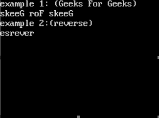

# 反转一个文件的内容并将其存储在另一个

中

> 原文:[https://www . geeksforgeeks . org/将文件内容反转并存储在另一个文件中/](https://www.geeksforgeeks.org/reverse-the-content-of-a-file-and-store-it-in-another/)

本文解释了如何将第一个文本文件的数据反向存储到第二个文本文件中。在这篇文章中，假设第一个文本文件中没有文本。因此，我们将在第一个文本文件中写入一些文本，方法是将数据传递给 reverse 函数，然后在 reverse 函数中，我们将它的数据的 reverse 复制到另一个文本文件中。

**先决条件:**
在文本文件中，数据以 **ASCII** 格式存储，并且可以在文本编辑器中读取数据，文件中的每个字母在内存中具有特定的**索引**，类似于**数组**

**示例:**

```
// Sample input 1 
Input to the reverse function:
reverse

Output:
esrever

// Sample input 2
Input to the reverse function:  
Geeks For Geeks

Output:
skeeG roF skeeG

```

**方法:**
**第一步:**用需要包含在第一个文本文件中的文本调用逆向函数，即传递文本文件的样本输入。
*反向功能的工作*
**第二步:**以写入模式打开文件并将“str”写入第一个文本文件这里:在文件 **Geeks.txt**
**第三步:**将第一个文本文件的结束位置存储在变量“pos”中并关闭文件。
**第四步:**在阅读模式下打开第一个文本文件，将阅读指针放在位置 pos。
**第五步:**以书写模式打开新的文本文件“ **Geeks2.txt** ”。
**第六步:**从末尾开始逐字符读取第一个文本文件，并将每个字符存储到第二个文本文件中。
**步骤 7:** 在文本文件中将读取指针向后移动一个字母表。
**第八步:**关闭文本文件。
**第九步:**读取第二个文本文件(不需要的话可以跳过)。

```
**name of first text file ="Geeks.txt"
**name of second text file="Geeks2.txt"

```

**示例:**

```
#include <conio.h>
#include <fstream.h>
#include <iostream.h>
#include <stdio.h>

// function to perform the task
// accepts the parameter str as the text to
// be stored in text file
void reverse(char str[])
{
    char ch;
    ofstream ofs;

    // created text file
    ofs.open("Geeks.txt", ios::out);

    for (int i = 0; str[i] != '\0'; i++) {
        // writing into the file
        ofs.put(str[i]);
    }

    // storing the position of  end of the file
    int pos = ofs.tellp();
    ofs.close();

    // object for reading the contents of the
    // first text file
    ifstream ifs;
    ifs.open("Geeks.txt", ios::in);

    // object for writing in to the text file 2
    ofstream ofs1;
    ofs1.open("Geeks2.txt", ios::out);

    // putting the read pointer to the last alphabet
    // of the file
    ifs.seekg(--pos);

    while (pos >= 0) {
        // reading from the file 1
        ifs.get(ch);

        // writing to the file 2
        ofs1.put(ch);

        /* shifting read pointer position one 
        alphabet backwards in the text file */
        pos--;

        ifs.seekg(pos);
    }

    ifs.close();
    ofs1.close();

    ifstream ifs1;
    ifs1.open("Geeks2.txt", ios::in);

    // file.eof() checks the end of the text file
    while (!ifs1.eof()) {
        ifs1.get(ch);
        cout << ch;
    }
    ifs1.close();
}

// Driver code
int main()
{
    clrscr();

    // sample input 1
    cout << "example 1: (Geeks For Geeks) \n";

    // passing first text file's text
    // through reverse function
    reverse("Geeks For Geeks");

    // sample input 2
    cout << "\n example 2:(reverse)\n";
    reverse("reverse");

    getch();
    return 0;
}
```

**输出:**
