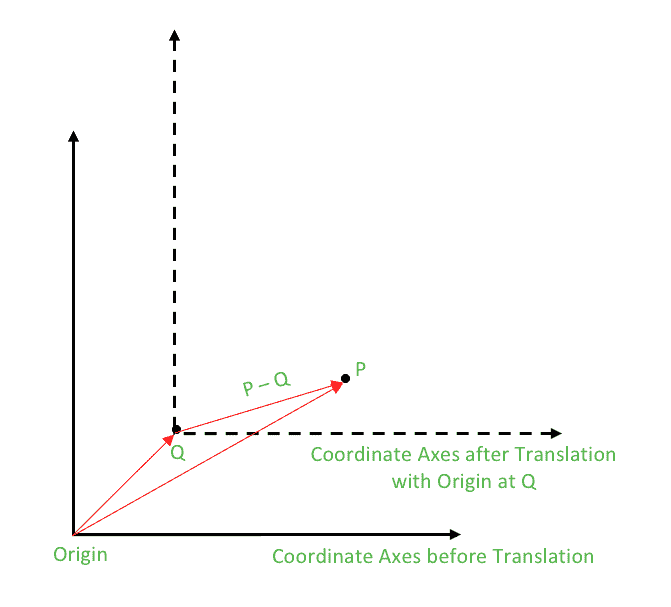

# c++中一个点围绕另一个点的旋转

> 原文:[https://www . geeksforgeeks . org/一点转另一点转 cpp/](https://www.geeksforgeeks.org/rotation-of-a-point-about-another-point-in-cpp/)

我们已经在[集合 1](https://www.geeksforgeeks.org/geometry-using-complex-numbers-stdcomplex-in-c/) 和[集合 2](https://www.geeksforgeeks.org/geometry-using-complex-numbers-c-set-2/) 中讨论了点 P 围绕原点的旋转。点 P 绕原点逆时针旋转角度θ如下所示:

```cpp
Rotation of P about origin: P * polar(1.0, θ)

```

**P 围绕点 Q 的旋转**

现在，我们要旋转点 P，不是关于原点，而是关于一个一般的点 q。这可以很容易地通过平移的方法来理解，这是几何分析中非常常见的技术。
**什么是翻译？**
在欧几里得几何中，平移是一种几何变换，它在给定的方向上以相同的量移动图形或空间的每个点。

**如何进行翻译？**
平移也可以解释为在每个点上增加一个恒定的矢量，或者改变坐标系的原点。
平移后，进行所需的计算，通过减去每个点的恒定向量或将原点移回，平移无效。



所以，为了绕着 Q 旋转 P，我们在 Q 处移动原点，也就是说，我们从坐标平面的每一点减去 Q 的向量等价物。现在新的点 P–Q 必须围绕原点旋转，然后平移必须无效。
这些步骤可描述如下:

1.  **平移(在 Q 处移动原点):**从所有点中减去 Q。因此，P 变成了 P–Q
2.  **围绕原点旋转(P–Q):**(P–Q)*极轴(1.0，θ)
3.  **恢复原点:**给所有点加 Q。

因此，

```cpp
 Rotation of P about Q : (P – Q) * polar(1.0, θ) + Q

```

```cpp
// CPP example to illustrate the rotation 
// of a point about another point
#include <iostream>
#include <complex>

using namespace std;

typedef complex<double> point;
#define x real()
#define y imag()

// Constant PI for providing angles in radians
#define PI 3.1415926535897932384626

// Function used to display X and Y coordinates of a point
void displayPoint(point P)
{
    cout << "(" << P.x << ", " << P.y << ")" << endl;
}

//Function for Rotation of P about Q by angle theta
point rotate(point P, point Q, double theta)
{
    return (P-Q) * polar(1.0, theta) +  Q;
}

int main()
{
    // Rotate P about Q
    point P(4.0, 3.0);
    point Q(2.0, 2.0);

    // Angle of rotation = 90 degrees
    double theta = PI/2;

    point P_rotated = rotate(P, Q, theta);
    cout << "The point P on rotating 90 degrees anti-clockwise about Q becomes:";
    cout << "P_rotated"; displayPoint(P_rotated);

    return 0;
}
```

输出:

```cpp
The point P on rotating 90 degrees anti-clockwise about Q becomes: P_rotated(1, 4)

```

本文由**安雅金达尔**供稿。如果你喜欢 GeeksforGeeks 并想投稿，你也可以使用[contribute.geeksforgeeks.org](http://www.contribute.geeksforgeeks.org)写一篇文章或者把你的文章邮寄到 contribute@geeksforgeeks.org。看到你的文章出现在极客博客主页上，帮助其他极客。

如果你发现任何不正确的地方，或者你想分享更多关于上面讨论的话题的信息，请写评论。