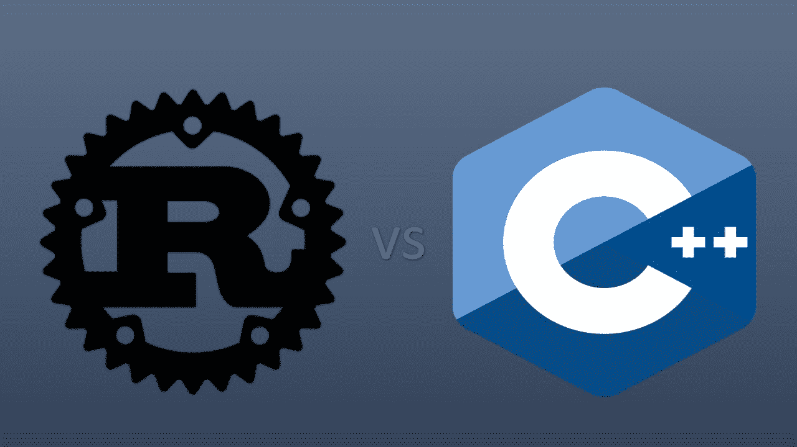

# Rust vs C++ :未来 Rust 会取代 C++ 吗？

> 原文:[https://www . geesforgeks . org/rust-vs-c-will-rust-replace-c-in-future/](https://www.geeksforgeeks.org/rust-vs-c-will-rust-replace-c-in-future/)

我们已经看到许多编程语言根据它们的功能和流行程度而发展，但是语言并不意味着根据它们的流行程度来使用。在使用编程语言时，我们应该考虑整体效率和生产率。说到效率和普及这个时代最常用的编程语言之一就是 [C++ ](https://www.geeksforgeeks.org/c-plus-plus/) 。它以其在操作系统方面对游戏行业的贡献而闻名，并且由于其预定义的标准模板库( [STL](https://www.geeksforgeeks.org/the-c-standard-template-library-stl/) )而成为[竞争性编程](https://www.geeksforgeeks.org/how-to-begin-with-competitive-programming/)方面使用最广泛的语言。另一方面，Rust 似乎是最近关于 C++ 的热门话题，因为它有相似的语法。除了语法，还有其他因素，如嵌入式系统编程，这就是为什么 rust 与 C++ 形成对比。让我们看看为什么选择 Rust 而不是 C++ 或者相反的一些事实。



### C++

C++ 是一种高级、通用的面向对象编程语言。它是由丹麦计算机科学家比雅尼·斯特劳斯特鲁普开发的。这种语言是 C 编程语言的扩展，或者说是“带类的 C”。C++ 的设计偏向于系统编程和嵌入式、资源受限的软件和大型系统，性能、效率和使用灵活性是其设计亮点。使用 C++ 程序员可以对系统资源和内存进行高级别的控制。它是一种面向对象的编程语言，为程序提供了清晰的结构，并允许代码被重用。

C++ 是一种伟大的语言，它可以提供令人敬畏的性能，并且您可以用更少的编译和执行时间构建超快的应用程序，因为它有丰富的标准库，称为“STL 库”。您可以构建各种各样的应用程序，从图形用户界面应用程序到 3D 图形、游戏、桌面应用程序，以及核心计算机视觉应用程序。

**示例:**

## 卡片打印处理机（Card Print Processor 的缩写）

```cpp
#include <iostream>
int main() {
    std::cout << "Hello, world!";
    return 0;
}
```

**输出:**

```cpp
Hello, world!
```

### 锈

Rust 是一种多范式编程语言，侧重于性能和安全性，尤其是安全并发性。它在语法上类似于 C++，但是在不使用垃圾收集的情况下提供了内存安全。Rust 编程语言是由 **Mozilla** 开发的，目的是为开发他们的浏览器 Mozilla Firefox 创建一个更好的工具。然而，这种语言似乎非常有效，以至于许多程序员现在选择将其用于软件开发，而不是使用 C++。Rust 在语法上类似于 C++，但它提供了更高的速度和更好的内存安全性。

就更安全的内存管理而言，Rust 是一种更具创新性的系统级语言，因为它不允许悬空指针或空指针。它的创建是为了安全可靠，不影响性能和速度。Rust 主要用于开发设备驱动程序、操作系统，如 BlogOS、intermezzOS、QuiltOS、Redox、RustOS、Rux、Tefflin 和 Tock。它也用在像 Mozilla firefox、游戏等浏览器中。

**示例:**

```cpp
fn main() {
    println!("Hello World!");
}
```

**输出:**

```cpp
Hello World!
```

### 结论

这两种编程语言都有自己的优缺点，比如 C++ 有大量的社区支持和许多软件开发框架，但与 C++ 相比，rust 没有那么多支持。另一方面，Rust 在几个方面要好得多，比如内存安全、并发性，它让你更仔细地考虑内存使用和指针。

几乎任何使用 Rust 的人都可以说，由于定义良好的语义和防止不必要的行为，用这种语言编程更容易。在 C++ 中，开发人员在试图避免未定义的行为时会遇到更多问题。此外，与 Rust 相比，C++ 是一个深海，因为 C++ 有如此多的特性和实现机会，以至于跟踪它们变得非常困难。

如果您正在寻找一种支持良好且框架丰富的语言，您可能会选择 C++。在其他情况下，您可能希望您的代码极其安全，避免内存泄漏和其他未定义的行为，然后开始学习 Rust。据说 Rust 还缺少工具和框架。

说到底，这完全取决于你对 C++ 还是 Rust 是否适应。如果你对 C++ 感到满意，那么它是一个很好的选择，有很多支持和框架。Rust 擅长安全方面，但仍处于试验阶段，因此决定是选择一种支持力度巨大的语言，还是选择一种具有安全内存访问的年轻实验语言。