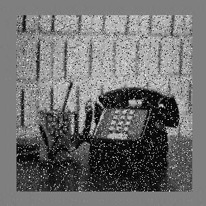
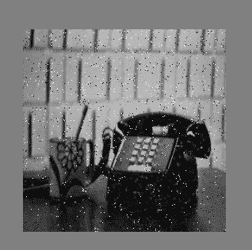

# 用 C++去除椒盐噪声

> 原文:[https://www . geesforgeks . org/椒盐噪声去除-使用-c/](https://www.geeksforgeeks.org/salt-and-pepper-noise-removal-using-c/)

椒盐噪声是有时在图像上看到的一种噪声。它也被称为脉冲噪声。这种噪声可能是由图像信号中的急剧和突然干扰引起的。它表现为稀疏出现的白色和黑色像素。对于这种类型的噪声，一种有效的降噪方法是中值滤波器或形态滤波器。
在本文中，我们将学习如何简单地使用 C++(不使用任何像 OpenCV 这样的外部图像处理库)从图像中去除椒盐噪声。
**进场:**

1.  将输入图像的像素值存储在数组中。
2.  对于每个像素值，如果它包含 0(黑色)或 255(白色)，则计算其相邻像素值的平均值，否则该像素值存储在另一个数组中。
3.  新数组的像素值用于输出文件。

下面是椒盐噪声去除的简单 C++实现:

## 卡片打印处理机（Card Print Processor 的缩写）

```cpp
#include <fstream>
#include <iostream>
#include <sstream>

using namespace std;

int array[2000][2000]; // used for input image
int arr[2000][2000]; // used for output image
int hist[255];

int main()
{
    int i, row = 0, j = 0, col = 0, numrows = 0, numcols = 0, MAX = 0;

    // input image
    ifstream infile("saltpepper.pgm");
    stringstream ss;
    string inputLine = "";

    // First line : version
    getline(infile, inputLine);
    if (inputLine.compare("P2") != 0)
        cerr << "Version error" << endl;
    else
        cout << "Version : " << inputLine << endl;

    // Continue with a stringstream
    ss << infile.rdbuf();

    // Secondline : size
    ss >> numcols >> numrows >> MAX;

    // print total number of columns,
    // rows and maximum intensity of the image
    cout << numcols << " columns and " << numrows << " rows" << endl
         << " Maximium Intesity " << MAX << endl;

    // Initialize a new array of
    // same size of the image with 0
    for (row = 0; row <= numrows; ++row)
        array[row][0] = 0;

    for (col = 0; col <= numcols; ++col)
        array[0][col] = 0;

    printf("****\n");

    // Following lines : data
    for (row = 1; row <= numrows; ++row) {
        for (col = 1; col <= numcols; ++col) {
            // original data store in new array
            ss >> array[row][col];
        }
    }

    for (row = 1; row <= numrows; ++row) {
        for (col = 1; col <= numcols; ++col) {

            // check if intensity is black or white
            if (array[row][col] == 0 || array[row][col] == 255)
            {
                // compute average of neighbours pixels
                // and store the pixel value in another
                // array for output image
                arr[row][col] = (array[row - 1][col] +
                                 array[row - 1][col - 1] +
                                 array[row - 1][col + 1] +
                                 array[row][col - 1] +
                                 array[row][col + 1] +
                                 array[row + 1][col + 1] +
                                 array[row + 1][col] +
                                 array[row + 1][col - 1]) / 8;
            }
            else {
                // store pixel value in another
                // array for output image
                arr[row][col] = array[row][col];
            }
        }
    }

    ofstream outfile;

    // new file open to store the output image
    outfile.open("salt and pepper.pgm");
    outfile << "P2" << endl;
    outfile << numcols << " " << numrows << endl;
    outfile << "255" << endl;

    for (row = 1; row <= numrows; ++row) {
        for (col = 1; col <= numcols; ++col) {

            // store resultant pixel intensity to the output file
            outfile << arr[row][col] << " ";
        }
    }

    outfile.close();
    infile.close();
    return 0;
}
```

**输入图像:**



**输出图像:**

