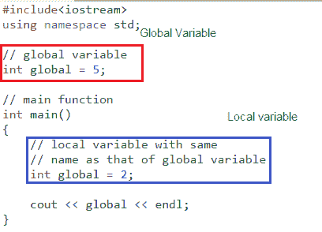

# c++中变量的作用域

> 原文:[https://www.geeksforgeeks.org/scope-of-variables-in-c/](https://www.geeksforgeeks.org/scope-of-variables-in-c/)

一般来说，范围被定义为可以处理某件事情的程度。在编程中，变量的范围也被定义为程序代码的范围，在该范围内变量可以被访问、声明或使用。变量范围主要有两种类型:

1.  局部变量
2.  全局变量



现在让我们更详细地了解每个范围:

### 局部变量

在函数或块中定义的变量被称为这些函数的局部变量。

*   “{ 0 }”和“}”之间的任何内容都被称为块内部。
*   局部变量不存在于声明它们的块之外，即它们**不能在该块之外被访问或使用。**
*   **声明局部变量**:局部变量在块内部声明。

## C++

```cpp
// CPP program to illustrate
// usage of local variables
#include<iostream>
using namespace std;

void func()
{  
    // this variable is local to the
    // function func() and cannot be
    // accessed outside this function
    int age=18;   
}

int main()
{
    cout<<"Age is: "<<age;

    return 0;
}
```

输出:

```cpp
Error: age was not declared in this scope
```

上面的程序显示一个错误，说“年龄未在此范围内声明”。变量 age 是在 func()函数中声明的，因此它是该函数的本地变量，对于该函数之外的程序部分不可见。

**修正程序**:要修正上述错误，我们只需从函数 func()中显示变量 age 的值即可。这显示在下面的程序中:

## C++

```cpp
// CPP program to illustrate
// usage of local variables
#include<iostream>
using namespace std;

void func()
{  
    // this variable is local to the
    // function func() and cannot be
    // accessed outside this function
    int age=18;
    cout<<age;
}

int main()
{
    cout<<"Age is: ";
    func();

    return 0;
}
```

输出:

```cpp
Age is: 18
```

### 全局变量

顾名思义，可以从程序的任何部分访问全局变量。

*   它们在程序的整个生命周期中都是可用的。
*   它们在所有函数或块之外的程序顶部声明。
*   **声明全局变量**:全局变量通常在所有函数和块之外声明，在程序的顶部。它们可以从程序的任何部分访问。

## C++

```cpp
// CPP program to illustrate
// usage of global variables
#include<iostream>
using namespace std;

// global variable
int global = 5;

// global variable accessed from
// within a function
void display()
{
    cout<<global<<endl;
}

// main function
int main()
{
    display();

    // changing value of global
    // variable from main function
    global = 10;
    display();
}
```

输出:

```cpp
5
10
```

在程序中，变量“全局”在所有函数之外的程序顶部声明，因此它是一个全局变量，可以从程序的任何地方访问或更新。

**如果函数内部存在一个与全局变量同名的局部变量会怎样？**

让我们再次重复这个问题。问题是:如果函数中有一个变量与全局变量同名，并且函数试图访问具有该名称的变量，那么哪个变量将被赋予优先级？局部变量还是全局变量？看下面的程序来理解这个问题:

## C++

```cpp
// CPP program to illustrate
// scope of local variables
// and global variables together
#include<iostream>
using namespace std;

// global variable
int global = 5;

// main function
int main()
{  
    // local variable with same
    // name as that of global variable

    int global = 2;
    cout << global << endl;
}
```

看上面的程序。在顶部声明的变量“global”是全局变量，存储值 5，其中在 main 函数中声明的是局部变量，存储值 2。那么，问题是当存储在名为“global”的变量中的值从主函数中打印出来时，输出会是什么？两个还是五个？

*   通常，当定义了两个同名变量时，编译器会产生编译时错误。但是如果变量被定义在不同的范围内，那么编译器允许。
*   每当有一个局部变量被定义为与全局变量同名时，**编译器将优先考虑局部变量**

**当存在同名局部变量时，如何访问全局变量？**

如果我们想做与上述任务相反的事情呢。当有一个同名的局部变量时，如果我们想访问全局变量呢？
要解决这个问题我们需要使用 [**范围解析符**](https://www.geeksforgeeks.org/scope-resolution-operator-in-c/) 。下面的程序解释了如何在范围解析操作符的帮助下做到这一点。

## C++

```cpp
// C++ program to show that we can access a global
// variable using scope resolution operator :: when 
// there is a local variable with same name
#include<iostream>
using namespace std;

// Global x 
int x = 0; 

int main()
{
  // Local x   
  int x = 10;
  cout << "Value of global x is " << ::x;
  cout<< "\nValue of local x is " << x; 
  return 0;
}
```

输出:

```cpp
Value of global x is 0
Value of local x is 10
```

本文由 [**哈什·阿加瓦尔**](https://www.facebook.com/harsh.agarwal.16752) 供稿。如果你喜欢 GeeksforGeeks 并想投稿，你也可以使用[write.geeksforgeeks.org](https://write.geeksforgeeks.org)写一篇文章或者把你的文章邮寄到 review-team@geeksforgeeks.org。看到你的文章出现在极客博客主页上，帮助其他极客。
如果发现有不正确的地方，或者想分享更多关于上述话题的信息，请写评论。