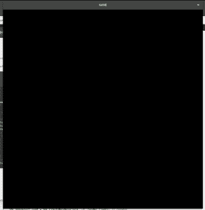

# C/c++中的 SDL 库，带示例

> 原文:[https://www . geesforgeks . org/SDL-library-in-c-c-with-examples/](https://www.geeksforgeeks.org/sdl-library-in-c-c-with-examples/)

**SDL** 是**简单直接媒体层**。这是一个跨平台开发库，旨在通过 OpenGL 和 Direct3D 提供对音频、键盘、鼠标、操纵杆和图形硬件的低级访问。它可以用来制作动画和电子游戏。

*   它基本上提供了一套与图形硬件、音频、键盘、鼠标等各种设备交互的 API。
*   它是用 C 编程语言编写的，可与 C++和各种其他语言(如 c#和 python)一起工作。

**在 Linux 上安装(对于使用 apt 包管理器的操作系统，例如:Ubuntu ):**

1.  在您的终端上运行命令 **sudo apt-get update** 。
2.  在您的终端上运行命令 **sudo apt-get install clang** 。
3.  运行命令**sudo apt-get install libsdl 2-2.0-0 libsdl 2-dbg libsdl 2-dev libsdl 2-image-2.0-0 libsdl 2-image-dbg libsdl 2-image-dev**在您的终端上。
4.  我们需要制作一个 Makefile。所以打开你选择的文本编辑器，开始写下面的代码。

```cpp
# A simple Makefile for compiling small SDL projects

# set the compiler
CC := clang

# set the compiler flags
CFLAGS := `sdl2-config --libs --cflags` -ggdb3 -O0 --std=c99 -Wall -lSDL2_image -lm
# add header files here
HDRS :=

# add source files here
SRCS := #file-name.c

# generate names of object files
OBJS := $(SRCS:.c=.o)

# name of executable
EXEC := #name your executable file

# default recipe
all: $(EXEC)

showfont: showfont.c Makefile
    $(CC) -o $@ $@.c $(CFLAGS) $(LIBS)

glfont: glfont.c Makefile
    $(CC) -o $@ $@.c $(CFLAGS) $(LIBS)

# recipe for building the final executable
$(EXEC): $(OBJS) $(HDRS) Makefile
    $(CC) -o $@ $(OBJS) $(CFLAGS)

# recipe for building object files
#$(OBJS): $(@:.o=.c) $(HDRS) Makefile
#    $(CC) -o $@ $(@:.o=.c) -c $(CFLAGS)

# recipe to clean the workspace
clean:
    rm -f $(EXEC) $(OBJS)

.PHONY: all clean
```

**头文件:**

## C++

```cpp
// for initializing and shutdown functions
#include <SDL2/SDL.h>

// for rendering images and graphics on screen
#include <SDL2/SDL_image.h>

// for using SDL_Delay() functions
#include <SDL2/SDL_timer.h>
```

**初始化:**

## C++

```cpp
#include <SDL2/SDL.h>
#include <SDL2/SDL_image.h>
#include <SDL2/SDL_timer.h>

int main(int argc, char *argv[])
{

    // retutns zero on success else non-zero
    if (SDL_Init(SDL_INIT_EVERYTHING) != 0) {
        printf("error initializing SDL: %s\n", SDL_GetError());
    }
    SDL_Window* win = SDL_CreateWindow("GAME",
                                       SDL_WINDOWPOS_CENTERED,
                                       SDL_WINDOWPOS_CENTERED,
                                       1000, 1000, 0);
    while (1)
        ;

    return 0;
}
```

**这将在你的屏幕上创建一个空窗口。**
**输出:**



**我们将编写一个简单的程序来解释渲染和 I/O 处理:**

## C++

```cpp
#include <SDL2/SDL.h>
#include <SDL2/SDL_image.h>
#include <SDL2/SDL_timer.h>

int main(int argc, char *argv[])
{

    // retutns zero on success else non-zero
    if (SDL_Init(SDL_INIT_EVERYTHING) != 0) {
        printf("error initializing SDL: %s\n", SDL_GetError());
    }
    SDL_Window* win = SDL_CreateWindow("GAME", // creates a window
                                       SDL_WINDOWPOS_CENTERED,
                                       SDL_WINDOWPOS_CENTERED,
                                       1000, 1000, 0);

    // triggers the program that controls
    // your graphics hardware and sets flags
    Uint32 render_flags = SDL_RENDERER_ACCELERATED;

    // creates a renderer to render our images
    SDL_Renderer* rend = SDL_CreateRenderer(win, -1, render_flags);

    // creates a surface to load an image into the main memory
    SDL_Surface* surface;

    // please provide a path for your image
    surface = IMG_Load("path");

    // loads image to our graphics hardware memory.
    SDL_Texture* tex = SDL_CreateTextureFromSurface(rend, surface);

    // clears main-memory
    SDL_FreeSurface(surface);

    // let us control our image position
    // so that we can move it with our keyboard.
    SDL_Rect dest;

    // connects our texture with dest to control position
    SDL_QueryTexture(tex, NULL, NULL, &dest.w, &dest.h);

    // adjust height and width of our image box.
    dest.w /= 6;
    dest.h /= 6;

    // sets initial x-position of object
    dest.x = (1000 - dest.w) / 2;

    // sets initial y-position of object
    dest.y = (1000 - dest.h) / 2;

    // controls annimation loop
    int close = 0;

    // speed of box
    int speed = 300;

    // annimation loop
    while (!close) {
        SDL_Event event;

        // Events management
        while (SDL_PollEvent(&event)) {
            switch (event.type) {

            case SDL_QUIT:
                // handling of close button
                close = 1;
                break;

            case SDL_KEYDOWN:
                // keyboard API for key pressed
                switch (event.key.keysym.scancode) {
                case SDL_SCANCODE_W:
                case SDL_SCANCODE_UP:
                    dest.y -= speed / 30;
                    break;
                case SDL_SCANCODE_A:
                case SDL_SCANCODE_LEFT:
                    dest.x -= speed / 30;
                    break;
                case SDL_SCANCODE_S:
                case SDL_SCANCODE_DOWN:
                    dest.y += speed / 30;
                    break;
                case SDL_SCANCODE_D:
                case SDL_SCANCODE_RIGHT:
                    dest.x += speed / 30;
                    break;
                default:
                    break;
                }
            }
        }

        // right boundary
        if (dest.x + dest.w > 1000)
            dest.x = 1000 - dest.w;

        // left boundary
        if (dest.x < 0)
            dest.x = 0;

        // bottom boundary
        if (dest.y + dest.h > 1000)
            dest.y = 1000 - dest.h;

        // upper boundary
        if (dest.y < 0)
            dest.y = 0;

        // clears the screen
        SDL_RenderClear(rend);
        SDL_RenderCopy(rend, tex, NULL, &dest);

        // triggers the double buffers
        // for multiple rendering
        SDL_RenderPresent(rend);

        // calculates to 60 fps
        SDL_Delay(1000 / 60);
    }

    // destroy texture
    SDL_DestroyTexture(tex);

    // destroy renderer
    SDL_DestroyRenderer(rend);

    // destroy window
    SDL_DestroyWindow(win);

    // close SDL
    SDL_Quit();

    return 0;
}
```

**这将在窗口上呈现一个图像，可以通过键盘上、下、左、右进行控制。**
**输出:**

<video class="wp-video-shortcode" id="video-281042-1" width="640" height="360" preload="metadata" controls=""><source type="video/mp4" src="https://media.geeksforgeeks.org/wp-content/uploads/20190228033910/2019-02-28-03-34-51.mp4?_=1">[https://media.geeksforgeeks.org/wp-content/uploads/20190228033910/2019-02-28-03-34-51.mp4](https://media.geeksforgeeks.org/wp-content/uploads/20190228033910/2019-02-28-03-34-51.mp4)</video>

**参考文献:**T2】https://www.libsdl.org/[https://github.com/vivek9236/rocket_game](https://github.com/vivek9236/rocket_game)T6】