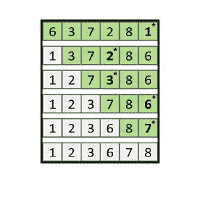
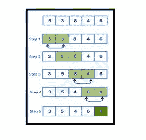

# 选择排序 VS 冒泡排序

> 原文:[https://www . geesforgeks . org/selection-sort-vs-bubble-sort/](https://www.geeksforgeeks.org/selection-sort-vs-bubble-sort/)

在本文中，我们将讨论选择排序和冒泡排序之间的比较。基于时间和空间复杂度的选择排序和冒泡排序算法所需的资源如下。

```cpp
Time Complexity - 
Same Complexity - 
```

让我们深入研究这些算法的工作原理。

[**选择排序**](https://www.geeksforgeeks.org/selection-sort/) **:**
选择排序算法一般是第一个教给我们的排序算法。这里，在内部循环的每次迭代中，最小的元素被替换为每个循环中的起始元素。每个循环结束后，我们将起始位置增加 1，并运行它直到数组中的第二个最后一个元素。因此，通过在外循环结束时这样做，我们将得到一个排序的数组。

下图解释了选择排序算法的迭代。



这里我们可以简化选择排序算法，说这里的排序是在最小到最大元素的基础上进行的。首先排序最小的元素，然后排序第二个最小的元素，以此类推。

**选择排序的实现:**

下面是上述算法的实现。

## C++

```cpp
#include <iostream>
using namespace std;
void Selection_Sort(int arr[], int n) 
{
    for(int i = 0; i < n - 1; ++ i) 
    {
        int min_index = i; 
        for(int j = i + 1; j < n; ++ j) 
        {
            if(arr[j] < arr[min_index]) 
                min_index = j;
        }
        swap(arr[i], arr[min_index]); 
    }
}
int main()
{
    int n = 5;
    int arr[5] = {2, 0, 1, 4, 3};
    Selection_Sort(arr, n);
    cout<<"The Sorted Array by using Selection Sort is : ";
    for(int i = 0; i < n; ++ i)
        cout<<arr[i]<<" ";
    return 0;
}
```

## Java 语言(一种计算机语言，尤用于创建网站)

```cpp
class GFG{

  static void Selection_Sort(int arr[], int n) 
  {
    for(int i = 0; i < n - 1; ++ i) 
    {
      int min_index = i; 
      for(int j = i + 1; j < n; ++ j) 
      {
        if(arr[j] < arr[min_index]) 
          min_index = j;
      }
      int temp = arr[i];
      arr[i] = arr[min_index];
      arr[min_index] = temp;
    }
  }

  // Driver code
  public static void main(String[] args)
  {
    int n = 5;
    int arr[] = {2, 0, 1, 4, 3};
    Selection_Sort(arr, n);
    System.out.print("The Sorted Array by using Selection Sort is : ");
    for(int i = 0; i < n; ++ i)
      System.out.print(arr[i] + " ");
  }
}

// This code is contributed by aashish1995
```

## 蟒蛇 3

```cpp
def Selection_Sort(arr, n):

    for i in range(n - 1):
        min_index = i 

        for j in range(i + 1, n):
            if (arr[j] < arr[min_index]):
                min_index = j

        arr[i], arr[min_index] = arr[min_index], arr[i] 

# Driver Code
n = 5
arr = [ 2, 0, 1, 4, 3 ]
Selection_Sort(arr, n)

print("The Sorted Array by using " \
      "Selection Sort is : ", end = '')
for i in range(n):
    print(arr[i], end = " ")

# This code is contributed by SHUBHAMSINGH10
```

## C#

```cpp
using System;

public class GFG{

  static void Selection_Sort(int []arr, int n) 
  {
    for(int i = 0; i < n - 1; ++ i) 
    {
      int min_index = i; 
      for(int j = i + 1; j < n; ++ j) 
      {
        if(arr[j] < arr[min_index]) 
          min_index = j;
      }
      int temp = arr[i];
      arr[i] = arr[min_index];
      arr[min_index] = temp;
    }
  }

  // Driver code
  public static void Main(String[] args)
  {
    int n = 5;
    int []arr = {2, 0, 1, 4, 3};
    Selection_Sort(arr, n);
    Console.Write("The Sorted Array by using Selection Sort is : ");
    for(int i = 0; i < n; ++ i)
      Console.Write(arr[i] + " ");
  }
}

// This code is contributed by aashish1995
```

## java 描述语言

```cpp
<script>

// JavaScript program for above approach

    function Selection_Sort(arr, n)
  {
    for(let i = 0; i < n - 1; ++ i)
    {
      let min_index = i;
      for(let j = i + 1; j < n; ++ j)
      {
        if(arr[j] < arr[min_index])
          min_index = j;
      }
      let temp = arr[i];
      arr[i] = arr[min_index];
      arr[min_index] = temp;
    }
  }

// Driver Code

    let n = 5;
    let arr = [2, 0, 1, 4, 3];
    Selection_Sort(arr, n);
    document.write("The Sorted Array by using Selection Sort is : ");
    for(let i = 0; i < n; ++ i)
      document.write(arr[i] + " ");

</script>
```

**Output**

```cpp
The Sorted Array by using Selection Sort is : 0 1 2 3 4 
```

[**冒泡排序**](https://www.geeksforgeeks.org/bubble-sort/) **:**
当我们第一次研究冒泡排序算法时，它可能看起来有点混乱。但这里有一个简单的解释。这里交换是以两种方式进行的。在外循环的每次迭代中，找到最大的元素，并与循环中的最后一个元素交换。在内部循环中，我们进行两个连续元素的成对交换。在每个内部循环中，我们从第一个元素到前一个循环中少的一个元素。下图显示了冒泡排序算法中内部循环的第一次迭代。



这里我们可以简化冒泡排序算法，说这里的排序是基于**最大到最小的元素**进行的。最大的元素首先保留在数组的最后一个位置。然后是倒数第二个位置的第二大元素，依此类推。

**冒泡排序的实现:**
下面是上面解释的算法的实现。

## C++

```cpp
#include <iostream>
using namespace std;
void Bubble_Sort(int arr[], int n) 
{
    for(int i = 1; i < n; ++ i)     
    {   
                for(int j = 0; j <= (n - i - 1); ++ j)  
        {   
            if(arr[j] > arr[j + 1])
                swap(arr[j], arr[j + 1]); 
        }
    }
}

int main()
{
    int n = 5;
    int arr[5] = {2, 0, 1, 4, 3};
    Bubble_Sort(arr, n);
    cout<<"The Sorted Array by using Bubble Sort is : ";
    for(int i = 0; i < n; ++ i)
        cout<<arr[i]<<" ";
    return 0;
}
```

## Java 语言(一种计算机语言，尤用于创建网站)

```cpp
import java.io.*;

class GFG{

static void Bubble_Sort(int arr[], int n) 
{
    for(int i = 1; i < n; ++ i)     
    {
        for(int j = 0; j <= (n - i - 1); ++ j)  
        {   
            if (arr[j] > arr[j + 1])
            {
                int temp = arr[j];
                arr[j] = arr[j + 1];
                arr[j + 1] = temp;
            } 
        }
    }
}

// Driver code
public static void main(String[] args)
{
    int n = 5;
    int arr[] = { 2, 0, 1, 4, 3 };

    Bubble_Sort(arr, n);

    System.out.print("The Sorted Array by using Bubble Sort is : ");
    for(int i = 0; i < n; ++ i)
        System.out.print(arr[i]+" ");
}
}

// This code is contributed by Shubhamsingh10
```

## 蟒蛇 3

```cpp
def Bubble_Sort(arr, n):
    for i in range(1, n):
        for j in range(0, n - i):
            if (arr[j] > arr[j + 1]):
                arr[j], arr[j + 1] = arr[j + 1], arr[j]

    return arr

# Driver Code
n = 5
arr = [ 2, 0, 1, 4, 3 ]
arr = Bubble_Sort(arr, n)

print("The Sorted Array by using Bubble Sort is : ", end = '')
for i in range(n):
    print(arr[i], end = " ")

# This code is contributed by Shubhamsingh10
```

## C#

```cpp
// C# program for the above approach
using System;

public class GFG{

    static void Bubble_Sort(int[] arr, int n) 
    {
        for(int i = 1; i < n; ++ i)     
        {
            for(int j = 0; j <= (n - i - 1); ++ j)  
            {   
                if (arr[j] > arr[j + 1])
                {
                    int temp = arr[j];
                    arr[j] = arr[j + 1];
                    arr[j + 1] = temp;
                } 
            }
        }
    }

    // Driver Code
    static public void Main ()
    {
        int n = 5;
        int[] arr = { 2, 0, 1, 4, 3 };

        Bubble_Sort(arr, n);

        Console.Write("The Sorted Array by using Bubble Sort is : ");
        for(int i = 0; i < n; ++ i){
            Console.Write(arr[i]+" ");
        }
    }
}

// This code is contributed by Shubhamsingh10
```

## java 描述语言

```cpp
<script>
// Javascript program for the above approach

function Bubble_Sort( arr, n) 
{
    for(var i = 1; i < n; ++ i)     
    {   
        for(var j = 0; j <= (n - i - 1); ++ j)  
        {   
            if(arr[j] > arr[j + 1]){
                var temm = arr[j];
                arr[j] = arr[j + 1];
                arr[j+1] = temm;
             }
        }
    }
}

var n = 5;
var arr = [2, 0, 1, 4, 3];
Bubble_Sort(arr, n);
document.write("The Sorted Array by using Bubble Sort is : ");
for(var i = 0; i < n; i++){
    document.write(arr[i]+" ");
}

// This code is contributed by Shubhamsingh10
</script>
```

**Output**

```cpp
The Sorted Array by using Bubble Sort is : 0 1 2 3 4 
```

**给冒泡排序增加智能:**

1.  我们必须考虑这样一个事实，即使我们的数据最初是以排序的形式存在的，我们当前的算法也会执行所有的迭代。
2.  如上面的代码所示，当 arr[i] > arr[i+1]时，我们交换两个元素(比如 I 和 i+1)。因此，即使我们的数据已经被排序(或者仅仅经过几次迭代就被排序)，我们的算法仍然会运行，
3.  **然而，我们可以调整我们的代码，以便我们的算法能够识别给定数据何时被排序，并且不需要进一步的迭代。**

4.  我们可以通过简单地添加一个*“标志”*变量来实现这一点。将此*“标志”*变量初始化为假的外部内部循环，并将其设置为真，如果在任何时候(arr[j] > arr[j+1])条件为真。
5.  退出内部循环后，检查标志。如果*标志==真*，即改变，进行交换操作。然而，如果 flag == false，这意味着没有对整个迭代执行交换，因此我们的数据现在被排序，并且<u>不需要进一步的迭代。</u>

## C++

```cpp
// C++ program for the above approach
#include <iostream>
using namespace std;

// Function for bubble sort
void Bubble_Sort(int arr[], int n)
{
    bool flag;

    // Iterate from 1 to n - 1
    for (int i = 1; i < n; ++ i) {

        flag = false;

        // Iterate from 0 to n - i - 1
        for (int j = 0; j <= (n - i - 1); ++ j) {
            if (arr[j] > arr[j + 1]) {
                swap(arr[j], arr[j + 1]);
                flag = true;
            }
        }
        if (flag == false)
            break;
    }
}

// Driver Code
int main()
{
    int n = 5;
    int arr[5] = { 2, 0, 1, 4, 3 };
    Bubble_Sort(arr, n);
    cout << "The Sorted Array by using Bubble Sort is : ";
    for (int i = 0; i < n; ++ i)
        cout << arr[i] << " ";
    return 0;
}
```

## Java 语言(一种计算机语言，尤用于创建网站)

```cpp
// Java program for the above approach
import java.io.*;

class GFG{

// Function for bubble sort
static void Bubble_Sort(int[] arr, int n)
{
    boolean flag;

    // Iterate from 1 to n - 1
    for(int i = 1; i < n; ++ i)
    {
        flag = false;

        // Iterate from 0 to n - i - 1
        for(int j = 0; j <= (n - i - 1); ++ j)
        {
            if (arr[j] > arr[j + 1])
            {
                int temp  = arr[j];
                arr[j] = arr[j + 1];
                arr[j + 1] = temp;
                flag = true;
            }
        }
        if (flag == false)
            break;
    }
}

// Driver Code
public static void main(String[] args)
{
    int n = 5;
    int[] arr = { 2, 0, 1, 4, 3 };
    Bubble_Sort(arr, n);
    System.out.print("The Sorted Array by " +
                     "using Bubble Sort is : ");

    for(int i = 0; i < n; ++ i)
        System.out.print(arr[i] + " ");
}
}

// This code is contributed by shubhamsingh10
```

## 蟒蛇 3

```cpp
# Python3 program for the above approach

# Function for bubble sort
def Bubble_Sort(arr, n):
    flag = True

    # Iterate from 1 to n - 1
    for i in range(1,n):
        flag = False
        # Iterate from 0 to n - i - 1
        for j in range(n-i):
            if (arr[j] > arr[j + 1]):
                arr[j], arr[j + 1] = arr[j + 1], arr[j]
                flag = True

        if (flag == False):
            break

# Driver Code
n = 5
arr = [2, 0, 1, 4, 3]
Bubble_Sort(arr, n)
print("The Sorted Array by using Bubble Sort is : ", end='')
for i in range(n):
    print(arr[i], end= " ")

# This code is contributed by ShubhamSingh10
```

## C#

```cpp
// C# program for the above approach
using System;
public class GFG{

    // Function for bubble sort
    static void Bubble_Sort(int[] arr, int n)
    {
        bool flag;

        // Iterate from 1 to n - 1
        for (int i = 1; i < n; ++ i) {

            flag = false;

            // Iterate from 0 to n - i - 1
            for (int j = 0; j <= (n - i - 1); ++ j) {
                if (arr[j] > arr[j + 1]) {
                    int temp  = arr[j];
                    arr[j] = arr[j + 1];
                    arr[j + 1] = temp;
                    flag = true;
                }
            }
            if (flag == false)
                break;
        }
    }

    // Driver Code
    static public void Main ()
    {
        int n = 5;
        int[] arr = { 2, 0, 1, 4, 3 };
        Bubble_Sort(arr, n);
        Console.Write("The Sorted Array by using Bubble Sort is : ");
        for (int i = 0; i < n; ++ i)
            Console.Write(arr[i] + " ");
    }

}

// This code is contributed by shubhamsingh10.
```

## java 描述语言

```cpp
<script>

// JavaScript program for the above approach

// Function for bubble sort
function Bubble_Sort(arr, n)
{
    Boolean(flag = true);

    // Iterate from 1 to n - 1
    for(var i = 1; i < n; ++ i)
    {
        flag = false;

        // Iterate from 0 to n - i - 1
        for(var j = 0; j <= (n - i - 1); ++ j)
        {
            if (arr[j] > arr[j + 1])
            {
                var temp  = arr[j];
                arr[j] = arr[j + 1];
                arr[j + 1] = temp;
                flag = true;
            }
        }
        if (flag == false)
            break;
    }
}

// Driver Code
var n = 5;
var arr = [ 2, 0, 1, 4, 3 ];
Bubble_Sort(arr, n);

document.write("The Sorted Array by " +
                 "using Bubble Sort is : ");

for(var i = 0; i < n; ++ i)
    document.write(arr[i] + " ");

// This code is contributed by shivanisinghss2110

</script>
```

**Output**

```cpp
The Sorted Array by using Bubble Sort is : 0 1 2 3 4 
```

**注意:**这个小小的调整并没有改变冒泡排序算法最坏情况下的时间复杂度，但是可以改善其在特定情况下的运行时间。

**参考文献:**
[讲座阅读](https://courses.cs.washington.edu/courses/cse373/19au/lectures/05/reading/)
[实现冒泡排序 c](https://qnaplus.com/implement-bubble-sort-c/)