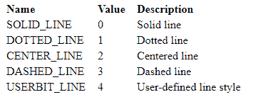
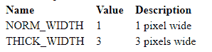

# 在 C

中设置 linestyle()函数

> 原文:[https://www.geeksforgeeks.org/setlinestyle-function-c/](https://www.geeksforgeeks.org/setlinestyle-function-c/)

头文件 graphics.h 包含 **setlinestyle()** 函数，该函数设置由直线、直线到矩形、drawpoly 等绘制的所有直线的样式。

**语法:**

```
void setlinestyle(int linestyle, unsigned upattern,
                                   int thickness);

```

**示例:**

```
Input : x = 200, y = 100
Output : 

x and y are initialized as (200, 100). 
For every line, value of y increments 
by 25 to change the position. 
The line style keep changing corresponding
to value of first parameter(c). 

```

**说明:** **线型**指定后续线条将以哪种样式绘制(如实线、虚线、居中、虚线)。

**up pattern**是 16 位模式，仅当 linestyle 为 USERBIT_LINE (4)时适用。在这种情况下，每当模式字中的一位为 1 时，该行中相应的像素就以当前的绘图颜色绘制。必须始终提供“upattern”的值。如果“linestyle”不是 USERBIT_LINE (4)，则简单地忽略它。
**粗细**指定后续绘制的线条宽度是正常还是粗。


下面是 setlinestyle()函数的实现:

```
// C Implementation for setlinestyle()
#include <graphics.h>

// driver code
int main()
{
    // gm is Graphics mode which is
    // a computer display mode that
    // generates image using pixels.
    // DETECT is a macro defined in
    // "graphics.h" header file
    int gd = DETECT, gm;

    // variable to change the
    // line styles
    int c;

    // initial coordinate to 
    // draw line
    int x = 200, y = 100;

    // initgraph initializes the
    // graphics system by loading a
    // graphics driver from disk
    initgraph(&gd, &gm, "");

    // To keep track of lines
    for ( c = 0 ; c < 5 ; c++ )
   {
       // setlinestyle function
       setlinestyle(c, 0, 1);

       // Drawing line
       line(x, y, x+200, y);
       y = y + 25;
   }

    getch();

    // closegraph function closes the
    // graphics mode and deallocates
    // all memory allocated by
    // graphics system .
    closegraph();

    return 0;
}
```

输出: