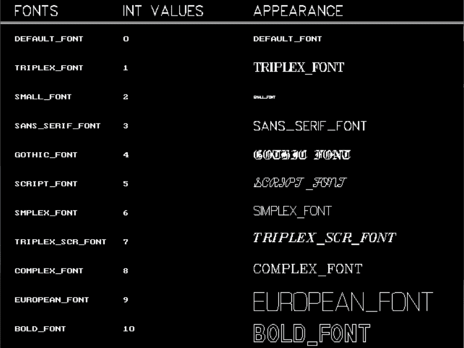

# C

中的 settextstyle 函数

> 原文:[https://www.geeksforgeeks.org/settextstyle-function-c/](https://www.geeksforgeeks.org/settextstyle-function-c/)

头文件 graphics.h 包含**setextstyle()**函数，用于更改文本的显示方式。使用它，我们可以修改文本的大小，改变文本的方向，改变文本的字体。
**语法:**

```cpp
void settextstyle(int font, int direction, int font_size);

where,
font argument specifies the font of text,
Direction can be HORIZ_DIR (Left to right) 
or VERT_DIR (Bottom to top).
```

**例:**

```cpp
Input : font = 8, direction = 0, font_size = 5
Output : 
```


```cpp
Input : font = 3, direction = 0, font_size = 5
Output : 
```


下表显示了字体及其 INT 值和外观:



下面是 settextstyle()函数的实现:

## 卡片打印处理机（Card Print Processor 的缩写）

```cpp
// C++ implementation for
// settextstyle() function
#include <graphics.h>

// driver code
int main()
{
    // gm is Graphics mode which is
    // a computer display mode that
    // generates image using pixels.
    // DETECT is a macro defined in
    // "graphics.h" header file
    int gd = DETECT, gm;

    // initgraph initializes the
    // graphics system by loading
    // a graphics driver from disk
    initgraph(&gd, &gm, "");

    // location of text
    int x = 150;
    int y = 150;

    // font style
    int font = 8;

    // font direction
    int direction = 0;

    // font size
    int font_size = 5;

    // for setting text style
    settextstyle(font, direction, font_size);

    // for printing text in graphics window
    outtextxy(x, y, "Geeks For Geeks");

    getch();

    // closegraph function closes the
    // graphics mode and deallocates
    // all memory allocated by graphics
    // system .
    closegraph();

    return 0;
}
```

输出:

