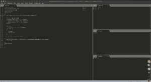

# 建立 C++竞争编程环境

> 原文:[https://www . geesforgeks . org/setting-a-c-competitive-programming-environment/](https://www.geeksforgeeks.org/setting-up-a-c-competitive-programming-environment/)

在本文中，我们将学习如何在一个竞争性编程环境中设置所有内容

## 操作系统

始终建议使用基于 Linux 的操作系统。之所以如此，是因为你不仅能学到一些更好的系统知识，还能得到一些预装的编码工具。
我自己会极力推荐一个 Linux 系统。首先，Ubuntu 很好。高级用户可以用 ArchLinux 或者 Kali Linux。即使您不想更改操作系统，也请使用最新版本的 Windows (7 或更高版本)。

[下载 Ubuntu 桌面](https://ubuntu.com/download/desktop)

## 文字编辑器

现在市场上有相当多的好的文本编辑器，比如 VS Code，Sublime text，Atom，Notepad++，等等。
我个人最喜欢的是威震文字 3，因为它重量轻，审美最低，功能高。

[下载崇高文字 3](https://www.sublimetext.com/3)

## 要使用的语言

现在是选择语言使用的时候了。大多数人使用 C++作为他们的主要编码语言。这主要是因为它的速度、清晰度和广泛的支持。所以，如果你是编码新手，你应该使用 C++语言，但是如果你不知道 C++但是知道一些其他的语言，试着只关注那种语言。大多数 CP Online 评委会做一些可变时间限制之类的事情，而且都是针对其他语言的。ie。如果你的语言比 C++慢 2 倍，那么与 C++程序相比，你也会有 2 倍的时间限制。

## 编译程序

现在，如果你使用 C++作为你的主要编码语言，你必须安装一个 gcc 编译器(Linux 用户可以跳过这一步，因为大多数 Linux 发行版都带有编译器:))，如果你不确定你是否有 gcc 编译器；打开外壳(ie cmd)并执行以下代码。如果你得到了答案，那么你就准备好出发了。如果没有(即系统不理解命令)，你必须先安装一个编译器。

g++–版本

[下载 MinGW 编译器](https://sourceforge.net/projects/mingw-w64/)

## 最终设置

现在这是文章最重要的一步……“修饰”。

### 合作伙伴关系模板

## C++

```
#include<bits/stdc++.h>
using namespace std;
void solve();
int main()
{
   ios_base::sync_with_stdio(false);cin.tie(NULL);

   #ifndef ONLINE_JUDGE
   freopen("input.txt", "r", stdin);
   freopen("error.txt", "w", stderr);
   freopen("output.txt", "w", stdout);
   #endif

   int t=1;
   ${2:/*is Single Test case?*/}cin>>t;
   while(t--)
   {
      solve();
      cout<<"\n";
   }

   cerr<<"time taken : "<<(float)clock()/CLOCKS_PER_SEC<<" secs"<<endl;
   return 0;
}
void solve()
{
}
```

如果您正在使用崇高文本，那么按照以下步骤获取一个模板
打开崇高，转到工具>开发人员>新代码片段，点击它
用上面写的代码替换现有代码，并用一些名称保存它。

如果您正在使用其他文本编辑器，以下是您应该使用的模板:

## C++

```
#include <bits/stdc++.h>
using namespace std;
void solve();
int main()
{
    ios_base::sync_with_stdio(false);
    cin.tie(NULL);

#ifndef ONLINE_JUDGE
    freopen("input.txt", "r", stdin);
    freopen("error.txt", "w", stderr);
    freopen("output.txt", "w", stdout);
#endif

    int t = 1;
    /*is Single Test case?*/ cin >> t;
    while (t--) {
        solve();
        cout << "\n";
    }

    cerr << "time taken : " << (float)clock() / CLOCKS_PER_SEC << " secs" << endl;
    return 0;
}
void solve()
{
}
```

### 屏幕设置

所有编码站点都使用文件比较方法来检查答案。这意味着他们通过你的程序将输出存储在一个文本文件中，并与实际的答案文件进行比较。
所以你也应该这样做。您需要做的是创建一个文件夹，并在其中创建 3 个文件 input.txt、output.txt 和 error.txt。您还应该将您的 cpp 代码放在这里。之后，您应该将编辑器配置为如图所示的布局:



注意编辑器中打开的文件。

### 附加组件

建议随身携带所有代码的副本。因此，最好使用版本控制工具，比如 git。
通过使用 Git，你可以派生出你以前写过的任何代码。
我已经抓取了一些代码来自动化提交过程(它需要升华文本、Linux 操作系统和 Git)
[下载 GIT](https://git-scm.com/downloads)

## 服务器端编程语言（Professional Hypertext Preprocessor 的缩写）

```
{
"shell_cmd": "g++ \"${file}\" -o \"${file_path}\\\\${file_base_name}\"", "file_regex": "^(..[^:]):([0-9]+):?([0-9]+)?:? (.){content}quot;,
"shell_cmd": "g++ -O2 -std=c++11 \"${file}\" -o \"${file_path}\\\\${file_base_name}\" && \"${file_path}\\\\${file_base_name}\" < input.txt",
"working_dir": "${file_path}",
"selector": "source.c, source.c++",

"variants": [
 { "name": "Run + Commit",
"shell_cmd": "g++ -O2 -std=c++11 \"${file}\" -o \"${file_path}\\\\${file_base_name}\" && \"${file_path}\\\\${file_base_name}\" < input.txt && git add test.cpp && dd if=\"${file}\" of=*/Enter the location of your Programming folder her/*/name.txt bs=10 count=1 && git commit -F name.txt ",
 }
 ]
 }
```

要使用上述代码；转到升华文本>工具>构建系统>新建系统并粘贴此代码。用一个名称保存文件，然后再次转到工具>构建系统，选择您为我们的新代码选择的名称。
全部完成……
现在，您可以使用 CTRL+SHIFT+B 运行您的 CPP 代码，并从 2 个选项中进行选择。