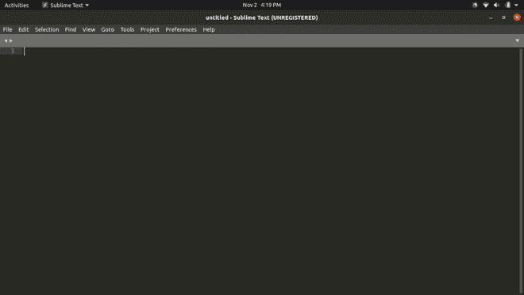
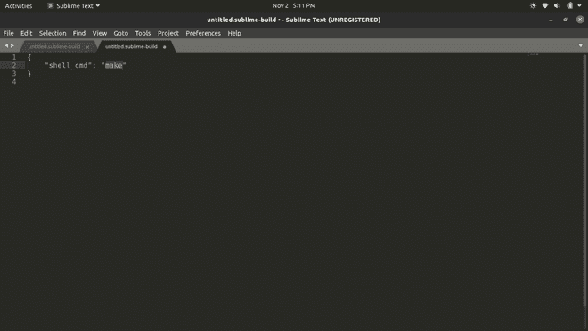
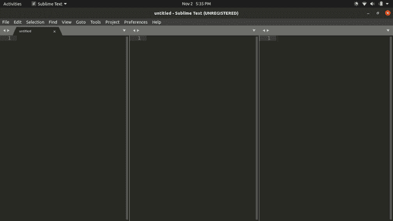
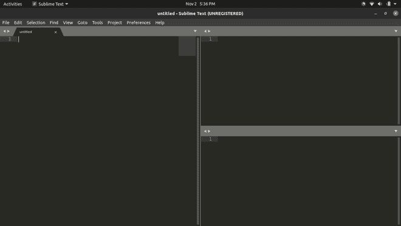
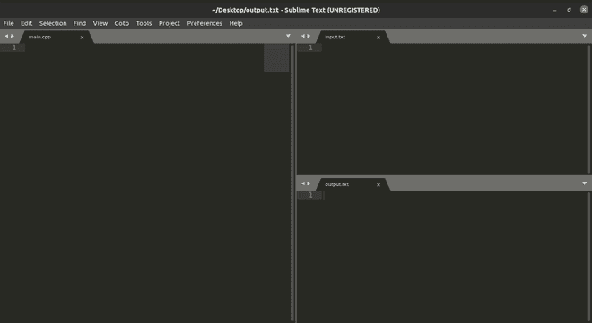
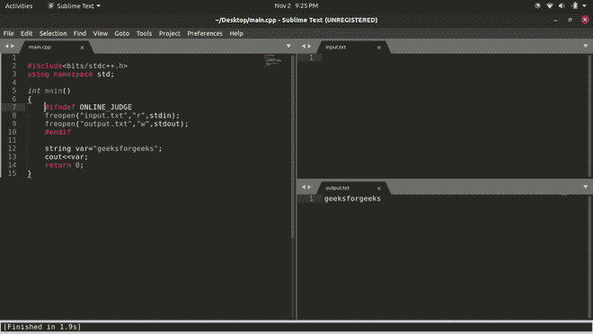

# 在 Ubuntu 上为 C++14 中的竞争编码设置崇高文本

> 原文:[https://www . geesforgeks . org/setting-supreme-text-for-competitive-coding-in-CPP 14-on-Ubuntu/](https://www.geeksforgeeks.org/setting-up-sublime-text-for-competitive-coding-in-cpp14-on-ubuntu/)

从编码开始，学习了 c++语言和基本的 ds&algo，并想更深入地学习它。好吧，竞争性编码正是你提升编码技能所需要的。在本教程中，我们将从设置 cp 环境开始，这样您就可以开始您的竞争编程之旅。

这里我们使用 Ubuntu 中的崇高文本编辑器。所以如果你的电脑上有 Ubuntu，你就可以开始了。

**如果你的 Ubuntu 没有崇高的文本编辑器，你可以很容易地安装它。只需遵循下面给出的步骤:**

1.  按下 **ctrl+alt+t** //这将打开终端
2.  现在写 **sudo snap 安装威震**
3.  安装将从**开始，只要按下“y”键，然后输入**
4.  恭喜崇高现在安装在你的 ubuntu。

### **设置****构建系统**

为了编译 c++14 代码，我们需要在崇高的文本中为 c++14 设置一个编译器，因为默认情况下它不会出现。

**第一步:**打开崇高文本



**步骤 2:** 从顶部菜单中，选择工具- >构建系统- >新构建系统。选择此选项后，将打开一个新窗口，如下所示



**第三步:**现在你要做的就是把下面给定的代码粘贴到打开的标签中。确保删除前一个

> {
> 
> " cmd":["bash "、"-c "、" g++-STD = c++ 14-Wall ' $ { file } '-o ' $ { file _ path }/$ { file _ base _ name } ' & & ' $ { file _ path }/$ { file _ base _ name } ' "]，
> 
> “file _ regex”:“^(..[^:]*):([0-9]+):?([0-9]+)?:?(.*){ content } # x201；,
> 
> 工作目录:“${file_path}”，
> 
> “选择器”:“source.c，source.c++”，
> 
> “变体”:
> 
> [
> 
> {
> 
> “名”:“跑”，
> 
> " cmd":["bash "、"-c "、" g++-STD = c++ 14 ' $ { file } '-o ' $ { file _ path }/$ { file _ base _ name } ' & ' $ { file _ path }/$ { file _ base _ name } ' "]
> 
> }
> 
> ]
> 
> }

上面的代码为 sublime 创建了一个 C++14 构建系统，因为默认情况下 sublime 有一个 c++11 的默认构建系统，所以为了使 c++14 的新特性在 sublime 中工作，我们需要为 c++14 设置构建系统。

**现在，我们已经为 c++14** 设置好了构建系统

### **改变输入输出操作的布局**

为了从代码中获取输入和接收输出，我们需要手动设置输入和输出文件。

**第一步:**从顶部菜单中选择**视图- >布局- >列:3** 或按 Shift+Alt+3。

**将创建三个新列，如下所示:**



**第 2 步:**现在选择**视图- >组- >最大列数:2。**

**这将对最后两个创建的列进行分组。见下图:**



**第三步:**现在你可以在崇高文本中同时查看三个文件。

我们现在将选择第一列(左)并将文件保存为 main.cpp(这是我们的代码将被写入的文件)。同样，选择第二列(右上角)，按(Ctrl+N)，然后将文件保存为 input.txt，最后选择第三列(右上角)，按(Ctrl+N)，然后将文件保存为 output.txt。



现在，我们已经为输入输出操作改变了崇高文本的布局。

当进行 cp 时，这种布局变得非常有用，因为在 cp 中，我们都知道检查各种类型的输入的代码，并根据它检查它们的输出，所以如果所有这些都发生在一个窗口中，这个过程会变得非常快。这种布局不是强制性的，但是在 cp 中最优选和使用

### **将输入输出文件与主文件链接**

为了将 main.cpp(程序文件)与 input.txt(输入文件)和 output.txt(输出文件)链接起来，请将下面的代码粘贴到主程序的 main.cpp 文件中。

将下面给出的整个代码复制到 main.cpp 文件中:

```
#ifndef ONLINE_JUDGE
freopen("input.txt","r",stdin); //file input.txt is opened in reading mode i.e "r"
freopen("output.txt","w",stdout);  //file output.txt is opened in writing mode i.e "w"
#endif
```

Input.txt 和 output.txt 是我们分别为给程序输入和接收输出而创建的文件。上面给出的代码行{ freopen("input.txt "，" r "，stdin)；}证明程序将从提到的文件即 input.txt 中获取输入，并且您将在 output.txt 中获得所需的输出，正如我们在最后一行代码{ freopen("output.txt "，" w "，stdout)中提到的那样；}

现在，我们已经在崇高的文本中建立了 cp 环境。

### **工作/执行代码**

在 main.cpp 文件中编写一个示例程序。

作为参考，您可以使用下面提到的代码:

## C++

```
#include <bits/stdc++.h>

using namespace std;

int main()

{

#ifndef ONLINE_JUDGE

    freopen("input.txt", "r", stdin);

    freopen("output.txt", "w", stdout);

#endif

    string var = "geekforgeeks";

    cout << var;

    return 0;
}
```

保存 main.cpp 文件后，按(Ctrl+b)运行该文件，您想要的输出将显示在 output.txt 文件中。

