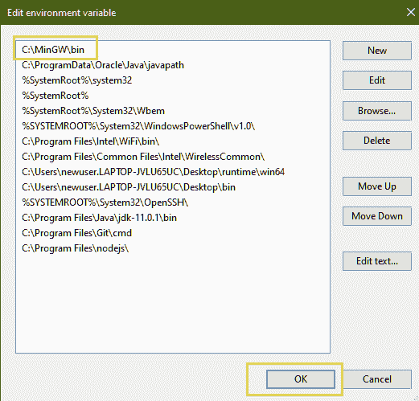

# 为 C++ 竞争性编程环境设置高级文本

> 原文:[https://www . geesforgeks . org/setting-supreme-text-for-CPP-competitive-programming-environment/](https://www.geeksforgeeks.org/setting-up-sublime-text-for-cpp-competitive-programming-environment/)

崇高文本是一个用于编码的文本编辑器。它有一个流畅的用户界面和其他令人兴奋的功能。直播比赛时，最好是[在本地 IDE 中编译程序](https://www.geeksforgeeks.org/compiling-a-c-program-behind-the-scenes/)，而不是[在线 IDE 的](https://ide.geeksforgeeks.org/)。

在本文中，我们将讨论如何[为 C++ 中的](https://www.geeksforgeeks.org/how-to-install-sublime-text-3-in-windows/)[竞争性编程](https://www.geeksforgeeks.org/setting-up-a-c-competitive-programming-environment/)设置崇高文本编辑器如何在崇高文本编辑器中创建我们自己的构建系统。

### [**<u>安装威震文字编辑器</u>**](https://www.geeksforgeeks.org/how-to-install-sublime-text-3-in-windows/) **:**

从[这里](https://www.sublimetext.com/)下载崇高文字的设置文件，然后安装。

### **<u>安装 MinGW 编译器</u> :**

**MinGW** 是 GNU 编译器集合(GCC)的原生 Windows 端口，拥有可自由分发的导入库和头文件，用于构建原生 Windows 应用程序。

*   从[这里](https://sourceforge.net/projects/mingw/)下载 **MinGW** 文件。
*   安装 MinGW 的所有基本设置。
*   标记所有要安装的软件包。
*   点击**安装**选项卡下的**应用更改**选项，如下图所示:

 

### <u>设置环境</u>

完成上述步骤后， [GCC](https://www.geeksforgeeks.org/gcc-command-in-linux-with-examples/) 启动运行。现在，**环境变量的路径**将被更新。按照以下步骤进行:

*   转到**我的电脑**，然后右键点击获取**属性** > **高级系统设置** > **环境变量**。


*   现在在**系统变量选项卡**下，查找**路径>点击路径>点击编辑>点击新建**。


*   现在在 c 盘的 MinGW 安装文件夹中找到**箱**文件夹。
*   复制 bin 文件夹的路径。默认路径为: ***C:\MinGW\bin***
*   在列表中粘贴这个新路径，点击 ***确定**。*



现在崇高文本可以从终端访问 [g++ ](https://www.geeksforgeeks.org/compiling-with-g-plus-plus/) ，因为路径变量已经更新。

### <u>创建构建系统</u>

崇高文本提供构建系统，允许用户运行外部程序。为崇高文本创建一个新的构建系统，用于设置 C++ 编译。

*   打开崇高文本编辑器，然后转到 ***【工具】>构建系统>新构建系统。**T3】*
*   将以下代码粘贴到文件中并保存。
*   将文件命名为“ **CP.sublime-build** ”。

```cpp
{
    "cmd": ["g++.exe", "-std=c++ 17", "${file}",
            "-o", "${file_base_name}.exe",
            "&&", "${file_base_name}.exe<inputf.in>outputf.out"],
    "shell":true,
    "working_dir":"$file_path",
    "selector":"source.cpp"
}
```

上述代码块用于从文件**“input . in”**中获取输入，并将输出打印到**“output . out”**。

### <u>设置窗口布局</u>

如下所示创建三个新文件，并确保它们都在同一个文件夹中。

*   **file.cpp:** 写代码的文件。
*   **input TF . in:**我们将在其中给出输入的文件。
*   **outputf.out:** 将显示输出的文件。

现在，执行以下步骤:

*   选择**查看>布局>列:3** 。这将在工作区中创建三列。将三个文件移动到三列中。
*   选择**查看>组>最大列数:2** 。
*   从**工具>构建系统> CP** 中选择我们刚刚创建的构建系统。

下图说明了同样的情况:


**准备执行程序:**


### <u>预编译头文件</u>:

通过预编译所有头文件，即预编译**位/stdc++，可以加快编译时间。h** [头文件](https://www.geeksforgeeks.org/header-files-in-c-cpp-and-its-uses/)。为此，请执行以下步骤:

*   导航至 [stdc++。h](https://www.geeksforgeeks.org/bitsstdc-h-c/) 档。默认情况下，该文件位于:**“C:\ MinGW \ lib \ gcc \ Ming W32 \ 6 . 3 . 0 \ include \ c++ \ Ming W32 \ bits”**
*   打开当前文件夹上的电源外壳或命令窗口。为此，请在按住 Shift 键的同时右键单击。
*   运行下面的命令来编译头。

> g++ -std = c++ 17 stdc++。h

